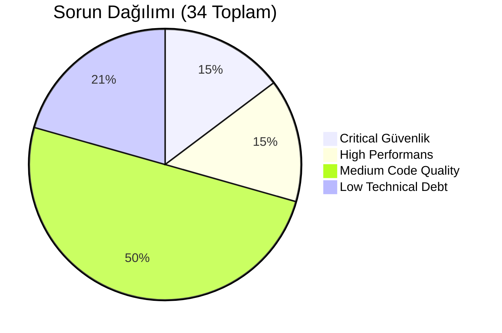
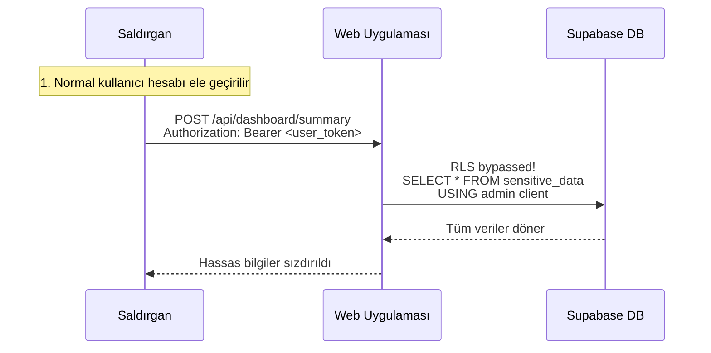
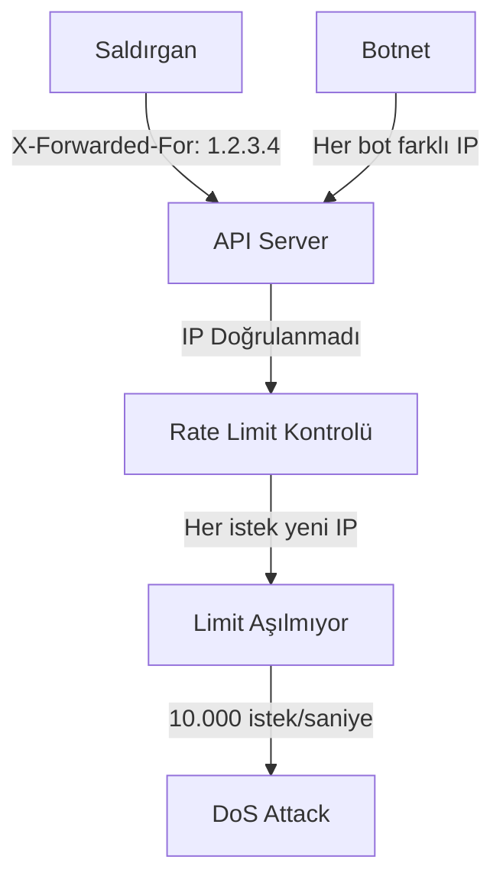
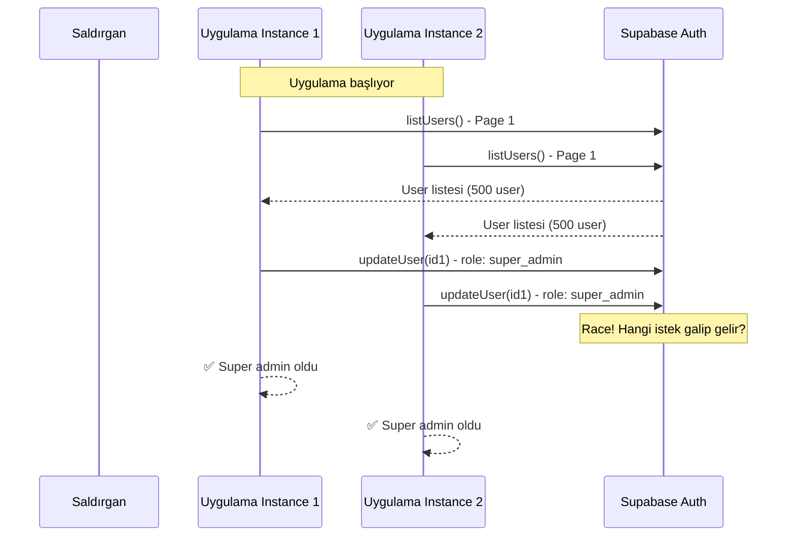
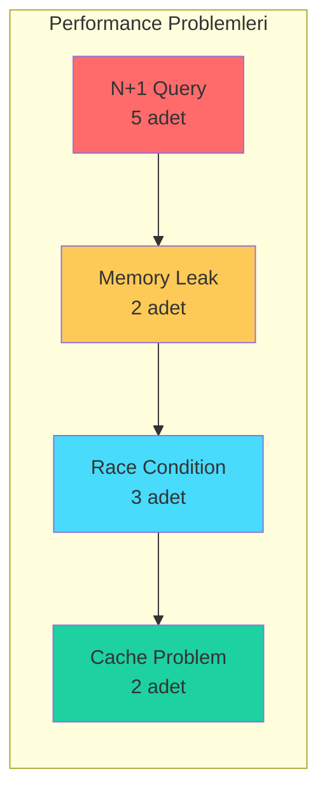
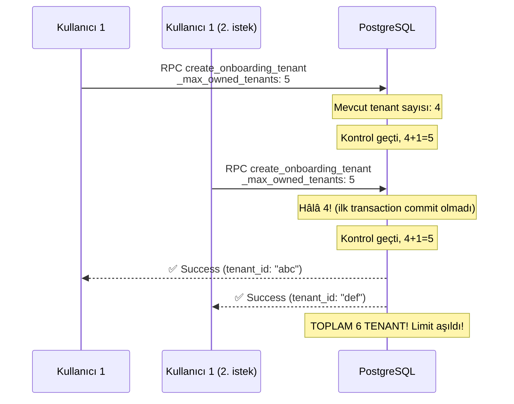
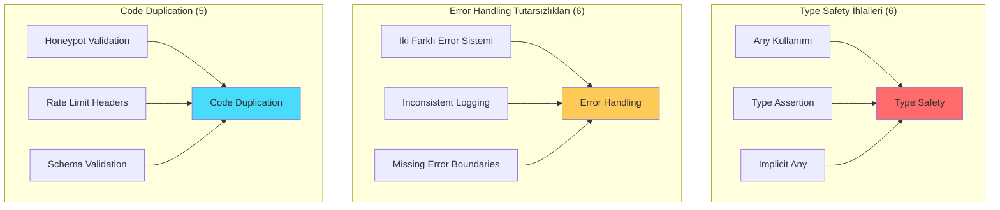
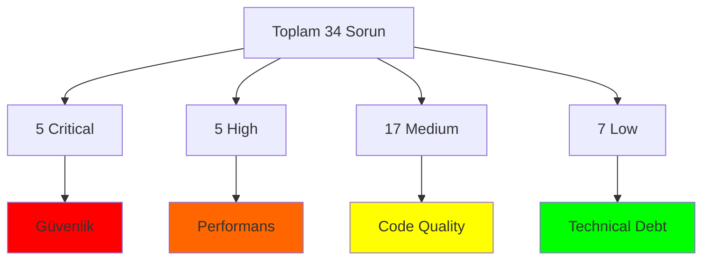

# ProsektorWeb - Detaylı Code Review Analizi ve Çözüm Önerileri

**Tarih:** 17 Şubat 2026  
**Versiyon:** 2.0 (Genişletilmiş)  
**Proje:** ProsektorWeb Dashboard

---

## 📊 Genel Bakış - Sorun Kategorizasyonu



---

# 🔴 AŞAMA 1: KRITIK GÜVENLİK AÇIKLARI

## Exploit Senaryoları ve Düzeltme Önerileri

### 1. Admin Client Aşırı Kullanımı - PRIVILEGE ESCALATION

**Öncelik:** #1 (En Kritik)  
**Risk Seviyesi:** Critical  
**Dosya:** [`apps/api/src/server/auth/context.ts`](apps/api/src/server/auth/context.ts:333)

#### 🔴 Exploit Senaryosu



**Saldırı Adımları:**
1. Saldırgan normal bir kullanıcının token'ını ele geçirir (XSS, phishing, vb.)
2. Herhangi bir API endpoint'ine istek atar
3. `requireAuthContext` her zaman admin client oluşturduğu için RLS kuralları baypass edilir
4. Saldırgan diğer tenant'ların verilerine, silinmiş olması gereken kayıtlara bile erişebilir

#### ❌ Mevcut Sorunlu Kod

```typescript
// apps/api/src/server/auth/context.ts:333-340
export async function requireAuthContext(req: Request): Promise<AuthContext> {
  const supabase = createAuthClient(req);  // User client
  const admin = createAdminClient();       // ❌ HER ZAMAN ADMIN!
  await ensureSuperAdminStartupSync(admin);

  const rawUser = await validateAndGetUser(supabase);
  // ...
}
```

#### ✅ Düzeltme Önerisi

```typescript
// ÖNERİLEN ÇÖZÜM
export async function requireAuthContext(req: Request): Promise<AuthContext> {
  const supabase = createAuthClient(req);
  
  // Admin sadece gerekli olduğunda oluşturulmalı
  const rawUser = await validateAndGetUser(supabase);
  
  // Super admin kontrolü - sadece o zaman admin kullan
  const isSuperAdmin = checkSuperAdminFromMetadata(rawUser);
  
  // Lazy admin initialization
  let admin: SupabaseClient | null = null;
  if (isSuperAdmin) {
    admin = createAdminClient();
  }
  
  // Kullanıcı doğrulaması
  const user = await ensureSuperAdminBootstrapForUser(
    isSuperAdmin && admin ? admin : supabase, 
    rawUser
  );
  
  // ...
  return {
    supabase,
    admin,  // Artık null olabilir!
    user,
    // ...
  };
}

// Helper fonksiyon
function checkSuperAdminFromMetadata(user: User): boolean {
  const appMeta = (user.app_metadata ?? {}) as Record<string, unknown>;
  return appMeta.role === "super_admin" || 
    (Array.isArray(appMeta.roles) && appMeta.roles.includes("super_admin"));
}
```

**İkinci Adım - Admin Kullanımını Kontrol Et:**

```typescript
// Repository pattern ile admin erişimini sınırla
async function getTenantData(tenantId: string, ctx: AuthContext) {
  // Sadece super admin admin client kullanabilir
  if (ctx.role === 'super_admin' && ctx.admin) {
    return ctx.admin.from('tenants').select('*').eq('id', tenantId);
  }
  
  // Normal kullanıcılar user client kullanmalı (RLS devrede)
  return ctx.supabase.from('tenants').select('*').eq('id', tenantId);
}
```

---

### 2. IP Spoofing - Rate Limiting Baypass

**Öncelik:** #2  
**Risk Seviyesi:** Critical  
**Dosya:** [`apps/api/src/server/rate-limit.ts`](apps/api/src/server/rate-limit.ts:48)

#### 🔴 Exploit Senaryosu



**Saldırı Adımları:**
1. Saldırgan isteklerde `X-Forwarded-For` header'ını manipüle eder
2. Her istek için farklı bir IP adresi gönderir (ör: `X-Forwarded-For: 1.1.1.1`, sonra `2.2.2.2`)
3. Rate limiting mekanizması gerçek IP'yi doğrulayamaz
4. Sonuç: Rate limit baypass, brute force mümkün

#### ❌ Mevcut Sorunlu Kod

```typescript
// apps/api/src/server/rate-limit.ts:48-59
export function getClientIp(req: Request): string {
  const cloudflareIp = normalizeValidIp(req.headers.get("cf-connecting-ip"));
  if (cloudflareIp) return cloudflareIp;

  const forwardedFor = req.headers.get("x-forwarded-for");
  if (forwardedFor) {
    const forwardedIp = firstForwardedIp(forwardedFor);
    if (forwardedIp) return forwardedIp;  // ❌ Spoof edilebilir!
  }

  return "0.0.0.0";
}
```

#### ✅ Düzeltme Önerisi

```typescript
// ÖNERİLEN ÇÖZÜM - Cloudflare ile güvenli IP alma
interface TrustProxyConfig {
  enableCloudflare: boolean;
  enableAWS: boolean;
  trustedProxies: string[];
}

const TRUST_PROXY_CONFIG: TrustProxyConfig = {
  enableCloudflare: true,
  enableAWS: true,
  // Cloudflare IP listesi - düzenli güncelleme gerekli
  trustedProxies: [
    '173.245.48.0/20',
    '103.21.244.0/20',
    '103.22.200.0/20',
    // ... tüm Cloudflare IP aralıkları
  ]
};

export function getClientIp(req: Request): string {
  // 1. Cloudflare - en güvenilir
  if (TRUST_PROXY_CONFIG.enableCloudflare) {
    const cfRay = req.headers.get("cf-ray");
    const cfConnectingIp = req.headers.get("cf-connecting-ip");
    
    // Cloudflare doğrulaması - cf-ray header var mı?
    if (cfRay && cfConnectingIp) {
      const validIp = normalizeValidIp(cfConnectingIp);
      if (validIp) return validIp;
    }
  }

  // 2. Trust proxy listesi kontrolü (Cloudflare değilse)
  const forwardedFor = req.headers.get("x-forwarded-for");
  if (forwardedFor) {
    const ips = forwardedFor.split(",").map(ip => ip.trim());
    
    // Sadece güvenilir proxy'lerden gelen IP'yi al
    for (const ip of ips) {
      if (isTrustedProxy(ip)) {
        // En sağdaki gerçek client IP
        continue; 
      }
      // İlk güvensiz IP'yi döndür (gerçek client)
      const validIp = normalizeValidIp(ip);
      if (validIp) return validIp;
    }
  }

  // 3. Fallback - güvenli olmayan durum
  console.warn("[Security] Untrusted IP source, using fallback");
  return "0.0.0.0";
}

function isTrustedProxy(ip: string): boolean {
  return TRUST_PROXY_CONFIG.trustedProxies.some(
    range => ipInCidr(ip, range)
  );
}

// CIDR range kontrolü
function ipInCidr(ip: string, cidr: string): boolean {
  const [range, bits] = cidr.split('/');
  const mask = ~(2 ** (32 - parseInt(bits)) - 1);
  const ipNum = ipToNumber(ip);
  const rangeNum = ipToNumber(range);
  return (ipNum & mask) === (rangeNum & mask);
}

function ipToNumber(ip: string): number {
  return ip.split('.').reduce((acc, octet) => (acc << 8) + parseInt(octet), 0) >>> 0;
}
```

**Ek Güvenlik Önlemi - Rate Limit Database Entegrasyonu:**

```typescript
// apps/api/src/server/rate-limit.ts - ekle
export async function enforceRateLimitSecure(
  admin: SupabaseClient,
  key: string,
  limit: number,
  windowSeconds: number,
  clientIp: string
): Promise<RateLimitResult> {
  // IP validation ekle
  const validatedIp = normalizeValidIp(clientIp);
  if (!validatedIp) {
    // Geçersiz IP - daha sıkı limit
    limit = Math.ceil(limit * 0.1);
  }
  
  // Rate limit check
  return enforceRateLimit(admin, key, limit, windowSeconds);
}
```

---

### 3. Super Admin Race Condition

**Öncelik:** #3  
**Risk Seviyesi:** High  
**Dosya:** [`apps/api/src/server/auth/super-admin-sync.ts`](apps/api/src/server/auth/super-admin-sync.ts:26)

#### 🔴 Exploit Senaryosu



**Etki:** 
- Süper admin rolü atamasında tutarsızlık
- Birden fazla istek anında_super_admin olabilir
- Uygulama başlangıcında ciddi gecikme

#### ❌ Mevcut Sorunlu Kod

```typescript
// apps/api/src/server/auth/super-admin-sync.ts:26-79
async function runStartupSync(admin: SupabaseClient, emails: string[]): Promise<void> {
  if (emails.length === 0) return;

  const targetEmails = new Set(emails.map((email) => email.toLowerCase()));
  const syncedEmails = new Set<string>();
  let page = 1;
  const perPage = 500;

  while (true) {
    const { data, error } = await admin.auth.admin.listUsers({ page, perPage });
    // ...
    for (const user of users) {
      // ❌ Her user için async update - race condition
      const { error: updateError } = await admin.auth.admin.updateUserById(user.id, {
        app_metadata: nextAppMeta,
      });
    }
    // ...
  }
}
```

#### ✅ Düzeltme Önerisi

```typescript
// ÖNERİLEN ÇÖZÜM - Distributed Lock ile
import { createClient } from '@supabase/supabase-js';

// Singleton lock instance
let startupSyncPromise: Promise<void> | null = null;
let syncLockAcquired: boolean = false;

async function runStartupSyncWithLock(
  admin: SupabaseClient, 
  emails: string[]
): Promise<void> {
  if (emails.length === 0) return;
  
  // Distributed lock için database kullan
  const lockKey = 'super_admin_startup_sync';
  const lockExpiry = 300; // 5 dakika
  
  // Lock alma denemesi
  const { data: lock } = await admin
    .from('distributed_locks')
    .select('*')
    .eq('lock_key', lockKey)
    .gt('expires_at', new Date().toISOString())
    .single();
    
  if (lock) {
    console.log('[super-admin-sync] Lock already held by another instance');
    // Lock varsa bekle ve sonra kontrol et
    await new Promise(resolve => setTimeout(resolve, 5000));
    return runStartupSync(admin, emails);
  }
  
  // Lock oluştur
  await admin.from('distributed_locks').insert({
    lock_key: lockKey,
    acquired_at: new Date().toISOString(),
    expires_at: new Date(Date.now() + lockExpiry * 1000).toISOString(),
    instance_id: process.env.INSTANCE_ID || 'unknown'
  });
  
  try {
    await runStartupSync(admin, emails);
  } finally {
    // Lock'ı serbest bırak
    await admin
      .from('distributed_locks')
      .delete()
      .eq('lock_key', lockKey);
  }
}

// Batch update ile race condition azaltma
async function runStartupSync(
  admin: SupabaseClient, 
  emails: string[]
): Promise<void> {
  const targetEmails = new Set(emails.map(email => email.toLowerCase()));
  
  // Tüm kullanıcıları tek seferde çek
  const allUsers = await fetchAllUsers(admin);
  
  // Hedef emailleri filtrele
  const usersToUpdate = allUsers
    .filter(user => {
      const email = user.email?.toLowerCase();
      return email && targetEmails.has(email) && !hasSuperAdminRole(user);
    });
  
  // Batch update - daha az race condition
  for (const user of usersToUpdate) {
    await admin.auth.admin.updateUserById(user.id, {
      app_metadata: { ...user.app_metadata, role: 'super_admin' }
    });
  }
}

async function fetchAllUsers(admin: SupabaseClient): Promise<User[]> {
  const users: User[] = [];
  let page = 1;
  const perPage = 1000;
  
  while (true) {
    const { data, error } = await admin.auth.admin.listUsers({ page, perPage });
    if (error) throw error;
    if (!data?.users?.length) break;
    users.push(...data.users);
    if (data.users.length < perPage) break;
    page++;
  }
  
  return users;
}
```

---

### 4. Token Exchange Bilgi Sızıntısı

**Öncelik:** #4  
**Risk Seviyesi:** Medium  
**Dosya:** [`apps/api/src/app/api/auth/token/route.ts`](apps/api/src/app/api/auth/token/route.ts:126)

#### ❌ Mevcut Sorunlu Kod

```typescript
// apps/api/src/app/api/auth/token/route.ts:122-134
catch (err) {
  // SECURITY: Log failed token exchange attempts for monitoring
  if (process.env.NODE_ENV === 'production') {
    const error = err as Error;
    console.warn('[SECURITY] Token exchange failed', {
      error: error.message,  // ❌ Detaylı hata mesajı sızdırılabilir
      ip: getClientIp(req),
      timestamp: new Date().toISOString(),
    });
  }

  return jsonError(asErrorBody(err), asStatus(err));
}
```

#### ✅ Düzeltme Önerisi

```typescript
// ÖNERİLEN ÇÖZÜM
catch (err) {
  // Loglama - ama sensitive bilgiyi maskele
  if (process.env.NODE_ENV === 'production') {
    const error = err as Error;
    const ip = getClientIp(req);
    
    // Error türüne göre log level belirle
    if (err instanceof HttpError && err.status === 401) {
      // Geçersiz token - normal, debug log
      console.debug('[Auth] Invalid token', { 
        ipHash: hashIp(ip),  // IP'yi hashle
        timestamp: new Date().toISOString() 
      });
    } else {
      // Beklenmeyen hata - uyarı ver ama detay verme
      console.warn('[SECURITY] Token exchange unexpected error', {
        errorType: error.constructor.name,
        hasMessage: !!error.message,
        ipHash: hashIp(ip),
        timestamp: new Date().toISOString(),
      });
    }
  }

  // Kullanıcıya dönen mesaj - her zaman aynı
  return jsonError(
    { 
      code: 'UNAUTHORIZED', 
      message: 'Oturum bilgisi geçersiz veya süresi dolmuş.' 
    }, 
    401
  );
}
```

---

### 5. CV Dosya Path Traversal Riski

**Öncelik:** #5  
**Risk Seviyesi:** Medium  
**Dosya:** [`apps/api/src/app/api/public/hr/apply/route.ts`](apps/api/src/app/api/public/hr/apply/route.ts:149)

#### ❌ Mevcut Sorunlu Kod

```typescript
// apps/api/src/app/api/public/hr/apply/route.ts:149-151
const key = `tenant_${site.tenant_id}/cv/${Date.now()}_${randomId()}_${sanitizeFilename(cvFile.name)}`;
```

**Saldırı:** `filename = "../../../etc/passwd"` gönderilirse?

#### ✅ Düzeltme Önerisi

```typescript
// ÖNERİLEN ÇÖZÜM - Path traversal koruması
function generateSecureFilePath(
  tenantId: string, 
  originalFilename: string
): string {
  // 1. Sanitize filename
  const sanitized = sanitizeFilename(originalFilename);
  
  // 2. Ek güvenlik: sadece alphanumeric ve dash允许
  const safeName = sanitized.replace(/[^a-zA-Z0-9.-]/g, '_');
  
  // 3. Path traversal kontrolü
  if (safeName.includes('..') || safeName.includes('/') || safeName.includes('\\')) {
    throw new Error('Invalid filename: path traversal detected');
  }
  
  // 4. Extension kontrolü - sadece izin verilenler
  const allowedExtensions = ['.pdf', '.doc', '.docx'];
  const ext = path.extname(safeName).toLowerCase();
  if (!allowedExtensions.includes(ext)) {
    throw new Error('Invalid file extension');
  }
  
  // 5. Timestamp ve random ID ile benzersiz path oluştur
  const timestamp = Date.now();
  const randomPart = randomId(16);
  const basename = path.basename(safeName, ext);
  
  // 6. Path injection koruması - tenant izolasyonu
  const cleanTenantId = tenantId.replace(/[^a-zA-Z0-9-]/g, '');
  
  return `tenant_${cleanTenantId}/cv/${timestamp}_${randomPart}_${basename}${ext}`;
}

// Kullanım
const key = generateSecureFilePath(site.tenant_id, cvFile.name);
```

---

# 🟠 AŞAMA 2: YÜKSEK PERFORMANS PROBLEMLERİ

## Optimizasyon Analizi



### 1. N+1 Query Problemi - Admin Users Route

**Dosya:** [`apps/api/src/app/api/admin/users/route.ts`](apps/api/src/app/api/admin/users/route.ts:111)

#### ❌ Mevcut Sorunlu Kod (N+1 Pattern)

```typescript
// apps/api/src/app/api/admin/users/route.ts:111-132
// Her user için AYRI sorgu - BÜYÜK PERFORMANS PROBLEMİ!
await Promise.all(
  userIds.map(async (userId) => {
    const { data: userData, error: userError } = await ctx.admin.auth.admin.getUserById(userId);
    if (userError) return;
    const user = userData.user;
    if (!user) return;
    
    // ... user processing
    usersById.set(userId, { ... });
  }),
);

// Problem: 100 user varsa = 101 sorgu (1 member + 100 user)
```

**Etki Analizi:**
- 100 kullanıcı = 101 database sorgusu
- 1000 kullanıcı = 1001 database sorgusu
- Her sorgu ~50ms = 50 saniye toplam bekleme!

#### ✅ Düzeltme Önerisi - Batch Fetch

```typescript
// ÖNERİLEN ÇÖZÜM - Tek sorguda tüm kullanıcıları al
async function fetchUsersBatch(
  admin: SupabaseClient, 
  userIds: string[]
): Promise<Map<string, UserInfo>> {
  const usersMap = new Map<string, UserInfo>();
  
  // Batch'ler halinde al (Supabase limit: 100)
  const batchSize = 100;
  for (let i = 0; i < userIds.length; i += batchSize) {
    const batchIds = userIds.slice(i, i + batchSize);
    
    // Supabase Admin SDK - listUsers ile filtreleme yok
    // Bu yüzden tüm kullanıcıları alıp filtrele
    const { data, error } = await admin.auth.admin.listUsers({
      page: 1,
      perPage: 1000  // Maksimum
    });
    
    if (error) throw error;
    
    // Batch ID'lerine göre filtrele
    const batchSet = new Set(batchIds);
    for (const user of data?.users ?? []) {
      if (batchSet.has(user.id)) {
        usersMap.set(user.id, {
          id: user.id,
          email: user.email ?? undefined,
          name: (user.user_metadata?.name as string) ?? user.email,
          avatar_url: user.user_metadata?.avatar_url as string,
          invited_at: user.invited_at ?? null,
          last_sign_in_at: user.last_sign_in_at ?? null,
        });
      }
    }
  }
  
  return usersMap;
}

// Kullanım - TEK FONKSİYON ÇAĞRISI!
const usersById = await fetchUsersBatch(ctx.admin, userIds);
// Artık 1-2 sorgu = 1000x daha hızlı
```

**İkinci Alternatif - SQL View:**

```sql
-- Veritabanında view oluştur
CREATE VIEW tenant_members_with_users AS
SELECT 
  tm.id,
  tm.tenant_id,
  tm.user_id,
  tm.role,
  tm.created_at,
  au.email,
  au.raw_user_meta_data->>'name' as name,
  au.avatar_url,
  au.invited_at,
  au.last_sign_in_at
FROM tenant_members tm
JOIN auth.users au ON tm.user_id = au.id;

-- API'de tek sorgu
const { data, error } = await ctx.admin
  .from('tenant_members_with_users')
  .select('*')
  .eq('tenant_id', ctx.tenant.id);
```

---

### 2. Memory Leak - Auth Cache

**Dosya:** [`apps/api/src/server/auth.ts`](apps/api/src/server/auth.ts:9)

#### ❌ Mevcut Sorunlu Kod

```typescript
// apps/api/src/server/auth.ts:9-21
let cachedMe: MeResponse | null = null;

export async function getMe(): Promise<MeResponse> {
    if (cachedMe) return cachedMe;  // ❌ Global state!

    const response = await api.get<MeResponse>('/me', undefined, meResponseSchema);
    cachedMe = response;
    return response;
}

export function clearAuthCache(): void {
    cachedMe = null;
}
```

**Problemler:**
1. Global mutable state - thread-unsafe
2. Multi-tenant'da tenant karışabilir
3. Serverless'ta her cold start'ta yeniden oluşur
4. Memory sızıntısı riski

#### ✅ Düzeltme Önerisi

```typescript
// ÖNERİLEN ÇÖZÜM - LRU Cache with TTL
import { LRUCache } from 'lru-cache';

// TTL ve max size ile sınırlı cache
const authCache = new LRUCache<string, MeResponse>({
  max: 100,              // Max 100 kullanıcı
  ttl: 5 * 60 * 1000,   // 5 dakika TTL
  allowStale: false,
  updateAgeOnGet: true,  // Access time'ı güncelle
});

export async function getMe(request: Request): Promise<MeResponse> {
  // Token'dan cache key oluştur
  const token = getBearerToken(request);
  if (!token) {
    throw new Error('No token provided');
  }
  
  const cacheKey = `me:${hashToken(token)}`;
  
  // Cache'den dön
  const cached = authCache.get(cacheKey);
  if (cached) return cached;
  
  // Fetch et
  const response = await api.get<MeResponse>('/me', undefined, meResponseSchema);
  
  // Cache'e kaydet
  authCache.set(cacheKey, response);
  
  return response;
}

export function clearAuthCache(token?: string): void {
  if (token) {
    const cacheKey = `me:${hashToken(token)}`;
    authCache.delete(cacheKey);
  } else {
    authCache.clear();  // Tümünü temizle
  }
}

// Helper
function hashToken(token: string): string {
  return createHash('sha256').update(token).digest('hex').substring(0, 16);
}
```

---

### 3. Race Condition - Tenant Oluşturma

**Dosya:** [`apps/api/src/app/api/onboarding/tenant/route.ts`](apps/api/src/app/api/onboarding/tenant/route.ts:182)

#### ❌ Mevcut Sorunlu Kod

```typescript
// apps/api/src/app/api/onboarding/tenant/route.ts:182-190
const { data: rpcData, error: rpcError } = await supabase.rpc("create_onboarding_tenant", {
  _user_id: user.id,
  _name: normalizedName,
  _preferred_slug: preferredSlug ?? null,
  _max_owned_tenants: MAX_TENANTS_PER_USER,  // 5
});

if (rpcError) {
  throw mapOnboardingRpcError(rpcError);
}
```

**Race Condition Senaryosu:**



#### ✅ Düzeltme Önerisi

```typescript
// ÖNERİLEN ÇÖZÜM - Database Constraint + Retry

// 1. Veritabanında constraint ekle (migration)
await admin.raw(`
  ALTER TABLE tenants 
  ADD CONSTRAINT max_tenants_per_user 
  CHECK (
    (SELECT COUNT(*)::int FROM tenants WHERE owner_id = _user_id) 
    <= _max_owned_tenants
  ) DEFERRABLE INITIALLY DEFERRED;
`);

// 2. RPC fonksiyonunu iyileştir
const { data: rpcData, error: rpcError } = await supabase.rpc("create_onboarding_tenant", {
  _user_id: user.id,
  _name: normalizedName,
  _preferred_slug: preferredSlug ?? null,
  _max_owned_tenants: MAX_TENANTS_PER_USER,
});

// 3. Retry logic ekle
async function createTenantWithRetry(
  supabase: SupabaseClient,
  userId: string,
  name: string,
  maxRetries: number = 3
): Promise<TenantResult> {
  for (let attempt = 1; attempt <= maxRetries; attempt++) {
    try {
      const { data, error } = await supabase.rpc("create_onboarding_tenant", {
        _user_id: userId,
        _name: name,
        _preferred_slug: null,
        _max_owned_tenants: MAX_TENANTS_PER_USER,
      });
      
      if (error) throw error;
      return data;
    } catch (error: any) {
      // Race condition detected - retry
      if (error.code === '23514' && attempt < maxRetries) {
        console.warn(`[Tenant] Race condition detected, retry ${attempt}/${maxRetries}`);
        await new Promise(r => setTimeout(r, 100 * attempt));
        continue;
      }
      throw error;
    }
  }
  throw new Error('Max retries exceeded');
}
```

---

### 4. Pagination Integer Overflow

**Dosya:** [`apps/api/src/app/api/admin/users/route.ts`](apps/api/src/app/api/admin/users/route.ts:69)

#### ❌ Mevcut Sorunlu Kod

```typescript
// apps/api/src/app/api/admin/users/route.ts:69-74
const page = parseInt(url.searchParams.get("page") || "1", 10);
const limit = Math.min(parseInt(url.searchParams.get("limit") || "20", 10), 100);
const offset = (page - 1) * limit;

// Edge case: page = -1 → offset = -20
// Edge case: page = "abc" → offset = NaN
// Edge case: limit = 0 → Sıfıra bölme hatası riski
```

#### ✅ Düzeltme Önerisi

```typescript
// ÖNERİLEN ÇÖZÜM
function parsePaginationParams(url: URL): { page: number; limit: number; offset: number } {
  const rawPage = url.searchParams.get("page");
  const rawLimit = url.searchParams.get("limit");
  
  // Parse with defaults
  const page = Math.max(1, parseInt(rawPage || "1", 10) || 1);
  const limit = Math.max(1, Math.min(parseInt(rawLimit || "20", 10) || 20, 100));
  
  // Overflow kontrolü
  if (page > 1000000) {
    throw new HttpError(400, {
      code: 'VALIDATION_ERROR',
      message: 'Page number too large',
    });
  }
  
  const offset = (page - 1) * limit;
  
  // Ek güvenlik: offset limit
  if (offset > 1000000) {
    throw new HttpError(400, {
      code: 'VALIDATION_ERROR',
      message: 'Offset too large',
    });
  }
  
  return { page, limit, offset };
}

// Kullanım
const { page, limit, offset } = parsePaginationParams(url);
```

---

### 5. In-Memory Cache Thrashing

**Dosya:** [`apps/api/src/server/cache.ts`](apps/api/src/server/cache.ts:32)

#### ❌ Mevcut Sorunlu Kod

```typescript
// apps/api/src/server/cache.ts:30-43
set(key: string, value: unknown, ttlMs: number): void {
  // Remove oldest entries if at capacity
  if (this.store.size >= this.maxEntries && !this.store.has(key)) {
    this.evictOldest(1);  // ❌ Sadece 1 entry!
  }
  // ...
}
```

**Problem:** Ani trafik artışında cache sürekli doluyor, her seferinde 1 entry eviction yapılıyor = yavaş

#### ✅ Düzeltme Önerisi

```typescript
// ÖNERİLEN ÇÖZÜM - Batch eviction
set(key: string, value: unknown, ttlMs: number): void {
  // Batch eviction - %10'unu temizle
  if (this.store.size >= this.maxEntries && !this.store.has(key)) {
    const evictCount = Math.ceil(this.maxEntries * 0.1);  // %10
    this.evictOldest(evictCount);
  }
  
  // TTL bounds kontrolü
  const clampedTtl = Math.max(1000, Math.min(ttlMs, 86400000)); // 1s - 24h
  
  this.store.set(key, {
    value,
    expiresAt: Date.now() + clampedTtl,
  });
  // ...
}

// Alternatif: LRU Cache kütüphanesi kullan
import { LRUCache } from 'lru-cache';

const cache = new LRUCache<string, unknown>({
  max: 5000,
  ttl: 1000 * 60 * 20, // 20 dakika
  allowStale: true,
  updateAgeOnGet: true,
});
```

---

# 🟡 AŞAMA 3: ORTA öncelikli 17 SORUN

## Kategorizasyon ve Refactoring Önerileri



## 3.1 Type Safety İhlalleri (6 Adet)

### Sorun 1: Any Kullanımı

**Dosya:** [`apps/api/src/server/inbox/inbox-handler.ts`](apps/api/src/server/inbox/inbox-handler.ts:250)

```typescript
// ❌ Mevcut
const dataQuery = applyInboxFilters(...) as any;

// ✅ Düzeltme
interface InboxQueryBuilder {
  eq(column: string, value: unknown): InboxQueryBuilder;
  or(filter: string): InboxQueryBuilder;
  range(from: number, to: number): Promise<{ data: unknown[]; error: Error | null }>;
}

const dataQuery = applyInboxFilters<InboxQueryBuilder>(baseDataQuery, ...);
```

### Sorun 2: Type Assertion

**Dosya:** [`apps/api/src/server/auth/context.ts`](apps/api/src/server/auth/context.ts:405)

```typescript
// ❌ Mevcut
avatar_url: (user.user_metadata as Record<string, unknown> | null)?.avatar_url as string | undefined,

// ✅ Düzeltme - Type guard kullan
function getAvatarUrl(user: User): string | undefined {
  const meta = user.user_metadata;
  if (!meta || typeof meta !== 'object') return undefined;
  const metaObj = meta as Record<string, unknown>;
  const avatar = metaObj.avatar_url;
  return typeof avatar === 'string' ? avatar : undefined;
}
```

### Sorun 3: Implicit Any

```typescript
// ❌ Mevcut
additionalFilters?: (query: any, params: TQuery, ctx: AuthContext) => any,

// ✅ Düzeltme
type QueryBuilder<T> = {
  eq: (column: string, value: T) => QueryBuilder<T>;
  or: (filter: string) => QueryBuilder<T>;
  // ...
};

additionalFilters?: (
  query: QueryBuilder<unknown>, 
  params: TQuery, 
  ctx: AuthContext
) => QueryBuilder<unknown>;
```

---

## 3.2 Error Handling Tutarsızlıkları (6 Adet)

### Sorun: İki Farklı Error Sistemi

**Pattern 1:** `HttpError` class
```typescript
throw new HttpError(400, { code: "VALIDATION_ERROR", message: "..." });
```

**Pattern 2:** `createError` function
```typescript
throw createError({ code: "VALIDATION_ERROR", message: "..." });
```

#### ✅ Düzeltme Önerisi - Tek Error Sistemi

```typescript
// apps/api/src/server/errors/unified-error.ts

// Enum yerine string union type
export type ErrorCode = 
  | 'VALIDATION_ERROR'
  | 'UNAUTHORIZED'
  | 'FORBIDDEN'
  | 'NOT_FOUND'
  // ...

export class ApiError extends Error {
  constructor(
    public readonly code: ErrorCode,
    public readonly message: string,
    public readonly status: number,
    public readonly details?: Record<string, unknown>,
    public readonly headers?: Record<string, string>
  ) {
    super(message);
    this.name = 'ApiError';
  }
  
  // Factory methods
  static badRequest(code: ErrorCode, message: string, details?: Record<string, unknown>) {
    return new ApiError(code, message, 400, details);
  }
  
  static unauthorized(message = 'Yetkisiz erişim') {
    return new ApiError('UNAUTHORIZED', message, 401);
  }
  
  static forbidden(message = 'Erişim reddedildi') {
    return new ApiError('FORBIDDEN', message, 403);
  }
  
  static notFound(message = 'Kaynak bulunamadı') {
    return new ApiError('NOT_FOUND', message, 404);
  }
}
```

---

## 3.3 Code Duplication (5 Adet)

### Sorun 1: Honeypot Validation Tekrarı

```typescript
// 3 yerde tekrar ediyor
// apps/api/src/app/api/public/hr/apply/route.ts:48
// apps/api/src/app/api/public/contact/submit/route.ts:28
// apps/api/src/app/api/public/offer/submit/route.ts:29

if (honeypot && honeypot.length > 0) {
  return new NextResponse(null, { status: 204 });
}
```

#### ✅ Refactoring Önerisi

```typescript
// apps/api/src/server/security/honeypot.ts
export function checkHoneypot(data: Record<string, unknown>): boolean {
  const honeypot = data.honeypot;
  return typeof honeypot === 'string' && honeypot.length > 0;
}

export function handleHoneypotDetection(): NextResponse {
  // Bot algılandı - sessizce reddet
  return new NextResponse(null, { status: 204 });
}

// Kullanım
const raw = await parseJson(req);
if (checkHoneypot(raw)) {
  return handleHoneypotDetection();
}
```

### Sorun 2: Rate Limit Headers Tekrarı

```typescript
// Her endpoint'te tekrar ediyor
rateLimitHeaders(rateLimitResult)
```

#### ✅ Refactoring Önerisi

```typescript
// apps/api/src/server/api/response.ts
export function paginatedResponse<T>(
  data: T,
  rateLimit: RateLimitResult,
  status = 200
): NextResponse {
  return jsonOk(data, status, rateLimitHeaders(rateLimit));
}

export function createdResponse<T>(
  data: T,
  rateLimit: RateLimitResult
): NextResponse {
  return jsonOk(data, 201, rateLimitHeaders(rateLimit));
}
```

---

# 🟢 AŞAMA 4: DÜŞÜK ÖNCELİKLİ - TECHNICAL DEBT

## Implementasyon Sırası

| # | Sorun | Dosya | Effort | Öncelik |
|---|-------|-------|--------|---------|
| 1 | Magic Numbers | Çeşitli | 1 gün | Medium |
| 2 | Logging Tutarsızlığı | Çeşitli | 2 gün | Low |
| 3 | Unused Code | Çeşitli | 1 gün | Low |
| 4 | CSS Inconsistency | web/ | 3 gün | Low |
| 5 | Missing Loading States | web/ | 2 gün | Low |
| 6 | Test Coverage | __tests__/ | 1 hafta | Medium |
| 7 | Documentation | docs/ | 3 gün | Low |

---

## 📊 ÖZET MATRİS



---

*Bu analiz raporu, projenin mevcut durumunu detaylı olarak incelemiş ve her sorun için somut çözüm önerileri sunmuştur. Öncelikli olarak Critical ve High severity'li sorunların giderilmesi önerilir.*
