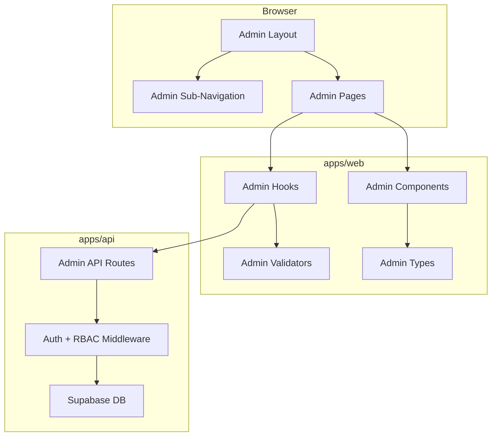
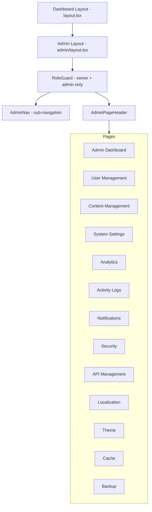
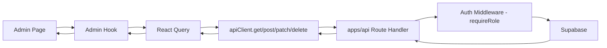
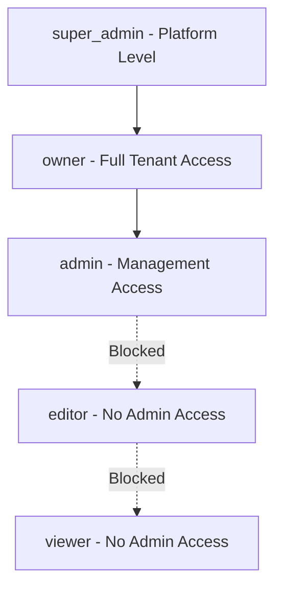

# Admin Panel Architecture

> ProsektorWeb Dashboard — Admin Panel Comprehensive Architecture Plan

## 1. Overview

The admin panel is a dedicated section within the existing dashboard at [`apps/web/src/app/(dashboard)/admin/`](apps/web/src/app/(dashboard)/admin/) providing system-wide management capabilities. It is restricted to `owner` and `admin` roles using the existing [`RoleGuard`](apps/web/src/components/layout/role-guard.tsx:21) component and the [`hasRole()`](packages/contracts/common.ts:27) utility from `@prosektor/contracts`.

### Tech Stack Alignment

| Layer | Technology |
|-------|-----------|
| Framework | Next.js 16 App Router, React 19, TypeScript 5 |
| UI | shadcn/ui new-york, Tailwind CSS 4, Lucide React |
| State | TanStack React Query 5 |
| Forms | React Hook Form 7 + Zod 4 |
| Auth | Supabase + Custom JWT |
| API | Next.js Route Handlers in `apps/api` |
| Contracts | `@prosektor/contracts` shared Zod schemas |
| Language | Turkish UI labels |

---

## 2. High-Level Architecture



---

## 3. File & Folder Structure

### 3.1 Frontend — `apps/web/src/`

```
app/(dashboard)/admin/
├── layout.tsx                    # Admin layout with sub-navigation + RoleGuard
├── page.tsx                      # Admin dashboard — KPIs, widgets, quick actions
├── loading.tsx                   # Skeleton loader for admin root
├── not-found.tsx                 # Admin 404
│
├── users/
│   ├── page.tsx                  # User list with DataTable, bulk ops
│   ├── loading.tsx
│   ├── [id]/
│   │   └── page.tsx              # User detail / edit
│   └── invite/
│       └── page.tsx              # Invite new user
│
├── content/
│   ├── page.tsx                  # Content overview — pages, posts
│   ├── loading.tsx
│   ├── pages/
│   │   ├── page.tsx              # Page management list
│   │   └── [id]/
│   │       └── page.tsx          # Page detail with revision history
│   └── media/
│       └── page.tsx              # Media library management
│
├── settings/
│   ├── page.tsx                  # General system settings
│   ├── loading.tsx
│   ├── email/
│   │   └── page.tsx              # Email configuration — SMTP, templates
│   └── site/
│       └── page.tsx              # Site-level settings
│
├── analytics/
│   ├── page.tsx                  # Charts, reports, data viz
│   ├── loading.tsx
│   └── reports/
│       └── page.tsx              # Exportable reports
│
├── logs/
│   ├── page.tsx                  # Activity logs, audit trail
│   └── loading.tsx
│
├── notifications/
│   ├── page.tsx                  # Notification management
│   ├── loading.tsx
│   └── templates/
│       └── page.tsx              # Email template editor
│
├── security/
│   ├── page.tsx                  # Security overview
│   ├── loading.tsx
│   ├── sessions/
│   │   └── page.tsx              # Active session management
│   ├── two-factor/
│   │   └── page.tsx              # 2FA settings
│   └── ip-blocking/
│       └── page.tsx              # IP whitelist/blacklist
│
├── api/
│   ├── page.tsx                  # API keys overview
│   ├── loading.tsx
│   ├── keys/
│   │   └── page.tsx              # API key CRUD
│   ├── integrations/
│   │   └── page.tsx              # Third-party integrations
│   └── webhooks/
│       └── page.tsx              # Webhook management
│
├── i18n/
│   ├── page.tsx                  # Localization management
│   └── loading.tsx
│
├── theme/
│   ├── page.tsx                  # Theme customization
│   └── loading.tsx
│
├── cache/
│   ├── page.tsx                  # Cache management
│   └── loading.tsx
│
└── backup/
    ├── page.tsx                  # Backup & restore
    └── loading.tsx
```

### 3.2 Admin-Specific Components — `apps/web/src/features/admin/`

```
features/admin/
├── components/
│   ├── admin-nav.tsx             # Admin sub-navigation sidebar/tabs
│   ├── admin-page-header.tsx     # Consistent page header with breadcrumbs
│   ├── admin-kpi-card.tsx        # KPI widget card
│   ├── admin-quick-actions.tsx   # Quick action buttons grid
│   ├── admin-stat-chart.tsx      # Reusable chart wrapper
│   ├── admin-activity-feed.tsx   # Recent activity feed widget
│   │
│   ├── users/
│   │   ├── user-table.tsx        # User DataTable with columns
│   │   ├── user-form.tsx         # Create/edit user form
│   │   ├── user-role-select.tsx  # Role assignment dropdown
│   │   ├── user-bulk-actions.tsx # Bulk operation toolbar
│   │   └── invite-form.tsx       # User invitation form
│   │
│   ├── content/
│   │   ├── content-table.tsx     # Content list DataTable
│   │   ├── page-revision-list.tsx# Revision history component
│   │   └── media-grid.tsx        # Media library grid view
│   │
│   ├── settings/
│   │   ├── general-settings-form.tsx
│   │   ├── email-settings-form.tsx
│   │   └── site-settings-form.tsx
│   │
│   ├── analytics/
│   │   ├── analytics-dashboard.tsx
│   │   ├── user-behavior-chart.tsx
│   │   └── report-export-dialog.tsx
│   │
│   ├── logs/
│   │   ├── activity-log-table.tsx
│   │   ├── log-filters.tsx
│   │   └── log-detail-sheet.tsx
│   │
│   ├── notifications/
│   │   ├── notification-table.tsx
│   │   └── template-editor.tsx
│   │
│   ├── security/
│   │   ├── session-table.tsx
│   │   ├── two-factor-setup.tsx
│   │   └── ip-block-form.tsx
│   │
│   ├── api-management/
│   │   ├── api-key-table.tsx
│   │   ├── api-key-form.tsx
│   │   ├── webhook-table.tsx
│   │   └── webhook-form.tsx
│   │
│   ├── i18n/
│   │   ├── language-table.tsx
│   │   └── translation-editor.tsx
│   │
│   ├── theme/
│   │   ├── theme-preview.tsx
│   │   └── theme-settings-form.tsx
│   │
│   ├── cache/
│   │   └── cache-status-card.tsx
│   │
│   └── backup/
│       ├── backup-list.tsx
│       └── restore-dialog.tsx
│
├── hooks/
│   ├── use-admin-users.ts        # User CRUD queries/mutations
│   ├── use-admin-content.ts      # Content management queries
│   ├── use-admin-settings.ts     # Settings queries/mutations
│   ├── use-admin-analytics.ts    # Analytics data queries
│   ├── use-admin-logs.ts         # Activity log queries
│   ├── use-admin-notifications.ts
│   ├── use-admin-security.ts     # Sessions, 2FA, IP blocking
│   ├── use-admin-api-keys.ts     # API key management
│   ├── use-admin-webhooks.ts     # Webhook management
│   ├── use-admin-i18n.ts         # Localization queries
│   ├── use-admin-theme.ts        # Theme settings
│   ├── use-admin-cache.ts        # Cache operations
│   └── use-admin-backup.ts       # Backup/restore operations
│
└── validators/
    ├── user-schemas.ts           # Zod schemas for user forms
    ├── settings-schemas.ts       # Settings validation
    ├── security-schemas.ts       # Security form schemas
    ├── api-key-schemas.ts        # API key validation
    ├── webhook-schemas.ts        # Webhook validation
    ├── notification-schemas.ts   # Notification schemas
    └── i18n-schemas.ts           # Localization schemas
```

### 3.3 API Routes — `apps/api/src/app/api/admin/`

```
app/api/admin/
├── dashboard/
│   └── route.ts                  # GET — admin dashboard KPIs
│
├── users/
│   ├── route.ts                  # GET list, POST create
│   ├── [id]/
│   │   └── route.ts             # GET, PATCH, DELETE user
│   ├── bulk/
│   │   └── route.ts             # POST bulk operations
│   └── invite/
│       └── route.ts             # POST invite user
│
├── content/
│   ├── pages/
│   │   ├── route.ts             # GET list, POST create
│   │   └── [id]/
│   │       ├── route.ts         # GET, PATCH, DELETE
│   │       └── revisions/
│   │           └── route.ts     # GET revisions
│   └── media/
│       ├── route.ts             # GET list, POST upload
│       └── [id]/
│           └── route.ts         # GET, DELETE media
│
├── settings/
│   ├── general/
│   │   └── route.ts             # GET, PATCH general settings
│   ├── email/
│   │   └── route.ts             # GET, PATCH email config
│   └── site/
│       └── route.ts             # GET, PATCH site settings
│
├── analytics/
│   ├── overview/
│   │   └── route.ts             # GET analytics overview
│   ├── user-behavior/
│   │   └── route.ts             # GET user behavior data
│   └── reports/
│       └── route.ts             # GET, POST report generation
│
├── logs/
│   └── route.ts                 # GET activity logs with filters
│
├── notifications/
│   ├── route.ts                 # GET, POST notifications
│   └── templates/
│       ├── route.ts             # GET, POST templates
│       └── [id]/
│           └── route.ts         # GET, PATCH, DELETE template
│
├── security/
│   ├── sessions/
│   │   ├── route.ts             # GET active sessions
│   │   └── [id]/
│   │       └── route.ts         # DELETE revoke session
│   ├── two-factor/
│   │   └── route.ts             # GET status, POST enable/disable
│   └── ip-blocking/
│       ├── route.ts             # GET rules, POST add rule
│       └── [id]/
│           └── route.ts         # DELETE remove rule
│
├── api-keys/
│   ├── route.ts                 # GET list, POST create
│   └── [id]/
│       └── route.ts             # GET, PATCH, DELETE key
│
├── webhooks/
│   ├── route.ts                 # GET list, POST create
│   └── [id]/
│       └── route.ts             # GET, PATCH, DELETE webhook
│
├── i18n/
│   ├── languages/
│   │   └── route.ts             # GET, POST languages
│   └── translations/
│       └── route.ts             # GET, PATCH translations
│
├── theme/
│   └── route.ts                 # GET, PATCH theme settings
│
├── cache/
│   ├── route.ts                 # GET cache status
│   └── clear/
│       └── route.ts             # POST clear cache
│
└── backup/
    ├── route.ts                 # GET list, POST create backup
    └── [id]/
        ├── route.ts             # GET, DELETE backup
        └── restore/
            └── route.ts         # POST restore from backup
```

### 3.4 Shared Contracts — `packages/contracts/`

```
contracts/
├── admin.ts                      # Admin-specific Zod schemas
├── admin-users.ts                # User management schemas
├── admin-settings.ts             # Settings schemas
├── admin-security.ts             # Security schemas
├── admin-logs.ts                 # Activity log schemas
├── admin-api-keys.ts             # API key schemas
├── admin-webhooks.ts             # Webhook schemas
├── admin-notifications.ts        # Notification schemas
├── admin-i18n.ts                 # Localization schemas
├── admin-backup.ts               # Backup schemas
└── admin-cache.ts                # Cache schemas
```

---

## 4. Component Hierarchy



### Shared UI Components Used

All admin pages leverage the existing UI component library at [`apps/web/src/components/ui/`](apps/web/src/components/ui/):

| Component | Admin Usage |
|-----------|------------|
| [`DataTable`](apps/web/src/components/ui/data-table.tsx) | User lists, logs, API keys, webhooks, content tables |
| [`Card`](apps/web/src/components/ui/card.tsx) | KPI cards, status cards, setting sections |
| [`Dialog`](apps/web/src/components/ui/dialog.tsx) | Create/edit modals, confirmation dialogs |
| [`Form`](apps/web/src/components/ui/form.tsx) | All admin forms via React Hook Form |
| [`Sheet`](apps/web/src/components/ui/sheet.tsx) | Detail panels, log detail view |
| [`ConfirmDialog`](apps/web/src/components/ui/confirm-dialog.tsx) | Destructive action confirmations |
| [`Badge`](apps/web/src/components/ui/badge.tsx) | Role badges, status indicators |
| [`DropdownMenu`](apps/web/src/components/ui/dropdown-menu.tsx) | Row actions, bulk action menus |
| [`Switch`](apps/web/src/components/ui/switch.tsx) | Toggle settings, enable/disable features |
| [`Select`](apps/web/src/components/ui/select.tsx) | Role selection, filter dropdowns |
| [`ActionButton`](apps/web/src/components/ui/action-button.tsx) | Async action buttons with loading state |
| [`AnimatedNumber`](apps/web/src/components/ui/animated-number.tsx) | KPI counters |
| [`DateRangePicker`](apps/web/src/components/ui/date-range-picker.tsx) | Log filtering, analytics date ranges |
| [`Skeleton`](apps/web/src/components/ui/skeleton.tsx) | Loading states |
| [`ScrollArea`](apps/web/src/components/ui/scroll-area.tsx) | Long lists, log views |

---

## 5. Data Flow & State Management

### 5.1 Query Architecture

All admin data fetching follows the existing pattern using TanStack React Query 5 with the [`apiClient`](packages/shared/api-client.ts) from `@prosektor/shared`.



### 5.2 Hook Pattern

Each admin feature has a dedicated hook file following the existing convention in [`apps/web/src/hooks/`](apps/web/src/hooks/):

```typescript
// features/admin/hooks/use-admin-users.ts
import { useQuery, useMutation, useQueryClient } from '@tanstack/react-query';
import { apiClient } from '@prosektor/shared';

const ADMIN_USERS_KEY = ['admin', 'users'] as const;

export function useAdminUsers(params?: AdminUserListParams) {
  return useQuery({
    queryKey: [...ADMIN_USERS_KEY, params],
    queryFn: () => apiClient.get('/api/admin/users', { params }),
  });
}

export function useCreateUser() {
  const qc = useQueryClient();
  return useMutation({
    mutationFn: (data: CreateUserRequest) =>
      apiClient.post('/api/admin/users', data),
    onSuccess: () => qc.invalidateQueries({ queryKey: ADMIN_USERS_KEY }),
  });
}

export function useUpdateUser(id: string) {
  const qc = useQueryClient();
  return useMutation({
    mutationFn: (data: UpdateUserRequest) =>
      apiClient.patch(`/api/admin/users/${id}`, data),
    onSuccess: () => qc.invalidateQueries({ queryKey: ADMIN_USERS_KEY }),
  });
}

export function useDeleteUser() {
  const qc = useQueryClient();
  return useMutation({
    mutationFn: (id: string) => apiClient.delete(`/api/admin/users/${id}`),
    onSuccess: () => qc.invalidateQueries({ queryKey: ADMIN_USERS_KEY }),
  });
}

export function useBulkUserAction() {
  const qc = useQueryClient();
  return useMutation({
    mutationFn: (data: BulkUserActionRequest) =>
      apiClient.post('/api/admin/users/bulk', data),
    onSuccess: () => qc.invalidateQueries({ queryKey: ADMIN_USERS_KEY }),
  });
}
```

### 5.3 Query Key Convention

All admin queries use a namespaced key structure:

```typescript
['admin', 'dashboard']                    // Admin dashboard KPIs
['admin', 'users', { page, search }]      // User list with filters
['admin', 'users', userId]                // Single user detail
['admin', 'content', 'pages', params]     // Content pages list
['admin', 'logs', filters]               // Activity logs
['admin', 'security', 'sessions']        // Active sessions
['admin', 'api-keys']                    // API keys list
['admin', 'webhooks']                    // Webhooks list
['admin', 'settings', 'general']         // General settings
['admin', 'settings', 'email']           // Email settings
['admin', 'cache', 'status']             // Cache status
['admin', 'backup', 'list']              // Backup list
```

### 5.4 Form State

All forms use React Hook Form 7 with Zod 4 resolvers, matching the existing pattern in [`apps/web/src/lib/form-schemas.ts`](apps/web/src/lib/form-schemas.ts):

```typescript
// features/admin/validators/user-schemas.ts
import { z } from 'zod';
import { userRoleSchema } from '@prosektor/contracts';

export const createUserSchema = z.object({
  email: z.string().email('Geçerli bir e-posta adresi girin'),
  name: z.string().min(2, 'İsim en az 2 karakter olmalı'),
  role: userRoleSchema,
});

export const updateUserSchema = createUserSchema.partial();

export const bulkUserActionSchema = z.object({
  action: z.enum(['activate', 'suspend', 'delete', 'change_role']),
  userIds: z.array(z.string().uuid()).min(1),
  role: userRoleSchema.optional(),
});

export type CreateUserInput = z.infer<typeof createUserSchema>;
export type UpdateUserInput = z.infer<typeof updateUserSchema>;
export type BulkUserActionInput = z.infer<typeof bulkUserActionSchema>;
```

---

## 6. API Endpoint Design

### 6.1 Authentication & Authorization

Every admin API route uses the existing dual-auth middleware from [`apps/api/src/server/auth/dual-auth.ts`](apps/api/src/server/auth/dual-auth.ts) with an additional admin role check:

```typescript
// apps/api/src/server/auth/admin-guard.ts
import { getAuthContext } from './context';
import { hasRole, type UserRole } from '@prosektor/contracts';
import { errorResponse } from '../api/http';

const ADMIN_ROLES: UserRole[] = ['super_admin', 'owner', 'admin'];

export async function requireAdmin(request: Request) {
  const ctx = await getAuthContext(request);
  if (!ctx || !hasRole(ctx.role, ADMIN_ROLES)) {
    return errorResponse('FORBIDDEN', 403);
  }
  return ctx;
}

// For owner-only operations like billing, backup/restore
const OWNER_ROLES: UserRole[] = ['super_admin', 'owner'];

export async function requireOwner(request: Request) {
  const ctx = await getAuthContext(request);
  if (!ctx || !hasRole(ctx.role, OWNER_ROLES)) {
    return errorResponse('FORBIDDEN', 403);
  }
  return ctx;
}
```

### 6.2 Endpoint Summary

| Method | Endpoint | Auth | Description |
|--------|----------|------|-------------|
| `GET` | `/api/admin/dashboard` | admin+ | Dashboard KPIs and summary |
| `GET` | `/api/admin/users` | admin+ | List users with pagination/search |
| `POST` | `/api/admin/users` | admin+ | Create user |
| `GET` | `/api/admin/users/:id` | admin+ | Get user detail |
| `PATCH` | `/api/admin/users/:id` | admin+ | Update user |
| `DELETE` | `/api/admin/users/:id` | owner+ | Delete user |
| `POST` | `/api/admin/users/bulk` | admin+ | Bulk user operations |
| `POST` | `/api/admin/users/invite` | admin+ | Invite user via email |
| `GET` | `/api/admin/content/pages` | admin+ | List all pages |
| `GET` | `/api/admin/content/pages/:id/revisions` | admin+ | Page revision history |
| `GET/POST` | `/api/admin/content/media` | admin+ | Media library CRUD |
| `GET/PATCH` | `/api/admin/settings/general` | admin+ | General settings |
| `GET/PATCH` | `/api/admin/settings/email` | owner+ | Email configuration |
| `GET/PATCH` | `/api/admin/settings/site` | admin+ | Site settings |
| `GET` | `/api/admin/analytics/overview` | admin+ | Analytics overview |
| `GET` | `/api/admin/analytics/user-behavior` | admin+ | User behavior data |
| `POST` | `/api/admin/analytics/reports` | admin+ | Generate report |
| `GET` | `/api/admin/logs` | admin+ | Activity logs with filters |
| `GET/POST` | `/api/admin/notifications` | admin+ | Notification management |
| `GET/POST` | `/api/admin/notifications/templates` | admin+ | Email templates |
| `GET` | `/api/admin/security/sessions` | admin+ | Active sessions |
| `DELETE` | `/api/admin/security/sessions/:id` | admin+ | Revoke session |
| `GET/POST` | `/api/admin/security/two-factor` | admin+ | 2FA management |
| `GET/POST` | `/api/admin/security/ip-blocking` | owner+ | IP blocking rules |
| `GET/POST` | `/api/admin/api-keys` | owner+ | API key management |
| `GET/POST` | `/api/admin/webhooks` | admin+ | Webhook management |
| `GET/PATCH` | `/api/admin/i18n/languages` | admin+ | Language management |
| `GET/PATCH` | `/api/admin/i18n/translations` | admin+ | Translation management |
| `GET/PATCH` | `/api/admin/theme` | admin+ | Theme settings |
| `GET` | `/api/admin/cache` | admin+ | Cache status |
| `POST` | `/api/admin/cache/clear` | admin+ | Clear cache |
| `GET/POST` | `/api/admin/backup` | owner+ | Backup management |
| `POST` | `/api/admin/backup/:id/restore` | owner+ | Restore from backup |
| `DELETE` | `/api/admin/backup/:id` | owner+ | Delete backup |

### 6.3 API Route Pattern

Each route handler follows the existing pattern in [`apps/api/src/app/api/`](apps/api/src/app/api/):

```typescript
// apps/api/src/app/api/admin/users/route.ts
import { NextRequest, NextResponse } from 'next/server';
import { requireAdmin } from '@/server/auth/admin-guard';
import { jsonResponse, errorResponse } from '@/server/api/http';
import { adminUserListQuerySchema } from '@prosektor/contracts';
import { supabaseAdmin } from '@/server/supabase';

export async function GET(request: NextRequest) {
  const ctx = await requireAdmin(request);
  if (ctx instanceof NextResponse) return ctx;

  const params = adminUserListQuerySchema.parse(
    Object.fromEntries(request.nextUrl.searchParams)
  );

  const { data, error, count } = await supabaseAdmin
    .from('tenant_members')
    .select('*, user:users(*)', { count: 'exact' })
    .eq('tenant_id', ctx.tenant_id)
    .range(params.offset, params.offset + params.limit - 1)
    .order('created_at', { ascending: false });

  if (error) return errorResponse('INTERNAL_ERROR', 500);

  return jsonResponse({ items: data, total: count });
}
```

---

## 7. Type Definitions & Interfaces

### 7.1 Admin Entity Types

New types extend the existing [`entities.ts`](apps/web/src/types/entities.ts):

```typescript
// packages/contracts/admin.ts

// ===== Activity Log =====
export const activityLogSchema = z.object({
  id: uuidSchema,
  tenant_id: uuidSchema,
  user_id: uuidSchema,
  action: z.string(),           // e.g. 'user.created', 'settings.updated'
  resource_type: z.string(),    // e.g. 'user', 'page', 'setting'
  resource_id: uuidSchema.optional(),
  metadata: z.record(z.unknown()).optional(),
  ip_address: z.string().optional(),
  user_agent: z.string().optional(),
  created_at: isoDateTimeSchema,
});
export type ActivityLog = z.infer<typeof activityLogSchema>;

// ===== API Key =====
export const apiKeySchema = z.object({
  id: uuidSchema,
  tenant_id: uuidSchema,
  name: z.string(),
  key_prefix: z.string(),       // First 8 chars for display
  permissions: z.array(z.string()),
  last_used_at: isoDateTimeSchema.optional(),
  expires_at: isoDateTimeSchema.optional(),
  is_active: z.boolean(),
  created_at: isoDateTimeSchema,
  created_by: uuidSchema,
});
export type ApiKey = z.infer<typeof apiKeySchema>;

// ===== Webhook =====
export const webhookSchema = z.object({
  id: uuidSchema,
  tenant_id: uuidSchema,
  url: z.string().url(),
  events: z.array(z.string()),  // e.g. ['page.published', 'user.created']
  secret: z.string().optional(),
  is_active: z.boolean(),
  last_triggered_at: isoDateTimeSchema.optional(),
  failure_count: z.number().int().default(0),
  created_at: isoDateTimeSchema,
});
export type Webhook = z.infer<typeof webhookSchema>;

// ===== Session =====
export const sessionSchema = z.object({
  id: uuidSchema,
  user_id: uuidSchema,
  ip_address: z.string(),
  user_agent: z.string(),
  last_active_at: isoDateTimeSchema,
  created_at: isoDateTimeSchema,
  is_current: z.boolean(),
});
export type Session = z.infer<typeof sessionSchema>;

// ===== IP Block Rule =====
export const ipBlockRuleSchema = z.object({
  id: uuidSchema,
  tenant_id: uuidSchema,
  ip_address: z.string(),
  type: z.enum(['whitelist', 'blacklist']),
  reason: z.string().optional(),
  created_at: isoDateTimeSchema,
  created_by: uuidSchema,
});
export type IpBlockRule = z.infer<typeof ipBlockRuleSchema>;

// ===== Notification Template =====
export const notificationTemplateSchema = z.object({
  id: uuidSchema,
  tenant_id: uuidSchema,
  key: z.string(),              // e.g. 'welcome_email', 'password_reset'
  subject: z.string(),
  body_html: z.string(),
  body_text: z.string().optional(),
  variables: z.array(z.string()),
  is_active: z.boolean(),
  updated_at: isoDateTimeSchema,
});
export type NotificationTemplate = z.infer<typeof notificationTemplateSchema>;

// ===== Backup =====
export const backupSchema = z.object({
  id: uuidSchema,
  tenant_id: uuidSchema,
  filename: z.string(),
  size_bytes: z.number(),
  status: z.enum(['pending', 'in_progress', 'completed', 'failed']),
  type: z.enum(['full', 'partial']),
  created_at: isoDateTimeSchema,
  created_by: uuidSchema,
  completed_at: isoDateTimeSchema.optional(),
});
export type Backup = z.infer<typeof backupSchema>;

// ===== Admin Dashboard KPIs =====
export const adminDashboardSchema = z.object({
  total_users: z.number(),
  active_users_today: z.number(),
  total_pages: z.number(),
  total_media_size_bytes: z.number(),
  pending_notifications: z.number(),
  recent_activity: z.array(activityLogSchema).max(10),
  system_health: z.object({
    cache_hit_rate: z.number(),
    api_response_avg_ms: z.number(),
    error_rate_24h: z.number(),
    storage_used_bytes: z.number(),
    storage_limit_bytes: z.number(),
  }),
});
export type AdminDashboard = z.infer<typeof adminDashboardSchema>;

// ===== Language =====
export const languageSchema = z.object({
  code: z.string(),             // e.g. 'tr', 'en'
  name: z.string(),             // e.g. 'Türkçe', 'English'
  is_default: z.boolean(),
  is_active: z.boolean(),
  completion_percentage: z.number(),
});
export type Language = z.infer<typeof languageSchema>;

// ===== Cache Status =====
export const cacheStatusSchema = z.object({
  entries: z.number(),
  hit_rate: z.number(),
  memory_used_bytes: z.number(),
  last_cleared_at: isoDateTimeSchema.optional(),
});
export type CacheStatus = z.infer<typeof cacheStatusSchema>;
```

---

## 8. Role-Based Access Control Strategy

### 8.1 Role Hierarchy



### 8.2 Admin Access Matrix

| Feature | super_admin | owner | admin | editor | viewer |
|---------|:-----------:|:-----:|:-----:|:------:|:------:|
| Admin Dashboard | ✅ | ✅ | ✅ | ❌ | ❌ |
| User Management | ✅ | ✅ | ✅ read/create/update | ❌ | ❌ |
| User Delete | ✅ | ✅ | ❌ | ❌ | ❌ |
| Content Management | ✅ | ✅ | ✅ | ❌ | ❌ |
| System Settings | ✅ | ✅ | ✅ | ❌ | ❌ |
| Email Settings | ✅ | ✅ | ❌ | ❌ | ❌ |
| Analytics | ✅ | ✅ | ✅ | ❌ | ❌ |
| Activity Logs | ✅ | ✅ | ✅ | ❌ | ❌ |
| Notifications | ✅ | ✅ | ✅ | ❌ | ❌ |
| Security | ✅ | ✅ | ✅ limited | ❌ | ❌ |
| IP Blocking | ✅ | ✅ | ❌ | ❌ | ❌ |
| API Keys | ✅ | ✅ | ❌ | ❌ | ❌ |
| Webhooks | ✅ | ✅ | ✅ | ❌ | ❌ |
| Localization | ✅ | ✅ | ✅ | ❌ | ❌ |
| Theme | ✅ | ✅ | ✅ | ❌ | ❌ |
| Cache Management | ✅ | ✅ | ✅ | ❌ | ❌ |
| Backup & Restore | ✅ | ✅ | ❌ | ❌ | ❌ |

### 8.3 Frontend Guard Implementation

The admin layout wraps all children with [`RoleGuard`](apps/web/src/components/layout/role-guard.tsx:21):

```typescript
// apps/web/src/app/(dashboard)/admin/layout.tsx
'use client';

import { useAuth } from '@/components/auth/auth-provider';
import { RoleGuard, UnauthorizedScreen } from '@/components/layout/role-guard';
import { AdminNav } from '@/features/admin/components/admin-nav';

export default function AdminLayout({ children }: { children: React.ReactNode }) {
  const { me } = useAuth();
  const userRole = me?.user?.role ?? 'viewer';

  return (
    <RoleGuard
      allowedRoles={['super_admin', 'owner', 'admin']}
      userRole={userRole}
      fallback={<UnauthorizedScreen />}
    >
      <div className="flex gap-6">
        <AdminNav userRole={userRole} />
        <main className="flex-1 min-w-0">{children}</main>
      </div>
    </RoleGuard>
  );
}
```

### 8.4 Permission Extension

Extend the existing [`ROLE_PERMISSIONS`](apps/api/src/server/auth/permissions.ts:3) with admin-specific permissions:

```typescript
// New permissions to add:
'admin:dashboard:read'
'admin:users:create'
'admin:users:read'
'admin:users:update'
'admin:users:delete'
'admin:users:bulk'
'admin:content:*'
'admin:settings:read'
'admin:settings:update'
'admin:settings:email'        // owner+ only
'admin:analytics:read'
'admin:logs:read'
'admin:notifications:*'
'admin:security:sessions'
'admin:security:2fa'
'admin:security:ip-blocking'  // owner+ only
'admin:api-keys:*'            // owner+ only
'admin:webhooks:*'
'admin:i18n:*'
'admin:theme:*'
'admin:cache:*'
'admin:backup:*'              // owner+ only
```

---

## 9. Reusable Patterns

### 9.1 Admin Page Template

Every admin page follows a consistent structure:

```typescript
// Template for admin pages
'use client';

import { AdminPageHeader } from '@/features/admin/components/admin-page-header';
import { useAdminFeature } from '@/features/admin/hooks/use-admin-feature';
import { Skeleton } from '@/components/ui/skeleton';

export default function AdminFeaturePage() {
  const { data, isLoading, error } = useAdminFeature();

  return (
    <div className="space-y-6">
      <AdminPageHeader
        title="Özellik Başlığı"
        description="Özellik açıklaması"
        actions={<ActionButtons />}
      />

      {isLoading ? <LoadingSkeleton /> : <FeatureContent data={data} />}
    </div>
  );
}
```

### 9.2 Admin DataTable Pattern

Reusable table pattern with consistent column definitions:

```typescript
// Pattern for admin tables
import { DataTable } from '@/components/ui/data-table';
import { ColumnDef } from '@tanstack/react-table';
import { Badge } from '@/components/ui/badge';
import { DropdownMenu } from '@/components/ui/dropdown-menu';

const columns: ColumnDef<EntityType>[] = [
  { accessorKey: 'name', header: 'Ad' },
  {
    accessorKey: 'status',
    header: 'Durum',
    cell: ({ row }) => <Badge variant={...}>{row.original.status}</Badge>,
  },
  {
    id: 'actions',
    cell: ({ row }) => <RowActions item={row.original} />,
  },
];
```

### 9.3 Admin Form Pattern

Consistent form pattern using React Hook Form + Zod:

```typescript
// Pattern for admin forms
import { useForm } from 'react-hook-form';
import { zodResolver } from '@hookform/resolvers/zod';
import { Form, FormField, FormItem, FormLabel, FormControl, FormMessage } from '@/components/ui/form';
import { featureSchema, type FeatureInput } from '@/features/admin/validators/feature-schemas';

function FeatureForm({ onSubmit, defaultValues }: Props) {
  const form = useForm<FeatureInput>({
    resolver: zodResolver(featureSchema),
    defaultValues,
  });

  return (
    <Form {...form}>
      <form onSubmit={form.handleSubmit(onSubmit)} className="space-y-4">
        <FormField
          control={form.control}
          name="fieldName"
          render={({ field }) => (
            <FormItem>
              <FormLabel>Alan Adı</FormLabel>
              <FormControl><Input {...field} /></FormControl>
              <FormMessage />
            </FormItem>
          )}
        />
        <ActionButton type="submit" loading={form.formState.isSubmitting}>
          Kaydet
        </ActionButton>
      </form>
    </Form>
  );
}
```

### 9.4 Bulk Operations Pattern

```typescript
// Pattern for bulk operations
function useBulkSelection<T extends { id: string }>() {
  const [selectedIds, setSelectedIds] = useState<Set<string>>(new Set());

  const toggleSelection = (id: string) => {
    setSelectedIds(prev => {
      const next = new Set(prev);
      next.has(id) ? next.delete(id) : next.add(id);
      return next;
    });
  };

  const selectAll = (items: T[]) =>
    setSelectedIds(new Set(items.map(i => i.id)));

  const clearSelection = () => setSelectedIds(new Set());

  return { selectedIds, toggleSelection, selectAll, clearSelection };
}
```

### 9.5 Activity Logging Utility

Server-side utility for consistent audit logging:

```typescript
// apps/api/src/server/admin/audit-log.ts
import { supabaseAdmin } from '../supabase';

interface LogEntry {
  tenant_id: string;
  user_id: string;
  action: string;
  resource_type: string;
  resource_id?: string;
  metadata?: Record<string, unknown>;
  ip_address?: string;
  user_agent?: string;
}

export async function logActivity(entry: LogEntry) {
  await supabaseAdmin
    .from('activity_logs')
    .insert(entry);
}
```

---

## 10. Navigation Integration

### 10.1 Sidebar Extension

Add an admin section to the existing [`navItems`](apps/web/src/components/layout/sidebar.tsx:46) array:

```typescript
// New nav item to add to sidebar.tsx navItems array
{
  label: 'Yönetim',
  href: '/admin',
  icon: <Shield className={NAV_ICON_SIZE_CLASS} />,
  // Only visible to owner/admin roles — filtered in sidebar render
  children: [
    { label: 'Genel Bakış', href: '/admin', icon: <LayoutDashboard className="h-4 w-4" /> },
    { label: 'Kullanıcılar', href: '/admin/users', icon: <Users className="h-4 w-4" /> },
    { label: 'İçerik', href: '/admin/content', icon: <FileText className="h-4 w-4" /> },
    { label: 'Ayarlar', href: '/admin/settings', icon: <Settings className="h-4 w-4" /> },
    { label: 'Analitik', href: '/admin/analytics', icon: <BarChart2 className="h-4 w-4" /> },
    { label: 'Aktivite Logları', href: '/admin/logs', icon: <ScrollText className="h-4 w-4" /> },
    { label: 'Bildirimler', href: '/admin/notifications', icon: <Bell className="h-4 w-4" /> },
    { label: 'Güvenlik', href: '/admin/security', icon: <Lock className="h-4 w-4" /> },
    { label: 'API Yönetimi', href: '/admin/api', icon: <Key className="h-4 w-4" /> },
    { label: 'Dil Yönetimi', href: '/admin/i18n', icon: <Languages className="h-4 w-4" /> },
    { label: 'Tema', href: '/admin/theme', icon: <Palette className="h-4 w-4" /> },
    { label: 'Önbellek', href: '/admin/cache', icon: <Database className="h-4 w-4" /> },
    { label: 'Yedekleme', href: '/admin/backup', icon: <HardDrive className="h-4 w-4" /> },
  ],
}
```

### 10.2 Admin Sub-Navigation

The admin section has its own internal tab-style navigation rendered by `AdminNav`:

```typescript
// features/admin/components/admin-nav.tsx
const adminNavSections = [
  {
    title: 'Genel',
    items: [
      { label: 'Genel Bakış', href: '/admin', icon: LayoutDashboard },
      { label: 'Kullanıcılar', href: '/admin/users', icon: Users },
      { label: 'İçerik', href: '/admin/content', icon: FileText },
    ],
  },
  {
    title: 'Sistem',
    items: [
      { label: 'Ayarlar', href: '/admin/settings', icon: Settings },
      { label: 'Güvenlik', href: '/admin/security', icon: Lock },
      { label: 'Önbellek', href: '/admin/cache', icon: Database },
      { label: 'Yedekleme', href: '/admin/backup', icon: HardDrive, ownerOnly: true },
    ],
  },
  {
    title: 'İzleme',
    items: [
      { label: 'Analitik', href: '/admin/analytics', icon: BarChart2 },
      { label: 'Aktivite Logları', href: '/admin/logs', icon: ScrollText },
    ],
  },
  {
    title: 'Entegrasyonlar',
    items: [
      { label: 'API Yönetimi', href: '/admin/api', icon: Key, ownerOnly: true },
      { label: 'Bildirimler', href: '/admin/notifications', icon: Bell },
      { label: 'Webhooklar', href: '/admin/api/webhooks', icon: Webhook },
    ],
  },
  {
    title: 'Özelleştirme',
    items: [
      { label: 'Tema', href: '/admin/theme', icon: Palette },
      { label: 'Dil Yönetimi', href: '/admin/i18n', icon: Languages },
    ],
  },
];
```

---

## 11. Database Schema Extensions

New tables required for admin features:

```sql
-- Activity Logs
CREATE TABLE activity_logs (
  id UUID PRIMARY KEY DEFAULT gen_random_uuid(),
  tenant_id UUID NOT NULL REFERENCES tenants(id),
  user_id UUID NOT NULL REFERENCES auth.users(id),
  action TEXT NOT NULL,
  resource_type TEXT NOT NULL,
  resource_id UUID,
  metadata JSONB DEFAULT '{}',
  ip_address INET,
  user_agent TEXT,
  created_at TIMESTAMPTZ NOT NULL DEFAULT now()
);
CREATE INDEX idx_activity_logs_tenant ON activity_logs(tenant_id, created_at DESC);

-- API Keys
CREATE TABLE api_keys (
  id UUID PRIMARY KEY DEFAULT gen_random_uuid(),
  tenant_id UUID NOT NULL REFERENCES tenants(id),
  name TEXT NOT NULL,
  key_hash TEXT NOT NULL,
  key_prefix TEXT NOT NULL,
  permissions TEXT[] DEFAULT '{}',
  last_used_at TIMESTAMPTZ,
  expires_at TIMESTAMPTZ,
  is_active BOOLEAN DEFAULT true,
  created_at TIMESTAMPTZ NOT NULL DEFAULT now(),
  created_by UUID NOT NULL REFERENCES auth.users(id)
);

-- Webhooks
CREATE TABLE webhooks (
  id UUID PRIMARY KEY DEFAULT gen_random_uuid(),
  tenant_id UUID NOT NULL REFERENCES tenants(id),
  url TEXT NOT NULL,
  events TEXT[] NOT NULL DEFAULT '{}',
  secret TEXT,
  is_active BOOLEAN DEFAULT true,
  last_triggered_at TIMESTAMPTZ,
  failure_count INT DEFAULT 0,
  created_at TIMESTAMPTZ NOT NULL DEFAULT now()
);

-- IP Block Rules
CREATE TABLE ip_block_rules (
  id UUID PRIMARY KEY DEFAULT gen_random_uuid(),
  tenant_id UUID NOT NULL REFERENCES tenants(id),
  ip_address INET NOT NULL,
  type TEXT NOT NULL CHECK (type IN ('whitelist', 'blacklist')),
  reason TEXT,
  created_at TIMESTAMPTZ NOT NULL DEFAULT now(),
  created_by UUID NOT NULL REFERENCES auth.users(id)
);

-- Notification Templates
CREATE TABLE notification_templates (
  id UUID PRIMARY KEY DEFAULT gen_random_uuid(),
  tenant_id UUID NOT NULL REFERENCES tenants(id),
  key TEXT NOT NULL,
  subject TEXT NOT NULL,
  body_html TEXT NOT NULL,
  body_text TEXT,
  variables TEXT[] DEFAULT '{}',
  is_active BOOLEAN DEFAULT true,
  updated_at TIMESTAMPTZ NOT NULL DEFAULT now(),
  UNIQUE(tenant_id, key)
);

-- Backups
CREATE TABLE backups (
  id UUID PRIMARY KEY DEFAULT gen_random_uuid(),
  tenant_id UUID NOT NULL REFERENCES tenants(id),
  filename TEXT NOT NULL,
  size_bytes BIGINT NOT NULL DEFAULT 0,
  status TEXT NOT NULL DEFAULT 'pending' CHECK (status IN ('pending', 'in_progress', 'completed', 'failed')),
  type TEXT NOT NULL DEFAULT 'full' CHECK (type IN ('full', 'partial')),
  created_at TIMESTAMPTZ NOT NULL DEFAULT now(),
  created_by UUID NOT NULL REFERENCES auth.users(id),
  completed_at TIMESTAMPTZ
);

-- Languages
CREATE TABLE languages (
  code TEXT PRIMARY KEY,
  tenant_id UUID NOT NULL REFERENCES tenants(id),
  name TEXT NOT NULL,
  is_default BOOLEAN DEFAULT false,
  is_active BOOLEAN DEFAULT true,
  UNIQUE(tenant_id, code)
);

-- Translations
CREATE TABLE translations (
  id UUID PRIMARY KEY DEFAULT gen_random_uuid(),
  tenant_id UUID NOT NULL REFERENCES tenants(id),
  language_code TEXT NOT NULL,
  namespace TEXT NOT NULL,
  key TEXT NOT NULL,
  value TEXT NOT NULL,
  UNIQUE(tenant_id, language_code, namespace, key)
);
```

---

## 12. Implementation Priority

The recommended implementation order based on dependencies and value:

1. **Admin Layout + Dashboard** — Foundation for all admin pages
2. **User Management** — Core admin functionality, extends existing [`settings/users`](apps/web/src/app/(dashboard)/settings/users/page.tsx)
3. **Activity Logs** — Required for audit trail across all features
4. **System Settings** — Configuration management
5. **Security** — Session management, 2FA, IP blocking
6. **Content Management** — Extends existing page/media management
7. **Analytics** — Extends existing [`analytics`](apps/web/src/app/(dashboard)/analytics/page.tsx)
8. **Notifications** — Email templates and notification management
9. **API Management** — API keys and webhooks
10. **Cache Management** — Operational tooling
11. **Localization** — Multi-language support
12. **Theme** — Theme customization
13. **Backup & Restore** — Data safety

---

## 13. Testing Strategy

| Layer | Tool | Scope |
|-------|------|-------|
| Unit | Vitest | Validators, utility functions, hooks |
| Integration | Vitest | API route handlers with mocked Supabase |
| E2E | Playwright | Critical admin flows — user CRUD, settings |
| Contract | Vitest | Zod schema validation in `@prosektor/contracts` |

Test files follow existing conventions:
- API tests: `apps/api/tests/api/admin-*.test.ts`
- Contract tests: `packages/contracts/tests/admin-*.test.ts`
- E2E tests: `apps/web/tests/admin/`
