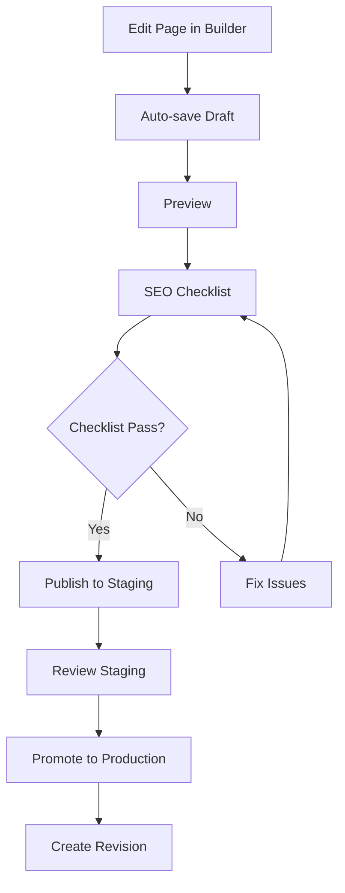

# ProsektorWeb Dashboard - Technical Specification

> **Version:** 1.0.0 | **Date:** 2026-02-08 | **Status:** MVP Specification

---

## 0. Ortak Çalışma Kuralları (Collaboration Rules)

### 0.1 Hedef & MVP Prensibi

| Kural | Açıklama |
|-------|----------|
| **Hedef** | ProsektorWeb Dashboard (tenant + super admin) için ship edilebilir MVP |
| **MVP Prensibi** | Sabit formlar + inbox; HR minimal (ilan + başvuru toplama). Pipeline/CRM **YOK** |
| **Repo Yönetimi** | Tek repo, çok iş paketi: PR'lar küçük, izole, geri alınabilir |
| **Bitmiş Tanımı** | "Çalışıyor" ≠ "Bitmiş". Her iş paketinin DoD (Definition of Done) checklist'i var |

### 0.2 Ortak Teknik Varsayımlar

```
┌─────────────────────────────────────────────────────────────┐
│ Layer          │ Technology                                │
├─────────────────────────────────────────────────────────────┤
│ Frontend       │ Next.js (App Router), TypeScript          │
│ Styling        │ TailwindCSS, shadcn/ui                    │
│ Forms          │ React Hook Form + Zod                     │
│ Backend        │ Supabase (Postgres + Auth + Storage)      │
│ Multi-tenant   │ tenant_id zorunlu + RLS zorunlu           │
│ Public Forms   │ rate-limit + honeypot + dosya limitleri   │
└─────────────────────────────────────────────────────────────┘
```

### 0.3 Repo Yapısı (Ajanların Çakışmasını Azaltır)

```
/apps/web
  /app                    # Next.js App Router
  /components             # UI bileşenleri
  /features               # Feature-based modules
  /styles                 # Global styles
  /lib                    # Utilities, helpers
  /types                  # TypeScript types
  /validators             # Zod schemas
  /server                 # Server actions

/packages/ui              # Paylaşılan UI bileşenleri + wrapper'lar
/packages/design-tokens   # Tailwind tokens, theme, spacing, radii
/packages/db              # SQL migrations, RLS policies, seed
/packages/contracts       # OpenAPI veya typed contracts, Zod schemas
/packages/testing         # Test utils, mocks

/docs
  /ux                     # UX dokümanları
  /ui                     # UI bileşen envanteri
  /api                    # API dokümanları
  /db                     # DB şema dokümanları
```

**Doküman Lokasyonları:**

| İçerik | Lokasyon |
|--------|----------|
| UX dokümanları | `/docs/ux/*` |
| UI bileşen envanteri | `/docs/ui/*` |
| API & kontratlar | `/docs/api/*` + `/packages/contracts` |
| DB & RLS | `/packages/db` |

### 0.4 Çoklu Ajan Sistem Mimarisi (Net Sorumluluk Ayrımı)

Ajanlar 5 üretici + 1 kontrol olarak ayrılır:

```mermaid
flowchart LR
    subgraph Producers["Üretici Ajanlar"]
        UX["🎯 UX Ajanı"]
        UI["🎨 UI Ajanı"]
        CSS["🎭 CSS/Design System"]
        FE["⚛️ Frontend Ajanı"]
        BE["🔧 Backend Ajanı"]
    end
    
    subgraph Control["Kontrol"]
        QA["✅ Kontrol Ajanı"]
    end
    
    UX --> UI --> CSS --> FE --> BE --> QA
```



| Ajan | Sorumluluk | Çıktı |
|------|------------|-------|
| **UX Ajanı** | IA + akış + ekran spesifikasyonu | `/docs/ux/*` |
| **UI Ajanı** | Component inventory + wireframe spec + UI kuralları | `/docs/ui/*` |
| **CSS/Design System** | Token'lar, theme, tailwind/shadcn standardizasyonu | `/packages/design-tokens` |
| **Frontend Ajanı** | Route'lar, sayfalar, state, form entegrasyonu, UI bağlama | `/apps/web/*` |
| **Backend Ajanı** | DB şeması, RLS, API/server actions, storage policy, audit log | `/packages/db`, `/apps/web/server` |
| **Kontrol Ajanı (QA)** | Bağımsız doğrulama + gap listesi | Review raporu |

### 0.5 Plan Modu (Görevler)

Aşağıdaki görevler sıralı; her ajan kendi bölümünü üretirken giriş/çıkış ve kontrol noktalarına uymak zorunda.

```mermaid
flowchart TD
    A[UX Ajanı: IA + Akış] --> B[UI Ajanı: Component Spec]
    B --> C[CSS Ajanı: Design Tokens]
    C --> D[Frontend Ajanı: Implementation]
    D --> E[Backend Ajanı: API + DB]
    E --> F[Kontrol Ajanı: QA Review]
    F --> G{Gap Var mı?}
    G -->|Evet| H[İlgili Ajana Geri Dön]
    G -->|Hayır| I[✅ Done]
    H --> A
```



### 0.6 Definition of Done (DoD) Checklist

Her iş paketi için:

- [ ] Kod yazıldı ve lint hatası yok
- [ ] TypeScript hataları yok
- [ ] İlgili Zod schema'ları tanımlı
- [ ] RLS policy aktif (multi-tenant tablolar için)
- [ ] Unit test yazıldı (kritik iş mantığı için)
- [ ] Empty/Loading/Error state'leri tanımlı
- [ ] PR açıklaması DoD'u referans alıyor
- [ ] Kontrol Ajanı review onayı

---

## 1. Overview

### 1.1 Product Vision
ProsektorWeb Dashboard, OSGB'lere (Ortak Sağlık Güvenlik Birimleri) hızlı kurulum ve satış odaklı web sitesi platformu sunan bir multi-tenant yönetim panelidir.

### 1.2 Business Model
- **Platform Sahibi (Super Admin):** 7 gün içinde demo site kurulumu → onay → ücretli paket
- **Tenant (OSGB):** Kendi sitesini blok tabanlı editör ile yönetir

### 1.3 Technical Stack
| Layer | Technology |
|-------|------------|
| Frontend | Next.js (App Router), TypeScript, TailwindCSS, shadcn/ui |
| Forms | React Hook Form + Zod |
| Data Fetching | Server Actions + React Query (caching) |
| Backend | Supabase (Postgres + Auth + Storage) |
| Multi-tenant | Row Level Security (RLS) |
| Deploy | Staging → Production publish flow |

> **Assumption:** Supabase Auth kullanılacak, magic link + email/password destekli.

---

## 2. Roles & Permissions (RBAC)

### 2.1 Role Definitions

| Role | Scope | Description |
|------|-------|-------------|
| **Super Admin** | Platform | Tüm tenantlar, templates, provisioning, billing, feature flags |
| **Tenant Owner** | Tenant | Tenant'ın her şeyi (billing dahil) |
| **Tenant Admin** | Tenant | Site + içerik + modüller + kullanıcı yönetimi |
| **Editor** | Tenant | Sayfa içerikleri, blog, medya (ayar yok) |
| **Viewer/Analyst** | Tenant | Sadece görüntüleme + analytics |

### 2.2 Permission Matrix

```
C = Create | R = Read | U = Update | D = Delete | - = No Access
```

| Module / Resource | Super Admin | Tenant Owner | Tenant Admin | Editor | Viewer |
|-------------------|-------------|--------------|--------------|--------|--------|
| **Tenants** | CRUD | R (own) | R (own) | - | - |
| **Sites** | CRUD | CRUD | CRUD | R | R |
| **Pages** | CRUD | CRUD | CRUD | CRUD | R |
| **Page Builder** | CRUD | CRUD | CRUD | CRUD | R |
| **Theme/Branding** | CRUD | CRUD | CRUD | RU | R |
| **Menus** | CRUD | CRUD | CRUD | CRUD | R |
| **Media Library** | CRUD | CRUD | CRUD | CRUD | R |
| **Domains/SSL** | CRUD | CRUD | CRU | R | R |
| **SEO Settings** | CRUD | CRUD | CRUD | CRUD | R |
| **Publish** | CRUD | CRUD | CRUD | R | R |
| **Offer Module** | CRUD | CRUD | CRUD | R | R |
| **Contact Module** | CRUD | CRUD | CRUD | R | R |
| **HR Module** | CRUD | CRUD | CRUD | CRUD | R |
| **Job Posts** | CRUD | CRUD | CRUD | CRUD | R |
| **Applications Inbox** | CRUD | CRUD | CRUD | R | R |
| **Offers Inbox** | CRUD | CRUD | CRUD | R | R |
| **Contact Inbox** | CRUD | CRUD | CRUD | R | R |
| **Users & Roles** | CRUD | CRUD | CRU | R | R |
| **Billing & Plan** | CRUD | CRUD | R | - | - |
| **Notifications** | CRUD | CRUD | CRUD | R | R |
| **Legal/KVKK** | CRUD | CRUD | CRUD | RU | R |
| **Analytics** | R | R | R | R | R |
| **Audit Logs** | R | R | R | - | - |
| **Templates** | CRUD | - | - | - | - |
| **Provisioning** | CRUD | - | - | - | - |
| **Global Settings** | CRUD | - | - | - | - |

### 2.3 Enforcement Strategy

```typescript
// UI Gating: RoleGuard component
<RoleGuard allowedRoles={['owner', 'admin']}>
  <BillingSettings />
</RoleGuard>

// Server-side: Middleware + RLS
// 1. API Route: Check user.role from session
// 2. Database: RLS policies enforce tenant_id filtering
```

> **Assumption:** Role bilgisi JWT token içinde claim olarak taşınır.

---

## 3. Information Architecture (IA) & Navigation

### 3.1 Tenant Dashboard Navigation

```
📊 Home (Özet)
│
├── 🌐 Site
│   ├── Pages
│   ├── Page Builder
│   ├── Theme & Branding
│   ├── Menus & Navigation
│   ├── Media Library
│   ├── Domains & SSL
│   ├── SEO
│   └── Publish
│
├── 📦 Modules
│   ├── Offer (Teklif Alma)
│   ├── Contact (İletişim)
│   ├── HR (Kariyer)
│   └── Legal/KVKK
│
├── 📥 Inbox
│   ├── Offers
│   ├── Contact Messages
│   └── Job Applications
│
├── 📈 Analytics
│
└── ⚙️ Settings
    ├── Users & Roles
    ├── Notifications
    └── Billing & Plan (Owner only)
```

### 3.2 Super Admin Navigation

```
🏢 Tenants
├── Templates
├── Provisioning Wizard
├── Global Settings
└── Audit Search
```

### 3.3 Navigation Behaviors

| Behavior | Implementation |
|----------|----------------|
| Active state | Left border highlight + background |
| Collapsed sections | Persist in localStorage |
| Mobile | Bottom sheet drawer |
| Breadcrumbs | Auto-generated from route |
| Tenant switch | Super Admin dropdown in topbar |

---

## 4. Workflows

### 4.1 Tenant Onboarding (Super Admin → Tenant)


**Steps:**
1. Super Admin fills tenant info (name, owner email, plan)
2. System creates `tenant` + `site` records
3. Default pages (Home, Hakkımızda, Hizmetler, İletişim, Kariyer) loaded from template
4. Placeholder logo/colors set
5. DNS setup instructions generated
6. Demo mode flag enabled (watermark + limited)

**Quality Gates:**
- [ ] `tenant_id` created with UUID
- [ ] RLS policies active (test with different user)
- [ ] Default pages count = 5
- [ ] Owner user created and invited

**Error Handling:**
- Partial creation → full rollback with audit log
- Email delivery failure → retry queue + manual resend option

---

### 4.2 Site Build & Publish (Tenant)



**Quality Gates (Pre-publish):**
- [ ] Homepage has meta title (≤60 chars) and description (≤160 chars)
- [ ] All pages have valid slugs
- [ ] No broken internal links
- [ ] Form endpoints connected (offer/contact/hr)
- [ ] At least 1 image has alt text on homepage

**UI States:**
- Draft indicator: Yellow badge
- Staged: Blue badge
- Published: Green badge
- Outdated: Orange badge (draft newer than published)

---

### 4.3 Offer Form (Site → Inbox)


**Quality Gates:**
- [ ] Rate limit: 5 requests/IP/hour
- [ ] Honeypot field empty
- [ ] Required fields validated (Zod)
- [ ] KVKK consent = true

---

### 4.4 Contact Form (Site → Inbox)

Same as 4.3 with `contact_messages` table.

---

### 4.5 HR Flow (Job Post → Application)


**Quality Gates:**
- [ ] CV file types: pdf, doc, docx only
- [ ] CV max size: 5MB
- [ ] File stored with tenant-scoped path
- [ ] KVKK consent = true
- [ ] Job post slug unique per site

---

## 5. Screen Specifications

### 5.1 Home (Özet)

| Attribute | Value |
|-----------|-------|
| **Purpose** | Site durumu, son aktiviteler, hızlı aksiyonlar |
| **Primary CTA** | "Siteyi Düzenle" button |
| **URL** | `/dashboard` |
| **Permissions** | All roles (R) |

**Layout:**
```
┌─────────────────────────────────────────────────────────────┐
│ [Topbar: Logo | Search | Notifications | Profile]          │
├──────────────┬──────────────────────────────────────────────┤
│              │  Welcome, [User Name]                        │
│   Sidebar    │  ┌──────────────────────────────────────┐   │
│              │  │ Site Health Widget                    │   │
│   - Home     │  │ [Domain ✓] [SSL ✓] [Last Publish: 2h]│   │
│   - Site     │  └──────────────────────────────────────┘   │
│   - Modules  │                                              │
│   - Inbox    │  ┌─────────────┐ ┌─────────────┐            │
│   - Analytics│  │ Traffic 7d  │ │ Conversions │            │
│   - Settings │  │ [Chart]     │ │ [Chart]     │            │
│              │  └─────────────┘ └─────────────┘            │
│              │                                              │
│              │  ┌──────────────────────────────────────┐   │
│              │  │ Son Başvurular/Mesajlar               │   │
│              │  │ 1. Ahmet Yılmaz - Teklif - 2 saat    │   │
│              │  │ 2. Mehmet Kaya - İletişim - 5 saat   │   │
│              │  └──────────────────────────────────────┘   │
│              │                                              │
│              │  ┌──────────────────────────────────────┐   │
│              │  │ Eksik Adımlar Checklist               │   │
│              │  │ [ ] Logo yükle                        │   │
│              │  │ [ ] İletişim bilgilerini güncelle     │   │
│              │  └──────────────────────────────────────┘   │
└──────────────┴──────────────────────────────────────────────┘
```

**Data Sources:**
- `GET /api/sites/:id/health`
- `GET /api/analytics/summary?range=7d`
- `GET /api/inbox/recent?limit=5`
- `GET /api/checklist`

**States:**
- **Empty:** First-time user → Show onboarding checklist prominently
- **Loading:** Skeleton cards
- **Error:** Inline error with retry button

---

### 5.2 Site > Pages

| Attribute | Value |
|-----------|-------|
| **Purpose** | Sayfa listesi, CRUD, sıralama |
| **Primary CTA** | "Yeni Sayfa" button |
| **URL** | `/dashboard/site/pages` |
| **Permissions** | Owner, Admin, Editor (CRUD), Viewer (R) |

**Layout:**
```
┌─────────────────────────────────────────────────────────────┐
│ Pages                                    [+ Yeni Sayfa]     │
├─────────────────────────────────────────────────────────────┤
│ Search: [________________]  Filter: [Status ▼] [Sort ▼]    │
├─────────────────────────────────────────────────────────────┤
│ ☰ Anasayfa          /              Published  ✏️ 🗑️       │
│ ☰ Hakkımızda        /hakkimizda    Published  ✏️ 🗑️       │
│ ☰ Hizmetler         /hizmetler     Draft      ✏️ 🗑️       │
│ ☰ İletişim          /iletisim      Published  ✏️ 🗑️       │
│ ☰ Kariyer           /kariyer       Published  ✏️ 🗑️       │
└─────────────────────────────────────────────────────────────┘
```

**Data:** `GET /api/pages?site_id={id}`

**Features:**
- Drag-drop reorder (updates `order_index`)
- Status badges (Draft/Published/Scheduled)
- Quick actions: Edit, Duplicate, Delete (soft)

**Empty State:**
> 🎨 Henüz sayfa oluşturmadınız.
> [+ İlk Sayfanı Oluştur]

---

### 5.3 Site > Page Builder

| Attribute | Value |
|-----------|-------|
| **Purpose** | Blok tabanlı görsel sayfa editörü |
| **Primary CTA** | "Yayınla" sticky button |
| **URL** | `/dashboard/site/pages/:id/edit` |
| **Permissions** | Owner, Admin, Editor (CRUD), Viewer (R) |

**Layout:**
```
┌─────────────────────────────────────────────────────────────┐
│ ← Sayfalar  |  Anasayfa  |  [Preview] [Save Draft] [Publish]│
├────────────────────┬────────────────────────┬───────────────┤
│                    │                        │               │
│   Block Picker     │      Canvas            │   Inspector   │
│                    │                        │               │
│   [Hero]           │   ┌──────────────┐     │  Block Props  │
│   [Text]           │   │   Hero       │     │               │
│   [Image]          │   └──────────────┘     │  Title: ___   │
│   [Gallery]        │   ┌──────────────┐     │  Subtitle: _  │
│   [CTA]            │   │   Features   │     │  BG Image: _  │
│   [Features]       │   └──────────────┘     │  CTA Text: _  │
│   [Testimonials]   │   ┌──────────────┐     │               │
│   [Contact Form]   │   │   Contact    │     │  [Advanced]   │
│   [Map]            │   └──────────────┘     │               │
│                    │                        │               │
├────────────────────┴────────────────────────┴───────────────┤
│ [📱 Mobile] [💻 Tablet] [🖥️ Desktop]  |  Draft saved 2m ago │
└─────────────────────────────────────────────────────────────┘
```

**3 Modes:**
1. **Structure:** Block order + hierarchy
2. **Content:** Text, images, links
3. **Design:** Colors, spacing, typography

**Features:**
- Drag-drop blocks
- Keyboard reorder (↑↓ + ⌘)
- Auto-save every 30 seconds
- Revision history access
- Responsive preview (mobile/tablet/desktop)
- Undo/Redo (⌘Z / ⌘⇧Z)

**Data:**
- `GET /api/pages/:id`
- `PATCH /api/pages/:id`
- `POST /api/pages/:id/revisions`

---

### 5.4 Site > Theme & Branding

| Attribute | Value |
|-----------|-------|
| **Purpose** | Site geneli görsel ayarlar |
| **Primary CTA** | "Değişiklikleri Kaydet" |
| **URL** | `/dashboard/site/theme` |
| **Permissions** | Owner, Admin (CRUD), Editor (RU), Viewer (R) |

**Sections:**
1. **Logo:** Light/Dark variants, favicon
2. **Colors:** Primary, secondary, accent, text, background
3. **Typography:** Heading font, body font, base size
4. **Header/Footer:** Layout options, social links
5. **Global CSS:** Custom CSS injection (advanced)

---

### 5.5 Site > Menus

| Attribute | Value |
|-----------|-------|
| **Purpose** | Navigasyon menü yapısı |
| **Primary CTA** | "Menü Ekle" |
| **URL** | `/dashboard/site/menus` |
| **Permissions** | Owner, Admin, Editor (CRUD), Viewer (R) |

**Features:**
- Multiple menus (header, footer, mobile)
- Nested items (max 2 levels)
- Link types: Page, URL, Anchor
- Drag-drop reorder

---

### 5.6 Site > Media Library

| Attribute | Value |
|-----------|-------|
| **Purpose** | Görsel/dosya yönetimi |
| **Primary CTA** | "Yükle" |
| **URL** | `/dashboard/site/media` |
| **Permissions** | All except Viewer |

**Features:**
- Grid/List view toggle
- Folder organization
- Image optimization on upload
- Used/Unused filter
- Bulk delete (MVP: single delete only)

**Limits:**
- Max file: 10MB (images), 5MB (CV)
- Allowed: jpg, png, webp, gif, svg, pdf, doc, docx

---

### 5.7 Site > Domains & SSL

| Attribute | Value |
|-----------|-------|
| **Purpose** | Custom domain bağlama |
| **Primary CTA** | "Domain Ekle" |
| **URL** | `/dashboard/site/domains` |
| **Permissions** | Owner, Admin (CRUD), Editor (R), Viewer (R) |

**Wizard Steps:**
1. Enter domain name
2. Copy DNS records (CNAME/A)
3. Verify DNS propagation
4. SSL provisioning (auto via Let's Encrypt)
5. Set as primary (optional)

**Status Indicators:**
- 🟡 Pending verification
- 🟢 Active
- 🔴 SSL expired
- ⚪ Inactive

---

### 5.8 Site > SEO

| Attribute | Value |
|-----------|-------|
| **Purpose** | Site geneli + sayfa bazlı SEO |
| **Primary CTA** | "Kaydet" |
| **URL** | `/dashboard/site/seo` |
| **Permissions** | All except Viewer |

**Sections:**
1. **Site-wide:** Default title template, meta description, OG image
2. **Page-level:** Override per page (accessible from Pages list)
3. **Technical:** robots.txt, sitemap.xml (auto-generated)

---

### 5.9 Site > Publish

| Attribute | Value |
|-----------|-------|
| **Purpose** | Staging → Production deploy |
| **Primary CTA** | "Production'a Al" |
| **URL** | `/dashboard/site/publish` |
| **Permissions** | Owner, Admin, Editor (staging only) |

**Layout:**
```
┌─────────────────────────────────────────────────────────────┐
│  Publish Control                                            │
├─────────────────────────────────────────────────────────────┤
│  Staging                    Production                      │
│  [🔵 Preview]               [🟢 Live Site]                  │
│  Last: 10 min ago           Last: 2 days ago                │
│                                                             │
│  Changes (3):                                               │
│  + Anasayfa güncellendi                                    │
│  + Yeni sayfa: Blog                                         │
│  ~ İletişim formu ayarı                                    │
│                                                             │
│  [Publish to Staging]       [Promote to Production]         │
└─────────────────────────────────────────────────────────────┘
```

**Pre-publish Checklist:**
- [ ] SEO meta complete
- [ ] No broken links
- [ ] Forms connected
- [ ] Primary domain active

---

### 5.10 Modules > Offer Settings

| Attribute | Value |
|-----------|-------|
| **Purpose** | Teklif formu yapılandırması |
| **Primary CTA** | "Kaydet" |
| **URL** | `/dashboard/modules/offer` |
| **Permissions** | Owner, Admin (CRUD), Editor (R) |

**Fields:**
- Enabled toggle
- Recipient emails (comma-separated)
- Success message text
- KVKK text selection (from library)

> **Assumption:** Form alanları sabit (MVP). Phase-2'de form builder.

---

### 5.11 Modules > Contact Settings

| Attribute | Value |
|-----------|-------|
| **Purpose** | İletişim bilgileri + form ayarı |
| **Primary CTA** | "Kaydet" |
| **URL** | `/dashboard/modules/contact` |
| **Permissions** | Owner, Admin (CRUD), Editor (R) |

**Fields:**
- Address
- Phone numbers (array)
- Email addresses (array)
- Map embed link
- Form enabled toggle
- Recipient emails
- KVKK text selection

---

### 5.12 Modules > HR > Job Posts

| Attribute | Value |
|-----------|-------|
| **Purpose** | İş ilanları CRUD |
| **Primary CTA** | "Yeni İlan" |
| **URL** | `/dashboard/modules/hr/jobs` |
| **Permissions** | Owner, Admin, Editor (CRUD), Viewer (R) |

**Table Columns:**
- Title
- Location
- Employment Type (Full-time, Part-time, Contract)
- Status (Active/Paused)
- Applications count
- Created date
- Actions (Edit, Pause, Duplicate, Delete)

**Job Post Form:**
- Title (required)
- Slug (auto-generated, editable)
- Location
- Employment Type
- Description (rich text)
- Requirements (rich text)
- Is Active toggle

---

### 5.13 Modules > HR > Applications

| Attribute | Value |
|-----------|-------|
| **Purpose** | Başvuru inbox |
| **Primary CTA** | - |
| **URL** | `/dashboard/modules/hr/applications` |
| **Permissions** | Owner, Admin (CRUD), Editor (R) |

**Table:**
- Date
- Job Title (filter)
- Candidate Name
- Email
- Phone
- CV (download link)
- Status: New/Read

**Row Action:** Open drawer with full details + CV preview

---

### 5.14-5.16 Inbox Screens

Pattern: DataTable + Drawer

| Screen | Columns | Filters |
|--------|---------|---------|
| Offers | Date, Name, Email, Phone, Company, Page | Date range |
| Contact | Date, Name, Subject, Email | Date range |
| Applications | Date, Job, Name, Email, CV | Job, Date, Status |

---

### 5.17 Settings > Users & Roles

| Attribute | Value |
|-----------|-------|
| **Purpose** | Kullanıcı davet + rol atama |
| **Primary CTA** | "Kullanıcı Davet Et" |
| **URL** | `/dashboard/settings/users` |
| **Permissions** | Owner (CRUD), Admin (CRU for non-owner) |

**Table:**
- Avatar
- Name
- Email
- Role
- Status (Active/Pending/Suspended)
- Actions

---

### 5.18 Settings > Notifications

| Attribute | Value |
|-----------|-------|
| **Purpose** | Form bildirimleri yapılandırma |
| **Primary CTA** | "Kaydet" |
| **URL** | `/dashboard/settings/notifications` |

**Options:**
- Email on new offer
- Email on new contact message
- Email on new application
- Daily digest (Phase-2)

---

### 5.19 Settings > Billing & Plan (Owner Only)

| Attribute | Value |
|-----------|-------|
| **Purpose** | Plan görüntüleme + upgrade |
| **URL** | `/dashboard/settings/billing` |
| **Permissions** | Owner only |

**Sections:**
- Current plan details
- Usage metrics
- Upgrade options
- Invoice history (Phase-2)

---

### 5.20 Legal/KVKK Text Library

| Attribute | Value |
|-----------|-------|
| **Purpose** | Onay metni şablonları |
| **Primary CTA** | "Yeni Metin Ekle" |
| **URL** | `/dashboard/modules/legal` |

**Fields:**
- Title
- Type (KVKK, Açık Rıza, Aydınlatma)
- Content (rich text)
- Version number
- Is Active

---

## 6. UI/UX Patterns

### 6.1 Design Principles

| Principle | Implementation |
|-----------|----------------|
| **Kurumsal** | Clean, professional color palette |
| **Sade** | Minimal visual noise, whitespace |
| **Hızlı iş bitirme** | Max 3 clicks to any action |
| **Az tıklama** | Inline editing, keyboard shortcuts |

### 6.2 Navigation Pattern

```typescript
// Role-based menu filtering
const menuItems = useMemo(() => 
  allMenuItems.filter(item => 
    item.roles.includes(currentUser.role)
  ), [currentUser.role]
);
```

### 6.3 Page Builder UX

**Block Operations:**
- Click to select
- Drag handle for reorder
- Double-click for inline edit
- Right panel for props
- Keyboard: ↑↓ to move, ⌫ to delete, ⌘D to duplicate

**Save Strategy:**
- Auto-save to draft every 30s
- Manual save button always available
- Explicit "Publish" action required

### 6.4 Inbox Pattern

```
┌────────────────────────────────────────────────┐
│ [Search] [Date Filter ▼] [Status Filter ▼]    │
├────────────────────────────────────────────────┤
│ ● Ahmet Yılmaz | offer@site.com | 2 saat      │
│ ○ Mehmet Kaya  | info@site.com  | 5 saat      │
│ ○ Ayşe Demir  | sales@site.com | 1 gün       │
└────────────────────────────────────────────────┘
         ↓ Row Click
┌────────────────────────────────────────────────┐
│                 Side Drawer                    │
│ ───────────────────────────────────────────── │
│ Full submission details                        │
│ + Actions (Mark as read, Export)               │
└────────────────────────────────────────────────┘
```

### 6.5 Wizard Pattern (Domain Setup)

```
Step 1 of 4: Domain Bilgisi
[domain.com            ]

[← Back]  [Continue →]
```

Each step:
- Progress indicator
- Copy button for DNS records
- Inline validation
- Help tooltip

### 6.6 Feedback Patterns

| Type | Component | Usage |
|------|-----------|-------|
| Success | Toast (green) | Save, publish, create |
| Error | Toast (red) + inline | Validation, API errors |
| Warning | Toast (yellow) | Destructive action confirm |
| Info | Toast (blue) | Tips, notifications |
| Loading | Skeleton / Spinner | Data fetching |
| Confirm | Modal | Delete, publish to prod |

### 6.7 Empty States

Always include:
1. Illustrative icon/image
2. Descriptive text
3. Primary action button

Example:
```
┌─────────────────────────────────────┐
│         [📄 Illustration]          │
│                                     │
│    Henüz iş ilanı oluşturmadınız   │
│                                     │
│    [+ İlk İlanınızı Oluşturun]     │
└─────────────────────────────────────┘
```

### 6.8 Accessibility Minimums

- [ ] Semantic headings (h1-h6 hierarchy)
- [ ] All interactive elements have aria-labels
- [ ] Focus visible on all clickables
- [ ] Keyboard navigation for all actions
- [ ] Color contrast ratio ≥ 4.5:1
- [ ] Focus trap in modals

---

## 7. Component Library

### 7.1 Core Components

| Component | Purpose | Props |
|-----------|---------|-------|
| `AppShell` | Layout wrapper | `sidebar`, `topbar`, `children` |
| `Sidebar` | Navigation | `items`, `collapsed`, `role` |
| `Topbar` | Header | `user`, `notifications`, `search` |
| `Breadcrumb` | Location | `items` |
| `RoleGuard` | Permission gate | `allowedRoles`, `fallback` |

### 7.2 Data Components

| Component | Purpose | Props |
|-----------|---------|-------|
| `DataTable` | Tabular data | `columns`, `data`, `pagination`, `sorting`, `filters` |
| `Drawer` | Side panel | `open`, `onClose`, `title`, `children` |
| `EmptyState` | No data | `icon`, `title`, `description`, `action` |

### 7.3 Form Components

| Component | Purpose |
|-----------|---------|
| `FormField` | Label + Input + Error |
| `RichTextEditor` | WYSIWYG content |
| `MediaPicker` | Image/file selection |
| `ColorPicker` | Theme colors |

### 7.4 Page Builder Components

| Component | Purpose |
|-----------|---------|
| `Canvas` | Block rendering area |
| `BlockPicker` | Available blocks list |
| `BlockInspector` | Selected block props |
| `BlockWrapper` | Drag handle + controls |
| `PreviewBar` | Responsive breakpoints |
| `PublishBar` | Status + actions |

### 7.5 Feedback Components

| Component | Purpose |
|-----------|---------|
| `Toast` | Notifications |
| `ConfirmDialog` | Destructive actions |
| `LoadingSpinner` | Inline loading |
| `Skeleton` | Content placeholder |
| `ErrorBoundary` | Error fallback |

### 7.6 Domain Components

| Component | Purpose |
|-----------|---------|
| `StatusBadge` | Domain/SSL/Publish status |
| `WizardContainer` | Multi-step flows |
| `DNSRecordCard` | Copy-able DNS info |

---

## 8. Data Model

### 8.1 Core Tables

```sql
-- Multi-tenant base
CREATE TABLE tenants (
  id UUID PRIMARY KEY DEFAULT gen_random_uuid(),
  name TEXT NOT NULL,
  slug TEXT UNIQUE NOT NULL,
  plan TEXT DEFAULT 'demo', -- demo, starter, pro
  status TEXT DEFAULT 'active', -- active, suspended, deleted
  settings JSONB DEFAULT '{}',
  created_at TIMESTAMPTZ DEFAULT now(),
  updated_at TIMESTAMPTZ DEFAULT now()
);

CREATE TABLE tenant_members (
  id UUID PRIMARY KEY DEFAULT gen_random_uuid(),
  tenant_id UUID REFERENCES tenants(id) ON DELETE CASCADE,
  user_id UUID REFERENCES auth.users(id) ON DELETE CASCADE,
  role TEXT NOT NULL, -- owner, admin, editor, viewer
  created_at TIMESTAMPTZ DEFAULT now(),
  UNIQUE(tenant_id, user_id)
);

-- Site management
CREATE TABLE sites (
  id UUID PRIMARY KEY DEFAULT gen_random_uuid(),
  tenant_id UUID REFERENCES tenants(id) ON DELETE CASCADE,
  name TEXT NOT NULL,
  status TEXT DEFAULT 'draft', -- draft, staging, published
  primary_domain TEXT,
  settings JSONB DEFAULT '{}', -- theme, branding, SEO defaults
  created_at TIMESTAMPTZ DEFAULT now(),
  updated_at TIMESTAMPTZ DEFAULT now()
);
```

### 8.2 Content Tables

```sql
CREATE TABLE pages (
  id UUID PRIMARY KEY DEFAULT gen_random_uuid(),
  tenant_id UUID REFERENCES tenants(id) ON DELETE CASCADE,
  site_id UUID REFERENCES sites(id) ON DELETE CASCADE,
  slug TEXT NOT NULL,
  title TEXT NOT NULL,
  status TEXT DEFAULT 'draft', -- draft, published
  seo JSONB DEFAULT '{}', -- title, description, og_image
  order_index INTEGER DEFAULT 0,
  created_at TIMESTAMPTZ DEFAULT now(),
  updated_at TIMESTAMPTZ DEFAULT now(),
  deleted_at TIMESTAMPTZ, -- soft delete
  UNIQUE(site_id, slug)
);

CREATE TABLE page_revisions (
  id UUID PRIMARY KEY DEFAULT gen_random_uuid(),
  tenant_id UUID REFERENCES tenants(id),
  page_id UUID REFERENCES pages(id) ON DELETE CASCADE,
  blocks JSONB NOT NULL, -- array of block definitions
  created_at TIMESTAMPTZ DEFAULT now(),
  created_by UUID REFERENCES auth.users(id)
);

CREATE TABLE media (
  id UUID PRIMARY KEY DEFAULT gen_random_uuid(),
  tenant_id UUID REFERENCES tenants(id) ON DELETE CASCADE,
  site_id UUID REFERENCES sites(id) ON DELETE CASCADE,
  filename TEXT NOT NULL,
  path TEXT NOT NULL, -- storage path
  type TEXT NOT NULL, -- image, document
  mime_type TEXT NOT NULL,
  size_bytes INTEGER,
  meta JSONB DEFAULT '{}', -- dimensions, alt text
  created_at TIMESTAMPTZ DEFAULT now(),
  created_by UUID REFERENCES auth.users(id)
);

CREATE TABLE menus (
  id UUID PRIMARY KEY DEFAULT gen_random_uuid(),
  tenant_id UUID REFERENCES tenants(id) ON DELETE CASCADE,
  site_id UUID REFERENCES sites(id) ON DELETE CASCADE,
  name TEXT NOT NULL, -- header, footer, mobile
  items JSONB NOT NULL, -- nested array of {label, url, children}
  created_at TIMESTAMPTZ DEFAULT now(),
  updated_at TIMESTAMPTZ DEFAULT now()
);
```

### 8.3 Module Tables

```sql
-- Module instances per site
CREATE TABLE module_instances (
  id UUID PRIMARY KEY DEFAULT gen_random_uuid(),
  tenant_id UUID REFERENCES tenants(id) ON DELETE CASCADE,
  site_id UUID REFERENCES sites(id) ON DELETE CASCADE,
  module_key TEXT NOT NULL, -- offer, contact, hr, legal
  enabled BOOLEAN DEFAULT false,
  settings JSONB DEFAULT '{}',
  created_at TIMESTAMPTZ DEFAULT now(),
  updated_at TIMESTAMPTZ DEFAULT now(),
  UNIQUE(site_id, module_key)
);

-- Offer submissions
CREATE TABLE offer_requests (
  id UUID PRIMARY KEY DEFAULT gen_random_uuid(),
  tenant_id UUID REFERENCES tenants(id) ON DELETE CASCADE,
  site_id UUID REFERENCES sites(id) ON DELETE CASCADE,
  full_name TEXT NOT NULL,
  email TEXT NOT NULL,
  phone TEXT NOT NULL,
  company_name TEXT,
  message TEXT,
  kvkk_accepted_at TIMESTAMPTZ NOT NULL,
  source JSONB DEFAULT '{}', -- page_url, utm, referrer
  is_read BOOLEAN DEFAULT false,
  created_at TIMESTAMPTZ DEFAULT now()
);

-- Contact messages
CREATE TABLE contact_messages (
  id UUID PRIMARY KEY DEFAULT gen_random_uuid(),
  tenant_id UUID REFERENCES tenants(id) ON DELETE CASCADE,
  site_id UUID REFERENCES sites(id) ON DELETE CASCADE,
  full_name TEXT NOT NULL,
  email TEXT NOT NULL,
  phone TEXT NOT NULL,
  subject TEXT,
  message TEXT NOT NULL,
  kvkk_accepted_at TIMESTAMPTZ NOT NULL,
  source JSONB DEFAULT '{}',
  is_read BOOLEAN DEFAULT false,
  created_at TIMESTAMPTZ DEFAULT now()
);

-- HR module
CREATE TABLE job_posts (
  id UUID PRIMARY KEY DEFAULT gen_random_uuid(),
  tenant_id UUID REFERENCES tenants(id) ON DELETE CASCADE,
  site_id UUID REFERENCES sites(id) ON DELETE CASCADE,
  title TEXT NOT NULL,
  slug TEXT NOT NULL,
  location TEXT,
  employment_type TEXT, -- full-time, part-time, contract
  description JSONB, -- rich text
  requirements JSONB,
  is_active BOOLEAN DEFAULT true,
  created_at TIMESTAMPTZ DEFAULT now(),
  updated_at TIMESTAMPTZ DEFAULT now(),
  deleted_at TIMESTAMPTZ,
  UNIQUE(site_id, slug)
);

CREATE TABLE job_applications (
  id UUID PRIMARY KEY DEFAULT gen_random_uuid(),
  tenant_id UUID REFERENCES tenants(id) ON DELETE CASCADE,
  site_id UUID REFERENCES sites(id) ON DELETE CASCADE,
  job_post_id UUID REFERENCES job_posts(id) ON DELETE CASCADE,
  full_name TEXT NOT NULL,
  email TEXT NOT NULL,
  phone TEXT NOT NULL,
  message TEXT,
  cv_path TEXT NOT NULL, -- storage path
  kvkk_accepted_at TIMESTAMPTZ NOT NULL,
  is_read BOOLEAN DEFAULT false,
  created_at TIMESTAMPTZ DEFAULT now()
);

-- Legal texts
CREATE TABLE legal_texts (
  id UUID PRIMARY KEY DEFAULT gen_random_uuid(),
  tenant_id UUID REFERENCES tenants(id) ON DELETE CASCADE,
  title TEXT NOT NULL,
  type TEXT NOT NULL, -- kvkk, consent, disclosure
  content TEXT NOT NULL,
  version INTEGER DEFAULT 1,
  is_active BOOLEAN DEFAULT true,
  created_at TIMESTAMPTZ DEFAULT now(),
  updated_at TIMESTAMPTZ DEFAULT now()
);
```

### 8.4 Security Tables

```sql
CREATE TABLE audit_logs (
  id UUID PRIMARY KEY DEFAULT gen_random_uuid(),
  tenant_id UUID REFERENCES tenants(id),
  actor_id UUID REFERENCES auth.users(id),
  action TEXT NOT NULL, -- create, update, delete, publish, etc.
  entity_type TEXT NOT NULL, -- page, site, job_post, etc.
  entity_id UUID,
  changes JSONB, -- before/after
  meta JSONB DEFAULT '{}', -- ip, user_agent
  created_at TIMESTAMPTZ DEFAULT now()
);

CREATE TABLE domains (
  id UUID PRIMARY KEY DEFAULT gen_random_uuid(),
  tenant_id UUID REFERENCES tenants(id) ON DELETE CASCADE,
  site_id UUID REFERENCES sites(id) ON DELETE CASCADE,
  domain TEXT UNIQUE NOT NULL,
  status TEXT DEFAULT 'pending', -- pending, verified, active, failed
  ssl_status TEXT DEFAULT 'pending',
  is_primary BOOLEAN DEFAULT false,
  verified_at TIMESTAMPTZ,
  created_at TIMESTAMPTZ DEFAULT now(),
  updated_at TIMESTAMPTZ DEFAULT now()
);
```

### 8.5 Indexes

```sql
-- Performance indexes
CREATE INDEX idx_sites_tenant_id ON sites(tenant_id);
CREATE INDEX idx_pages_site_id ON pages(site_id);
CREATE INDEX idx_pages_slug ON pages(site_id, slug);
CREATE INDEX idx_offer_requests_tenant_created ON offer_requests(tenant_id, created_at DESC);
CREATE INDEX idx_job_applications_job_post ON job_applications(job_post_id, created_at DESC);
CREATE INDEX idx_audit_logs_tenant_created ON audit_logs(tenant_id, created_at DESC);
```

---

## 9. API Contracts

### 9.1 Authentication

```typescript
// GET /api/me
// Auth: Required
interface MeResponse {
  user: {
    id: string;
    email: string;
    name: string;
    avatar_url?: string;
  };
  tenant: {
    id: string;
    name: string;
    slug: string;
    plan: string;
  };
  role: 'owner' | 'admin' | 'editor' | 'viewer';
  permissions: string[]; // ['pages:write', 'settings:read', ...]
}
```

### 9.2 Sites

```typescript
// GET /api/sites/:id
interface Site {
  id: string;
  tenant_id: string;
  name: string;
  status: 'draft' | 'staging' | 'published';
  primary_domain: string | null;
  settings: {
    theme: ThemeSettings;
    seo: SEOSettings;
  };
}

// PATCH /api/sites/:id
interface UpdateSiteRequest {
  name?: string;
  settings?: Partial<SiteSettings>;
}
```

### 9.3 Pages

```typescript
// GET /api/pages?site_id={id}
interface PagesResponse {
  items: Page[];
  total: number;
}

// POST /api/pages
const createPageSchema = z.object({
  site_id: z.string().uuid(),
  title: z.string().min(1).max(100),
  slug: z.string().regex(/^[a-z0-9-]+$/),
  seo: z.object({
    title: z.string().max(60).optional(),
    description: z.string().max(160).optional(),
    og_image: z.string().url().optional(),
  }).optional(),
});

// PATCH /api/pages/:id
const updatePageSchema = z.object({
  title: z.string().min(1).max(100).optional(),
  slug: z.string().regex(/^[a-z0-9-]+$/).optional(),
  status: z.enum(['draft', 'published']).optional(),
  seo: z.object({...}).optional(),
  blocks: z.array(blockSchema).optional(),
});

// POST /api/pages/:id/revisions
interface CreateRevisionRequest {
  blocks: Block[];
}
```

### 9.4 Publish

```typescript
// POST /api/publish
const publishSchema = z.object({
  site_id: z.string().uuid(),
  target: z.enum(['staging', 'production']),
});

interface PublishResponse {
  success: boolean;
  published_at: string;
  changes: {
    pages_updated: number;
    pages_created: number;
    pages_deleted: number;
  };
  warnings: string[]; // SEO warnings, etc.
}
```

### 9.5 Media

```typescript
// POST /api/media/upload
interface UploadRequest {
  filename: string;
  content_type: string;
  size: number;
}

interface UploadResponse {
  upload_url: string; // Signed URL for direct upload
  media_id: string;
  path: string;
}

// GET /api/media?site_id={id}
interface MediaListResponse {
  items: MediaItem[];
  total: number;
}
```

### 9.6 Modules

```typescript
// GET /api/modules?site_id={id}
interface ModulesResponse {
  offer: ModuleInstance;
  contact: ModuleInstance;
  hr: ModuleInstance;
  legal: ModuleInstance;
}

// PATCH /api/modules/:moduleKey
const updateModuleSchema = z.object({
  site_id: z.string().uuid(),
  enabled: z.boolean().optional(),
  settings: z.object({
    recipient_emails: z.array(z.string().email()).optional(),
    success_message: z.string().optional(),
    kvkk_text_id: z.string().uuid().optional(),
  }).optional(),
});
```

### 9.7 Inbox

```typescript
// GET /api/offers?site_id={id}&page=1&limit=20
interface OffersResponse {
  items: OfferRequest[];
  total: number;
  page: number;
  limit: number;
}

// GET /api/contact/messages?site_id={id}
// GET /api/hr/applications?site_id={id}&job_id={id}
// Same pagination pattern
```

### 9.8 HR

```typescript
// GET /api/hr/job-posts?site_id={id}
// POST /api/hr/job-posts
const createJobPostSchema = z.object({
  site_id: z.string().uuid(),
  title: z.string().min(1).max(200),
  slug: z.string().regex(/^[a-z0-9-]+$/),
  location: z.string().optional(),
  employment_type: z.enum(['full-time', 'part-time', 'contract']).optional(),
  description: z.object({}).optional(), // Rich text JSON
  requirements: z.object({}).optional(),
  is_active: z.boolean().default(true),
});

// PATCH /api/hr/job-posts/:id
const updateJobPostSchema = createJobPostSchema.partial();
```

### 9.9 Public Endpoints (Rate Limited)

```typescript
// POST /api/public/offer/submit
// Rate limit: 5 req/IP/hour
// No auth required
const offerSubmitSchema = z.object({
  site_token: z.string(), // Identifies the site
  full_name: z.string().min(2).max(100),
  email: z.string().email(),
  phone: z.string().min(10).max(20),
  company_name: z.string().max(100).optional(),
  message: z.string().max(2000).optional(),
  kvkk_consent: z.literal(true),
  honeypot: z.string().max(0), // Must be empty
});

// POST /api/public/contact/submit
const contactSubmitSchema = z.object({
  site_token: z.string(),
  full_name: z.string().min(2).max(100),
  email: z.string().email(),
  phone: z.string().min(10).max(20),
  subject: z.string().max(200).optional(),
  message: z.string().min(10).max(5000),
  kvkk_consent: z.literal(true),
  honeypot: z.string().max(0),
});

// POST /api/public/hr/apply
const applySchema = z.object({
  site_token: z.string(),
  job_post_id: z.string().uuid(),
  full_name: z.string().min(2).max(100),
  email: z.string().email(),
  phone: z.string().min(10).max(20),
  message: z.string().max(2000).optional(),
  cv_file: z.instanceof(File).refine(
    (file) => ['application/pdf', 'application/msword', 
               'application/vnd.openxmlformats-officedocument.wordprocessingml.document']
              .includes(file.type),
    'Only PDF, DOC, DOCX allowed'
  ).refine(
    (file) => file.size <= 5 * 1024 * 1024,
    'Max 5MB'
  ),
  kvkk_consent: z.literal(true),
  honeypot: z.string().max(0),
});
```

### 9.10 Error Format

```typescript
interface APIError {
  code: string; // 'VALIDATION_ERROR', 'NOT_FOUND', 'FORBIDDEN', etc.
  message: string; // Human-readable
  details?: Record<string, string[]>; // Field-level errors
}

// Example
{
  "code": "VALIDATION_ERROR",
  "message": "Validation failed",
  "details": {
    "email": ["Invalid email format"],
    "phone": ["Phone number is required"]
  }
}
```

---

## 10. Security & RLS

### 10.1 RLS Policies

```sql
-- Enable RLS on all tenant tables
ALTER TABLE tenants ENABLE ROW LEVEL SECURITY;
ALTER TABLE sites ENABLE ROW LEVEL SECURITY;
ALTER TABLE pages ENABLE ROW LEVEL SECURITY;
-- ... all other tables

-- Base policy: User can only see tenants they belong to
CREATE POLICY "Users see own tenants" ON tenants
  FOR SELECT
  USING (
    id IN (
      SELECT tenant_id FROM tenant_members 
      WHERE user_id = auth.uid()
    )
  );

-- Sites policy
CREATE POLICY "Users see own tenant sites" ON sites
  FOR SELECT
  USING (
    tenant_id IN (
      SELECT tenant_id FROM tenant_members 
      WHERE user_id = auth.uid()
    )
  );

-- Write policies with role check
CREATE POLICY "Admins can update sites" ON sites
  FOR UPDATE
  USING (
    tenant_id IN (
      SELECT tenant_id FROM tenant_members 
      WHERE user_id = auth.uid() 
      AND role IN ('owner', 'admin')
    )
  );

-- Pages policy (including soft delete filter)
CREATE POLICY "Users see own pages" ON pages
  FOR SELECT
  USING (
    deleted_at IS NULL AND
    tenant_id IN (
      SELECT tenant_id FROM tenant_members 
      WHERE user_id = auth.uid()
    )
  );

-- Media: Only tenant members can access
CREATE POLICY "Tenant media access" ON media
  FOR SELECT
  USING (
    tenant_id IN (
      SELECT tenant_id FROM tenant_members 
      WHERE user_id = auth.uid()
    )
  );

-- CVs stored in tenant-isolated bucket path
-- Storage RLS: /tenant_{id}/cv/*
```

### 10.2 Public Form Security

```typescript
// Rate limiter middleware
const rateLimit = new RateLimiter({
  windowMs: 60 * 60 * 1000, // 1 hour
  max: 5, // 5 requests per window per IP
  keyGenerator: (req) => req.ip,
});

// Site token validation
async function validateSiteToken(token: string) {
  const site = await db.sites.findFirst({
    where: { 
      id: decryptToken(token),
      status: 'published' 
    }
  });
  if (!site) throw new Error('Invalid site');
  return site;
}

// Honeypot check
function checkHoneypot(value: string) {
  if (value && value.length > 0) {
    // Log as spam attempt, don't reveal to client
    throw new Error('Submission failed');
  }
}
```

### 10.3 File Upload Security

```typescript
// CV upload validation
const allowedMimeTypes = [
  'application/pdf',
  'application/msword',
  'application/vnd.openxmlformats-officedocument.wordprocessingml.document'
];
const maxFileSize = 5 * 1024 * 1024; // 5MB

// Storage path isolation
function getCVStoragePath(tenantId: string, filename: string) {
  const safeFilename = sanitizeFilename(filename);
  return `tenant_${tenantId}/cv/${Date.now()}_${safeFilename}`;
}

// Supabase Storage policy
// Only authenticated users with matching tenant_id can read CV files
```

### 10.4 Audit Logging

```typescript
// Critical actions that trigger audit log
const auditableActions = [
  'publish_to_production',
  'domain_change',
  'role_change',
  'user_invite',
  'user_remove',
  'module_enable',
  'module_disable',
  'job_post_create',
  'job_post_delete',
  'page_delete',
];

async function createAuditLog(params: {
  tenantId: string;
  actorId: string;
  action: string;
  entityType: string;
  entityId: string;
  changes?: Record<string, any>;
  meta?: Record<string, any>;
}) {
  await db.audit_logs.create({
    data: {
      ...params,
      meta: {
        ...params.meta,
        ip: getClientIP(),
        user_agent: getUserAgent(),
      }
    }
  });
}
```

---

## 11. Quality Gates

### Gate-0: Tenant Provisioning

**Test:** RLS isolation verification

| Check | Method | Pass Criteria |
|-------|--------|---------------|
| Tenant A can't see Tenant B data | API test with different auth | 403 or empty result |
| Default pages created | DB query count | 5 pages exist |
| Owner user created | DB query | User with 'owner' role exists |

```typescript
// Automated test
it('should not leak tenant data', async () => {
  const tenantA = await createTenant();
  const tenantB = await createTenant();
  
  const response = await api
    .withAuth(tenantA.ownerToken)
    .get('/api/pages', { site_id: tenantB.site.id });
  
  expect(response.items).toHaveLength(0);
});
```

---

### Gate-1: Page Builder Idempotency

**Test:** Save/Load cycle integrity

| Check | Method | Pass Criteria |
|-------|--------|---------------|
| Blocks serialize correctly | JSON round-trip | Original === Loaded |
| Revisions increment | DB query | revision_count++ on save |
| Rollback works | API test | Previous revision restored |

---

### Gate-2: Pre-publish Checklist

**Test:** Publish validation

| Check | Method | Pass Criteria |
|-------|--------|---------------|
| Homepage has meta title | DB query | seo.title exists |
| Homepage has meta description | DB query | seo.description exists |
| No broken internal links | Link crawler | All /path links resolve |
| Form modules connected | Module check | enabled + settings valid |

```typescript
async function runPrePublishChecks(siteId: string) {
  const checks = [];
  
  // SEO check
  const homepage = await db.pages.findFirst({
    where: { site_id: siteId, slug: '' }
  });
  if (!homepage?.seo?.title) {
    checks.push({ type: 'error', message: 'Homepage meta title missing' });
  }
  
  // Link check
  const pages = await db.pages.findMany({ where: { site_id: siteId } });
  const slugs = pages.map(p => p.slug);
  for (const page of pages) {
    const links = extractInternalLinks(page.blocks);
    for (const link of links) {
      if (!slugs.includes(link.replace('/', ''))) {
        checks.push({ type: 'warning', message: `Broken link: ${link}` });
      }
    }
  }
  
  return checks;
}
```

---

### Gate-3: Spam Resistance

**Test:** Rate limit + honeypot

| Check | Method | Pass Criteria |
|-------|--------|---------------|
| Rate limit enforced | 6 rapid requests | 6th request returns 429 |
| Honeypot rejects | Request with honeypot filled | Silently rejected |
| KVKK consent required | Request without consent | 400 validation error |

---

### Gate-4: Storage Policy

**Test:** File access control

| Check | Method | Pass Criteria |
|-------|--------|---------------|
| CV only accessible by tenant | Signed URL with wrong tenant | 403 |
| File type validation | Upload .exe | 400 validation error |
| File size limit | Upload 6MB | 400 validation error |

---

### Gate-5: UI/UX Quality

**Test:** Manual + automated

| Check | Method | Pass Criteria |
|-------|--------|---------------|
| Empty states have CTAs | Visual review | All empty states actionable |
| Loading states exist | Slow network sim | Skeleton/spinner visible |
| Error states informative | Force API error | User-friendly message shown |
| Tab navigation works | Keyboard-only nav | All interactive elements reachable |
| Focus trap in modals | Open modal, Tab | Focus cycles within modal |

```typescript
// E2E test
it('should trap focus in modal', async () => {
  await page.click('[data-testid="open-modal"]');
  await page.keyboard.press('Tab');
  await page.keyboard.press('Tab');
  await page.keyboard.press('Tab');
  
  const focused = await page.evaluate(() => 
    document.activeElement?.closest('[role="dialog"]') !== null
  );
  expect(focused).toBe(true);
});
```

---

## 12. MVP Scope

### ✅ MVP Features

| Category | Features |
|----------|----------|
| **Multi-tenant** | Tenant isolation (RLS), tenant_members, role-based access |
| **Auth** | Supabase Auth (email/password, magic link), session management |
| **Site Builder** | Block-based page editor, 10+ block types, drag-drop, revisions |
| **Pages** | CRUD, soft delete, publish status, SEO per page |
| **Theme** | Logo, colors, typography, header/footer settings |
| **Menus** | Header/Footer navigation, nested items |
| **Media** | Upload, organize, image optimization |
| **Domains** | Custom domain setup wizard, SSL (Let's Encrypt) |
| **Publish** | Draft → Staging → Production flow |
| **Offer Module** | Fixed form, inbox, email notification |
| **Contact Module** | Contact info, fixed form, inbox |
| **HR Module** | Job posts CRUD, application form, inbox (no pipeline) |
| **Legal** | KVKK text library, version tracking |
| **Users** | Invite, role assignment, suspend |
| **Audit** | Critical action logging |

### 🚫 NOT in MVP

- Dynamic form builder
- Pipeline/Kanban for applications
- Notes and assignments on inbox items
- Advanced analytics dashboard
- CRM integrations (webhook, Zapier)
- WhatsApp/SMS notifications
- Template marketplace
- Multi-site per tenant
- Invoice generation
- A/B testing
- Scheduled publishing

---

## 13. Phase-2 Roadmap

### 13.1 Form Builder
- Drag-drop field creation
- Conditional logic
- Multi-step forms
- File upload fields

### 13.2 Pipeline & CRM Lite
- Kanban view for applications
- Status workflow (New → Review → Interview → Hired/Rejected)
- Notes per application
- Team assignment

### 13.3 Integrations
- Webhook on form submission
- Zapier/Make.com connector
- WhatsApp Business API
- Google Analytics 4 deep integration

### 13.4 Advanced Features
- Multi-site per tenant
- Template marketplace
- White-label options
- Scheduled publishing
- A/B page variants
- AI content suggestions

### 13.5 Billing
- Stripe integration
- Usage-based billing
- Invoice generation
- Plan upgrades/downgrades

---

## Appendix A: Block Types (MVP)

| Block | Purpose | Props |
|-------|---------|-------|
| `hero` | Landing section | title, subtitle, cta, bg_image |
| `text` | Rich text content | content (HTML) |
| `image` | Single image | src, alt, caption, link |
| `gallery` | Image grid | images[], columns |
| `features` | Feature cards | items[{icon, title, desc}] |
| `cta` | Call to action | title, subtitle, button, style |
| `testimonials` | Customer quotes | items[{quote, author, role}] |
| `team` | Team members | members[{photo, name, role}] |
| `faq` | Accordion | items[{question, answer}] |
| `contact_form` | Contact form embed | module_id |
| `offer_form` | Offer form embed | module_id |
| `map` | Google Maps embed | embed_url |
| `spacer` | Vertical space | height |
| `divider` | Horizontal line | style |

---

## Appendix B: Environment Variables

```env
# Supabase
NEXT_PUBLIC_SUPABASE_URL=
NEXT_PUBLIC_SUPABASE_ANON_KEY=
SUPABASE_SERVICE_ROLE_KEY=

# App
NEXT_PUBLIC_APP_URL=
SITE_TOKEN_SECRET=

# Email
RESEND_API_KEY=
EMAIL_FROM=

# Storage
STORAGE_BUCKET=

# Rate Limiting
UPSTASH_REDIS_URL=
UPSTASH_REDIS_TOKEN=
```

---

> **Document Status:** Ready for review
> 
> **Next Steps:**
> 1. Review and approve specification
> 2. Create Supabase project and schema
> 3. Initialize Next.js project with base structure
> 4. Implement auth flow
> 5. Build core components
