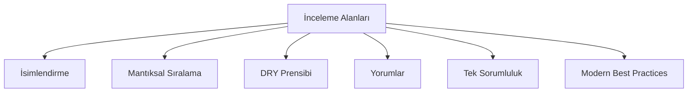

# Kod Okunabilirliği İnceleme Raporu

## Genel Değerlendirme

Bu rapor, `prosektorweb_dashboard` projesinin okunabilirlik, kod kalitesi ve best practice'lere uygunluk açısından detaylı incelemesini içermektedir. İnceleme altı ana başlık altında gerçekleştirilmiştir:



---

## 1. İsimlendirme Analizi

### 1.1 İyi Uygulamalar ✅

| Dosya | Örnek | Değerlendirme |
|-------|-------|---------------|
| [`apps/api/src/server/auth.ts`](apps/api/src/server/auth.ts:11) | [`getMe()`](apps/api/src/server/auth.ts:11) | Açıklayıcı, standart naming convention kullanılmış |
| [`apps/api/src/server/supabase.ts`](apps/api/src/server/supabase.ts:16) | [`createAdminClient()`](apps/api/src/server/supabase.ts:16) | Fonksiyon amacını net şekilde yansıtıyor |
| [`apps/web/src/features/inbox/index.ts`](apps/web/src/features/inbox/index.ts:8) | [`InboxItemStatus`](apps/web/src/features/inbox/index.ts:8) | TypeScript interface naming convention'a uygun |

### 1.2 İyileştirme Önerileri ⚠️

#### 1.2.1 Kısaltılmış Değişken İsimleri

**Orijinal Kod:**
```typescript
// apps/web/src/app/(dashboard)/home/page.tsx:67-73
const [offers, contacts, apps, posts, domains] = await Promise.all([
    api.get('/inbox/offers', { site_id: siteId, page: 1, limit: 3 }, listOfferRequestsResponseSchema),
    api.get('/inbox/contact', { site_id: siteId, page: 1, limit: 3 }, listContactMessagesResponseSchema),
    api.get('/inbox/applications', { site_id: siteId, page: 1, limit: 3 }, listJobApplicationsResponseSchema),
    api.get('/hr/job-posts', { site_id: siteId, include_deleted: false }, listJobPostsResponseSchema),
    api.get('/domains', { site_id: siteId }, listDomainsResponseSchema),
]);
```

**İyileştirilmiş Kod:**
```typescript
const [offerRequests, contactMessages, jobApplications, jobPosts, domains] = await Promise.all([
    api.get('/inbox/offers', { site_id: siteId, page: 1, limit: 3 }, listOfferRequestsResponseSchema),
    api.get('/inbox/contact', { site_id: siteId, page: 1, limit: 3 }, listContactMessagesResponseSchema),
    api.get('/inbox/applications', { site_id: siteId, page: 1, limit: 3 }, listJobApplicationsResponseSchema),
    api.get('/hr/job-posts', { site_id: siteId, include_deleted: false }, listJobPostsResponseSchema),
    api.get('/domains', { site_id: siteId }, listDomainsResponseSchema),
]);
```

**Neden Önemli:** `apps`, `posts` gibi kısaltmalar kod okunurluğunu azaltır. İsimlerden amacın anlaşılması gerekir.

---

#### 1.2.2 Tutarsız `refresh` Fonksiyonu İsimlendirmesi

**Orijinal Kod:**
```typescript
// apps/web/src/app/(dashboard)/inbox/applications/page.tsx:67-80
const refreshJobPosts = async () => { ... }
const refreshApplications = async (opts?: { search?: string; jobPostId?: string }) => { ... }

// apps/web/src/app/(dashboard)/inbox/contact/page.tsx:54-75
const refresh = async (opts?: { search?: string }) => { ... }
```

**İyileştirilmiş Kod:**
```typescript
const refreshJobPosts = async (): Promise<void> => { ... }
const fetchJobApplications = async (opts?: InboxFilters): Promise<void> => { ... }
const fetchContactMessages = async (opts?: InboxFilters): Promise<void> => { ... }
```

**Neden Önemli:** `refresh` genel bir terimdir. `fetch` veya `load` gibi daha spesifik fiiller kullanılmalı. Ayrıca tip tanımları eksik.

---

#### 1.2.3 Tek Harfli Döngü Değişkenleri

**Orijinal Kod:**
```typescript
// apps/web/src/app/(dashboard)/home/page.tsx:84-110
...offers.items.map((o) => ({ ... }))
...contacts.items.map((m) => ({ ... }))
...apps.items.map((a) => ({ ... }))
```

**İyileştirilmiş Kod:**
```typescript
...offers.items.map((offer) => ({ ... }))
...contacts.items.map((message) => ({ ... }))
...jobApplications.items.map((application) => ({ ... }))
```

---

## 2. Mantıksal Sıralama ve Gruplama

### 2.1 Mevcut Durum Analizi

Kod blokları genel olarak mantıksal sıralanmış olsa da bazı dosyalarda iyileştirme yapılabilir.

### 2.2 İyileştirme Önerileri

#### 2.2.1 `requireAuthContext` Fonksiyonunu Parçalara Ayırma

**Orijinal Kod:**
```typescript
// apps/api/src/server/auth/context.ts:37-103
export async function requireAuthContext(req: Request): Promise<AuthContext> {
    const bearer = getBearerToken(req);
    const supabase = bearer ? createUserClientFromBearer(bearer) : await createUserClientFromCookies();
    const admin = createAdminClient();

    const { data: userData, error: userError } = await supabase.auth.getUser();
    if (userError) throw new HttpError(401, { code: "UNAUTHORIZED", message: "Unauthorized" });
    
    // ... 60+ satır tek fonksiyonda
}
```

**İyileştirilmiş Kod:**
```typescript
/**
 * Auth Context Builder - Sorumlulukları ayrılmış yardımcı fonksiyonlar
 */

/**
 * Supabase client oluşturur (bearer token veya cookie'den)
 */
async function createSupabaseClient(req: Request): Promise<SupabaseClient> {
    const bearer = getBearerToken(req);
    return bearer ? createUserClientFromBearer(bearer) : await createUserClientFromCookies();
}

/**
 * Kullanıcı bilgilerini doğrular ve döndürür
 */
async function validateUser(supabase: SupabaseClient): Promise<User> {
    const { data: userData, error: userError } = await supabase.auth.getUser();
    if (userError || !userData?.user) {
        throw new HttpError(401, { code: "UNAUTHORIZED", message: "Unauthorized" });
    }
    return userData.user;
}

/**
 * Tenant membership bilgisini getirir
 */
async function fetchTenantMembership(supabase: SupabaseClient, userId: string): Promise<{ tenant_id: string; role: string }> {
    const { data: member, error: memberError } = await supabase
        .from("tenant_members")
        .select("tenant_id, role")
        .eq("user_id", userId)
        .order("created_at", { ascending: true })
        .limit(1)
        .maybeSingle();

    if (memberError) throw mapPostgrestError(memberError);
    if (!member) {
        throw new HttpError(403, { code: "FORBIDDEN", message: "No tenant membership" });
    }
    return member;
}

/**
 * Tenant detaylarını getirir
 */
async function fetchTenantDetails(supabase: SupabaseClient, tenantId: string): Promise<Tenant> {
    const { data: tenant, error: tenantError } = await supabase
        .from("tenants")
        .select("id, name, slug, plan")
        .eq("id", tenantId)
        .single();
    
    if (tenantError) throw mapPostgrestError(tenantError);
    return tenant;
}

/**
 * Ana auth context builder
 */
export async function requireAuthContext(req: Request): Promise<AuthContext> {
    const supabase = await createSupabaseClient(req);
    const admin = createAdminClient();
    const user = await validateUser(supabase);
    
    const member = await fetchTenantMembership(supabase, user.id);
    const tenant = await fetchTenantDetails(supabase, member.tenant_id);
    
    const resolvedRole: UserRole = isSuperAdmin(user)
        ? "super_admin"
        : (member.role as UserRole);

    const permissions = permissionsForRole(resolvedRole);

    return {
        supabase,
        admin,
        user: {
            id: user.id,
            email: extractUserEmail(user),
            name: extractUserName(user),
            avatar_url: user.user_metadata?.avatar_url as string | undefined,
        },
        tenant,
        role: resolvedRole,
        permissions,
    };
}
```

**Faydalar:**
- Her fonksiyon tek sorumluluk prensibine uygun
- Test edilebilirlik artar
- Hata ayıklama daha kolay

---

## 3. DRY Prensibi Analizi

### 3.1 Tekrarlayan Kod Örüleri

#### 3.1.1 Supabase Client Oluşturma Mantığı

**Orijinal Kod (3 farklı yerde tekrarlıyor):**
```typescript
// apps/api/src/server/supabase.ts:16-26
export function createAdminClient(): SupabaseClient {
    const env = getServerEnv();
    return createClient(env.supabaseUrl, env.supabaseServiceRoleKey, {
        auth: {
            persistSession: false,
            autoRefreshToken: false,
            detectSessionInUrl: false,
        },
    });
}

// apps/web/src/lib/supabase.ts:14-20
cachedBrowserClient = createClient(url, anonKey, {
    auth: {
        persistSession: true,
        autoRefreshToken: true,
        detectSessionInUrl: true,
    },
});
```

**İyileştirilmiş Kod:**
```typescript
// apps/api/src/server/supabase.ts

/**
 * Supabase auth yapılandırması oluşturur
 */
function createAuthConfig(options: {
    persistSession: boolean;
    autoRefreshToken: boolean;
    detectSessionInUrl: boolean;
}) {
    return {
        auth: {
            persistSession: options.persistSession,
            autoRefreshToken: options.autoRefreshToken,
            detectSessionInUrl: options.detectSessionInUrl,
        },
    };
}

export function createAdminClient(): SupabaseClient {
    const env = getServerEnv();
    return createClient(
        env.supabaseUrl, 
        env.supabaseServiceRoleKey, 
        { auth: createAuthConfig({ persistSession: false, autoRefreshToken: false, detectSessionInUrl: false }) }
    );
}

export function createUserClientFromBearer(token: string): SupabaseClient {
    const env = getServerEnv();
    return createClient(env.supabaseUrl, env.supabaseAnonKey, {
        auth: createAuthConfig({ persistSession: false, autoRefreshToken: false, detectSessionInUrl: false }),
        global: { headers: { Authorization: `Bearer ${token}` } },
    });
}
```

---

#### 3.1.2 İnbox Sayfalarında Tekrarlayan Yapı

**Orijinal Durum:** [`applications/page.tsx`](apps/web/src/app/(dashboard)/inbox/applications/page.tsx), [`contact/page.tsx`](apps/web/src/app/(dashboard)/inbox/contact/page.tsx) ve [`offers/page.tsx`](apps/web/src/app/(dashboard)/inbox/offers/page.tsx) benzer yapıyı tekrarlıyor.

**Önerilen Refactoring:**
```typescript
// apps/web/src/components/inbox/InboxTable.tsx

interface InboxTableProps<T extends { id: string; is_read: boolean; created_at: string }> {
    items: T[];
    columns: InboxColumn<T>[];
    renderDetail: (item: T) => React.ReactNode;
    onItemClick?: (item: T) => void;
    emptyState: { icon: React.ReactNode; title: string; description: string; action?: () => void };
}

export function InboxTable<T extends InboxItemBase>({ items, columns, renderDetail, onItemClick, emptyState }: InboxTableProps<T>) {
    // Ortak tablo mantığı burada
}
```

---

#### 3.1.3 Hata Haritalama Tekrarı

**Orijinal Kod:**
```typescript
// apps/api/src/server/api/http.ts:57-76
export function mapPostgrestError(error: PostgrestError): HttpError {
    const code = error.code ?? "";
    if (code === "PGRST116") {
        return new HttpError(404, { code: "NOT_FOUND", message: "Not found" });
    }
    if (code === "23505") {
        return new HttpError(409, { code: "CONFLICT", message: "Conflict" });
    }
    if (code === "42501" || code === "PGRST301") {
        return new HttpError(403, { code: "FORBIDDEN", message: "Forbidden" });
    }
    return new HttpError(500, {
        code: "INTERNAL_ERROR",
        message: error.message || "Internal error",
    });
}
```

**Bu fonksiyon iyi bir şekilde merkezileştirilmiş.** Ekstra bir işlem gerekmiyor.

---

## 4. Yorum Satırı Analizi

### 4.1 Mevcut Yorum Kalitesi

| Dosya | Yorum Tipi | Değerlendirme |
|-------|------------|---------------|
| [`apps/api/src/server/api/csv.ts`](apps/api/src/server/api/csv.ts:1-6) | Block comment | ✅ Mükemmel - neden ve notlar açıklanmış |
| [`apps/api/src/server/auth.ts`](apps/api/src/server/auth.ts:30-41) | Inline comments | ✅ İyi - wildcard matching açıklanmış |
| [`apps/web/src/features/inbox/index.ts`](apps/web/src/features/inbox/index.ts:1-6) | JSDoc | ✅ İyi |

### 4.2 Eksik Yorum Önerileri

#### 4.2.1 Karmaşık Tip Dönüşümleri İçin

**Orijinal Kod:**
```typescript
// apps/api/src/server/auth/context.ts:48-53
const emailCandidate =
    user.email ??
    ((user.user_metadata as Record<string, unknown> | null)?.email?.toString() ?? undefined);
if (!emailCandidate) {
    throw new HttpError(500, { code: "INTERNAL_ERROR", message: "User email missing" });
}
```

**İyileştirilmiş Kod:**
```typescript
/**
 * Kullanıcı email adresini güvenli şekilde çıkarır.
 * Öncelik sırası: user.email > user_metadata.email > undefined
 * 
 * @param user - Supabase kullanıcı objesi
 * @returns Çıkarılmış email veya undefined
 * @throws HttpError 500 - Email bulunamazsa
 */
function extractUserEmail(user: User): string {
    const emailCandidate =
        user.email ??
        ((user.user_metadata as Record<string, unknown> | null)?.email?.toString() ?? undefined);
    
    if (!emailCandidate) {
        throw new HttpError(500, { code: "INTERNAL_ERROR", message: "User email missing" });
    }
    return emailCandidate;
}
```

---

#### 4.2.2 İş Kuralları İçin

**Orijinal Kod:**
```typescript
// apps/api/src/server/rate-limit.ts:24-27
export function hashIp(ip: string): string {
    const env = getServerEnv();
    return createHash("sha256").update(ip + env.siteTokenSecret).digest("base64url");
}
```

**İyileştirilmiş Kod:**
```typescript
/**
 * IP adresini site-token secret ile birleştirip hash'ler.
 * Bu, kullanıcıların rate limit atlamak için IP değiştirmesini engeller.
 * 
 * @param ip - Hash'lenecek IP adresi
 * @returns SHA-256 hash (base64url encoded)
 */
export function hashIp(ip: string): string {
    const env = getServerEnv();
    return createHash("sha256").update(ip + env.siteTokenSecret).digest("base64url");
}
```

---

## 5. Tek Sorumluluk Prensibi (SRP) Değerlendirmesi

### 5.1 İhlal Örnekleri

#### 5.1.1 `requireAuthContext` Çok Fazla Sorumluluk Taşıyor

**Mevcut Sorumluluklar:**
1. Bearer token'dan Supabase client oluşturma
2. Kullanıcı doğrulama
3. Tenant membership sorgulama
4. Tenant detaylarını getirme
5. Rol çözümleme
6. Permissions hesaplama
7. Response objesi oluşturma

**Önerilen Parçalara Ayırma:**
```typescript
// Sorumluluk ayrımı
- AuthClientBuilder (1)
- UserValidator (2)
- TenantMembershipService (3, 4)
- RoleResolver (5)
- PermissionCalculator (6)
- AuthContextAssembler (7)
```

---

#### 5.1.2 HomePage Bileşeni Çok Fazla İş Yapıyor

**Orijinal Kod:**
```typescript
// apps/web/src/app/(dashboard)/home/page.tsx:43-333
export default function HomePage() {
    // - State yönetimi
    // - API çağrıları
    // - Veri dönüştürme
    // - UI rendering
    // - Event handlers
    // - Statistics hesaplama
}
```

**Önerilen Refactoring:**
```typescript
// apps/web/src/app/(dashboard)/home/page.tsx
export default function HomePage() {
    return (
        <DashboardLayout>
            <SiteHealthCard />
            <StatsGrid />
            <RecentActivitySection />
            <SetupChecklist />
        </DashboardLayout>
    );
}

// Ayrı bileşenler
function SiteHealthCard() { ... }
function StatsGrid() { ... }
function RecentActivitySection() { ... }
function SetupChecklist() { ... }
```

---

## 6. Modern Best Practices Uygunluk

### 6.1 Genel Uyum Durumu

| Kategori | Uyum | Notlar |
|----------|------|--------|
| TypeScript | ✅ | Tutarlı tip kullanımı |
| Error Handling | ⚠️ | Bazı yerlerde `catch {}` blokları boş |
| Async/Await | ✅ | Tutarlı kullanım |
| Component Structure | ⚠️ | Bazı bileşenler çok büyük |
| Imports | ⚠️ | Bazı dosyalarda sıralama eksik |
| Naming Conventions | ✅ | Genel olarak iyi |

### 6.2 İyileştirme Önerileri

#### 6.2.1 Boş Catch Bloklarının Düzeltilmesi

**Orijinal Kod:**
```typescript
// apps/web/src/app/(dashboard)/inbox/applications/page.tsx:76-79
} catch {
    // ignore: job posts are optional for filtering
    setJobPosts([]);
}
```

**İyileştirilmiş Kod:**
```typescript
} catch (error) {
    // Job posts are optional for filtering - silently continue with empty list
    console.debug('Job posts fetch failed:', error);
    setJobPosts([]);
}
```

---

#### 6.2.2 ESLint Yorumlarının Kaldırılması

**Orijinal Kod:**
```typescript
// apps/web/src/app/(dashboard)/inbox/applications/page.tsx:109-110
useEffect(() => {
    if (!site.currentSiteId) return;
    void refreshJobPosts();
    // eslint-disable-next-line react-hooks/exhaustive-deps
}, [site.currentSiteId]);
```

**İyileştirilmiş Kod:**
```typescript
useEffect(() => {
    if (!site.currentSiteId) return;
    void refreshJobPosts();
    // Intentionally not adding refreshJobPosts to deps to avoid refetching on filter changes
}, [site.currentSiteId]);
```

**Alternatif:** `refreshJobPosts` fonksiyonunu `useCallback` ile sarmalayın:
```typescript
const refreshJobPosts = useCallback(async () => {
    if (!site.currentSiteId) return;
    // ...
}, [site.currentSiteId]);
```

---

#### 6.2.3 Sabit Değerlerin Merkezileştirilmesi

**Orijinal Kod:**
```typescript
// apps/web/src/app/(dashboard)/inbox/applications/page.tsx:90-91
page: 1,
limit: 200,

// apps/web/src/app/(dashboard)/inbox/contact/page.tsx:62-63
page: 1,
limit: 200,
```

**İyileştirilmiş Kod:**
```typescript
// apps/web/src/lib/constants.ts
export const API_CONSTANTS = {
    DEFAULT_PAGE: 1,
    DEFAULT_LIMIT: 200,
    SEARCH_DEBOUNCE_MS: 250,
} as const;
```

---

## 7. Özet Tablo

| İnceleme Alanı | Genel Not | Öncelik |
|----------------|-----------|---------|
| İsimlendirme | B | Orta |
| Mantıksal Sıralama | B- | Yüksek |
| DRY Prensibi | B | Orta |
| Yorum Kalitesi | B+ | Düşük |
| Tek Sorumluluk | B- | Yüksek |
| Best Practices | B | Orta |

### Öncelikli Eylemler

1. **Yüksek Öncelik:** [`requireAuthContext()`](apps/api/src/server/auth/context.ts:37) fonksiyonunu parçalara ayırın
2. **Yüksek Öncelik:** HomePage bileşenini küçük bileşenlere ayırın
3. **Orta Öncelik:** İnbox sayfaları için ortak `InboxTable` bileşeni oluşturun
4. **Orta Öncelik:** Kısaltılmış değişken isimlerini düzeltin
5. **Düşük Öncelik:** Yorumları zenginleştirin

---

## 8. Sonuç

Proje genel olarak iyi organize edilmiş ve modern TypeScript/React pratiklerini takip ediyor. Ancak okunabilirliği artırmak için:

1. **Fonksiyonları küçültün** - Her fonksiyon tek iş yapmalı
2. **İsimlendirmeyi iyileştirin** - Açıklayıcı isimler kullanın
3. **Kodu parçalara ayırın** - Bileşenleri ayrı dosyalara taşıyın
4. **Boş catch bloklarını düzeltin** - Hata loglaması ekleyin
5. **Sabitleri merkezileştirin** - Tekrarı önleyin
