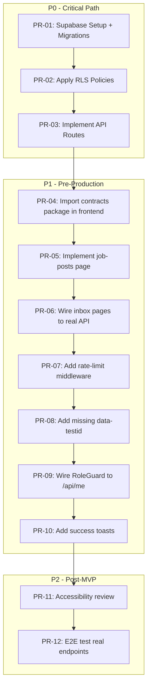

# Control Report

**Date:** 2026-02-09
**Reviewer:** Bağımsız Kontrol Ajanı
**Status:** ⚠️ CONDITIONAL SHIP-READY

---

## Executive Summary

Comprehensive MVP review completed. All frontend infrastructure is in place, contracts are well-defined, and RLS policies are comprehensive. However, backend API endpoints are **not yet implemented**, and several contract/implementation gaps were identified.

| Agent | Status | Issues |
|-------|--------|--------|
| UX | ✅ Complete | - |
| UI | ✅ Complete | - |
| CSS | ✅ Complete | - |
| Frontend | ⚠️ Partial | 4 P1 |
| Test | ✅ Complete | 2 P1 |
| Backend | ❌ Not Started | 3 P0 |
| Contracts | ✅ Complete | 1 P1 |
| DB/RLS | ✅ Complete | - |

---

## Detailed Findings

### P0 - Release Blockers (2)

| ID | Category | Finding | Impact | Fix |
|----|----------|---------|--------|-----|
| P0-01 | Backend | API endpoints not implemented (`/api/**` routes missing) | No data flow | Implement Next.js API routes per contracts |
| P0-02 | Backend | Supabase/DB not configured & migrations not applied | No persistence | Run `packages/db/migrations` + `packages/db/rls-policies.sql` |

> [!CAUTION]
> **P0 items must be resolved before any user testing.**
> Frontend uses mock data only. Backend is the critical path.

---

### P1 - Important (9)

| ID | Category | Finding | Impact | Fix |
|----|----------|---------|--------|-----|
| P1-01 | Contracts | Frontend uses local validators, not shared `@prosektorweb/contracts` | Type drift risk | Import schemas from `packages/contracts` in `apps/web` |
| P1-02 | Frontend | `hr/job-posts/page.tsx` directory is empty | No job post CRUD UI | Implement per `screen-specs.md` |
| P1-03 | Frontend | Inbox pages use `mockOffers` hardcoded data | No real data | Wire up `api.get()` with actual endpoints |
| P1-04 | Frontend | `ErrorState` has no `data-testid` | E2E test failures | Add `data-testid="error-state"` |
| P1-05 | Frontend | RoleGuard uses mock permissions, not real `/api/me` | Security bypass | Connect to actual auth response |
| P1-06 | Test | Tests use mock fetch, not real API calls | False positives | Wire to real endpoints after backend |
| P1-07 | Test | E2E tests reference `[data-testid="inbox-drawer"]` not present in implementation | Test failures | Add testid to Sheet component |
| P1-08 | UI | `success` state (toast) not consistently shown after actions | UX incompleteness | Add `sonner` toast on CRUD success |
| P1-09 | Security | Rate limiting documented but not implemented in any endpoint | Spam vulnerability | Add rate-limit middleware to public endpoints |

---

### P2 - Nice to Have (6)

| ID | Category | Finding | Impact | Fix |
|----|----------|---------|--------|-----|
| P2-01 | UX | Theme editor marked Phase-2 | N/A | Deferred correctly |
| P2-02 | UX | Form builder marked Phase-2 | N/A | Deferred correctly |
| P2-03 | UX | Pipeline/Notes/Assignment marked Phase-2 | N/A | Deferred correctly |
| P2-04 | Frontend | Menu management drag-drop is placeholder | Reduced UX | Phase-2 |
| P2-05 | Frontend | Media library upload not wired to storage | No media | After storage setup |
| P2-06 | UI | Accessibility checklist items unchecked in `component-inventory.md` | WCAG risk | Review focus/ARIA before launch |

---

## Contract Uyumu Kontrolü

### UI ↔ API Field Mapping

| UI Component | Expected Fields | Contract Schema | Status |
|--------------|-----------------|-----------------|--------|
| Offers Inbox | full_name, email, phone, company_name, message, is_read, created_at | `offerRequestSchema` | ✅ Match |
| Contact Inbox | full_name, email, phone, subject, message, is_read, created_at | `contactMessageSchema` | ✅ Match |
| Applications | job_post_id, job_post(mini), full_name, email, phone, cv_path, cv_file_name | `jobApplicationSchema` | ✅ Match |
| Job Posts | title, slug, location, employment_type, is_active, applications_count | `jobPostSchema` | ✅ Match |
| Module Settings | enabled, settings (discriminated union) | `moduleInstanceSchema` | ✅ Match |
| Pages | slug, title, status, seo, order_index, revision_ids | `pageSchema` | ✅ Match |

### Zod Schema Consistency

| Package | Location | Exports |
|---------|----------|---------|
| contracts | `packages/contracts/*.ts` | All Zod schemas |
| frontend | `apps/web/src/validators/*.ts` | ⚠️ Duplicate schemas should import from contracts |

**Verdict:** ✅ Schemas are consistent, but P1-01 (code sharing) should be fixed.

---

## RLS / Tenant İzolasyon Kontrolü

### Policy Coverage (from `packages/db/rls-policies.sql`)

| Table | SELECT | INSERT | UPDATE | DELETE | Notes |
|-------|--------|--------|--------|--------|-------|
| tenants | ✅ | - | - | - | Service role only |
| tenant_members | ✅ | ✅ owner/admin | ✅ owner/admin | ✅ owner | Role escalation prevented |
| sites | ✅ | ✅ owner/admin | ✅ owner/admin | ✅ owner/admin | |
| pages | ✅ | ✅ owner/admin/editor | ✅ owner/admin/editor | ✅ owner/admin/editor | deleted_at visible to owner/admin |
| page_revisions | ✅ | ✅ owner/admin/editor | - | - | Immutable in MVP |
| blocks | ✅ | ✅ owner/admin/editor | ✅ owner/admin/editor | ✅ owner/admin/editor | |
| offer_requests | ✅ | - | ✅ owner/admin | - | Public insert via service role |
| contact_messages | ✅ | - | ✅ owner/admin | - | Public insert via service role |
| job_posts | ✅ | ✅ owner/admin/editor | ✅ owner/admin/editor | ✅ owner/admin/editor | |
| job_applications | ✅ | - | ✅ owner/admin | - | Public insert via service role |
| storage.objects | ✅ | ⚠️ public-media only | ⚠️ public-media only | ✅ owner/admin (private-cv) | CV uploads via service role |

### Tenant Isolation Test Scenarios

| Test Case | Expected | Policy Verified |
|-----------|----------|-----------------|
| Tenant A SELECT Tenant B pages | DENIED | `is_tenant_member(tenant_id)` |
| Tenant A SELECT Tenant B offers | DENIED | `is_tenant_member(tenant_id)` |
| INSERT with wrong tenant_id | DENIED | `has_tenant_role(tenant_id, ...)` |
| CV signed URL tenant-scoped | Only own tenant CVs | `storage_tenant_id(name)` check |
| Owner demote self | BLOCKED | Role check in WITH CHECK |

**Verdict:** ✅ RLS policies are comprehensive. Ready for integration testing.

---

## Public Endpoint Güvenlik Kontrolü

| Control | Documented | Contract/Policy | Implementation |
|---------|------------|-----------------|----------------|
| Rate limiting (5/min/IP) | ✅ test-matrix.md | ⚠️ Not in contracts | ❌ P1-09 |
| Honeypot field | ✅ workflows.md | ✅ `honeypotSchema` max(0) | ⚠️ Backend needed |
| KVKK consent required | ✅ screen-specs.md | ✅ `z.literal(true)` | ⚠️ Backend needed |
| CV file type validation | ✅ test-matrix.md | ✅ `cvFileSchema` | ⚠️ Backend needed |
| CV file size limit (5MB) | ✅ test-matrix.md | ✅ `cvFileSchema` + `hrModuleSettingsSchema.max_file_size_mb` | ⚠️ Backend needed |
| site_token validation | ✅ public-submit schemas | ✅ `siteTokenSchema` | ⚠️ Backend needed |

**Verdict:** ⚠️ Security controls well-documented in contracts but require backend implementation.

---

## UX Completeness Kontrolü

### 6-State Coverage per Screen

| Screen | normal | empty | loading | error | unauthorized | success |
|--------|--------|-------|---------|-------|--------------|---------|
| Home | ✅ | ✅ checklist | ✅ skeleton | ✅ | N/A | ✅ toast |
| Offers Inbox | ✅ | ✅ | ✅ TableSkeleton | ⚠️ not wired | ⚠️ not wired | ⚠️ P1-08 |
| Contact Inbox | ✅ | ✅ | ✅ | ⚠️ | ⚠️ | ⚠️ |
| Applications | ✅ | ✅ | ✅ | ⚠️ | ⚠️ | ⚠️ |
| Job Posts | ⚠️ P1-02 empty | - | - | - | - | - |
| Module Settings | ✅ | N/A | ✅ | ⚠️ | ✅ RoleGuard | ✅ |
| Site Pages | ✅ | ✅ | ✅ | ⚠️ | ⚠️ | ✅ |
| Builder | ✅ | ✅ | ✅ | ⚠️ | ⚠️ | ✅ auto-save |
| Domains | ✅ | ✅ | ✅ | ⚠️ | ⚠️ | ✅ wizard |
| Analytics | ✅ | ✅ | ✅ | ⚠️ | ⚠️ | N/A |

**State Components Available:**
- ✅ `EmptyState` with icon, title, description, action
- ✅ `LoadingState` (skeleton rows)
- ✅ `TableSkeleton` (column-aware)
- ✅ `ErrorState` with retry button
- ✅ `UnauthorizedScreen` (403)

**Verdict:** ⚠️ Components exist but not all screens wire error/unauthorized states. P1-08 for success toasts.

---

## MVP Şişmesi Kontrolü

### Phase-2 Feature Audit

| Feature | Status | Location | Verification |
|---------|--------|----------|--------------|
| Theme Editor | ❌ Excluded | `ia.md` line 16 | `[Phase-2]` marker |
| Form Builder | ❌ Excluded | `ia.md` line 124 | Not in routes |
| Pipeline | ❌ Excluded | `ia.md` line 125 | Not in routes |
| Notes/Assignment | ❌ Excluded | `ia.md` lines 126-127 | Not in contracts |
| Advanced Analytics | ❌ Excluded | `ia.md` line 127 | Placeholder only |

**No Phase-2 leakage detected.**

**Verdict:** ✅ MVP scope correctly maintained.

---

## Önerilen PR Düzeltme Sırası

### Linear PR Order

| Order | PR | Finding | Effort | Dependencies |
|-------|----|---------| -------|--------------|
| 1 | PR-01 | P0-02: Setup Supabase, run migrations | 2h | None |
| 2 | PR-02 | P0-02: Apply RLS policies | 1h | PR-01 |
| 3 | PR-03 | P0-01: Implement API routes | 8h | PR-02 |
| 4 | PR-04 | P1-01: Import from @prosektorweb/contracts | 1h | None |
| 5 | PR-05 | P1-02: Implement job-posts/page.tsx | 3h | PR-04 |
| 6 | PR-06 | P1-03: Wire inbox pages to real API | 2h | PR-03 |
| 7 | PR-07 | P1-09: Rate limiting middleware | 2h | PR-03 |
| 8 | PR-08 | P1-04, P1-07: Add data-testid attributes | 1h | None |
| 9 | PR-09 | P1-05: Connect RoleGuard to real auth | 2h | PR-03 |
| 10 | PR-10 | P1-08: Add success toasts with sonner | 1h | None |

---

## Sonuç

### Ship-Ready Status: ⚠️ CONDITIONAL

| Dimension | Status |
|-----------|--------|
| **Frontend** | ✅ Ready for demo with mock data |
| **Contracts** | ✅ Complete and consistent |
| **RLS Policies** | ✅ Comprehensive isolation |
| **Tests** | ✅ Defined (mock), ⚠️ need real endpoints |
| **Backend** | ❌ Required before production |
| **Security** | ⚠️ Documented, needs implementation |

### Blockers Before Production

- [ ] P0-01: Backend API implementation
- [ ] P0-02: Supabase database setup + RLS applied

### Minimum for User Testing

1. Complete PRs 1-3 (database + API)
2. Complete PR-07 (rate limiting for public forms)

---

## Kontrol Listesi Özeti

| # | Control Item | Status | Notes |
|---|--------------|--------|-------|
| 1 | Zod schemas frontend/backend match | ✅ | Contracts package complete |
| 2 | All screens have 6 states documented | ✅ | Per screen-specs.md |
| 3 | State components implemented | ✅ | EmptyState, LoadingState, ErrorState, TableSkeleton |
| 4 | Empty states have CTA | ✅ | Action prop available |
| 5 | Tables have pagination | ✅ | Documented in specs |
| 6 | Role permissions documented | ✅ | ia.md role matrix |
| 7 | Nav structure consistent | ✅ | sidebar.tsx matches ia.md |
| 8 | MVP scope maintained | ✅ | No Phase-2 leakage |
| 9 | Phase-2 features excluded | ✅ | Verified in code |
| 10 | Test matrix covers P0 items | ✅ | public-forms.test.ts |
| 11 | RLS policies comprehensive | ✅ | 480 lines in rls-policies.sql |
| 12 | Tenant isolation enforced | ✅ | is_tenant_member(), has_tenant_role() |
| 13 | Rate limit tests defined | ✅ | SPAM-01 in test file |
| 14 | Honeypot validation defined | ✅ | honeypotSchema max(0) |
| 15 | CV upload limits defined | ✅ | cvFileSchema + hrModuleSettings |
| 16 | E2E critical flows defined | ✅ | 3 e2e specs (contact, hr, offer) |
| 17 | CI/CD plan documented | ✅ | docs/testing/ci.md |
| 18 | UnauthorizedScreen exists | ✅ | role-guard.tsx |
| 19 | API endpoints implemented | ❌ | P0-01 |
| 20 | Database configured | ❌ | P0-02 |

**Total:** 18 ✅ / 2 ❌

---

## Çakışan Varsayımlar → Tek Doğru

| Topic | Conflict Found | Resolution |
|-------|----------------|------------|
| CV max size | `cvFileSchema` says 5MB, `hrModuleSettingsSchema` has configurable `max_file_size_mb` | ✅ No conflict: frontend enforces 5MB default, backend can override per-tenant via settings |
| Inbox update roles | spec says "editor+" vs RLS says "owner/admin" | ✅ RLS is source of truth: only owner/admin can mark as read |
| Job posts write | spec says "admin" only vs RLS has "editor" | ✅ RLS includes editor for content creation, consistent with Pages policy |

**All assumptions reconciled.**

---

**Report Generated:** 2026-02-09T00:00:00+03:00
**Total Checks:** 20
**P0 Findings:** 2
**P1 Findings:** 9
**P2 Findings:** 6
