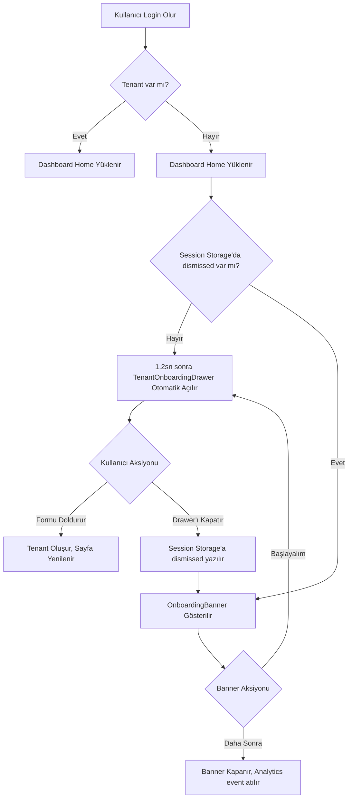

# Onboarding UX Specification

## 1. Information Architecture (IA) Etkisi

Yeni Onboarding akışı, kullanıcıyı doğrudan bir ödeme veya zorunlu form duvarına sokmak yerine (hard-wall), Dashboard'un içine alarak (soft-lock / progressive) Time-to-Value oranını artırmayı hedefler.

*   **Mevcut (Eski):** Login $\rightarrow$ /onboarding (Zorunlu) $\rightarrow$ Dashboard
*   **Yeni Akış:** Login $\rightarrow$ /home (Dashboard) $\rightarrow$ TenantOnboardingDrawer (Dismissible) $\rightarrow$ Banner (Eğer Drawer kapatılırsa)

---

## 2. Kullanıcı Akış Diyagramı (User Flow)



---

## 3. Ekran Spesifikasyonları (Screen Specs)

### 3.1 Dashboard Ana Sayfa (Onboarding Durumu)

| Attribute | Value |
|-----------|-------|
| **Purpose** | Kullanıcıya platformu hissettirmek ve organizasyon kurmaya teşvik etmek |
| **Primary CTA** | "Başlayalım" (Banner üzeri) |
| **URL** | `/home` |
| **Permissions** | Authenticated User (No Tenant yet) |

**Layout:**
```text
┌─────────────────────────────────────────────────────────────┐
│ [Topbar: Logo | Profil (Tenant Yok)]                        │
├──────────────┬──────────────────────────────────────────────┤
│              │                                              │
│   Sidebar    │  ┌──────────────────────────────────────┐   │
│   (Aktif)    │  │ OnboardingBanner                     │   │
│              │  │ 🚀 ProsektorWeb'e Hoş Geldiniz!      │   │
│   - Home     │  │ Organizasyonunuzu oluşturun.         │   │
│   - Diğer    │  │                  [Daha Sonra] [Başla]│   │
│              │  └──────────────────────────────────────┘   │
│              │                                              │
│              │  [Dashboard Skeleton / Empty States]         │
└──────────────┴──────────────────────────────────────────────┘
```

**Data Sources:**
- Context: `useAuth()` (tenant kontrolü)

**States:**
- **Empty:** Tüm dashboard modülleri empty/skeleton state gösterir, çünkü veri çekilecek bir `tenant_id` yoktur.
- **Banner Dismissed:** Kullanıcı "Daha Sonra" derse banner kaybolur, ancak Sidebar'da veya Header'da kalıcı bir CTA eklenebilir.

---

### 3.2 Tenant Onboarding Drawer

| Attribute | Value |
|-----------|-------|
| **Purpose** | Kullanıcıyı sayfadan koparmadan hızlıca organizasyon oluşturmasını sağlamak |
| **Primary CTA** | "Organizasyonu Oluştur" |
| **URL** | (Sayfa üstü overlay) |
| **Permissions** | Authenticated User |

**Layout:**
```text
┌────────────────────────────────────────────────┐
│                                ┌───────────────┤
│                                │ Organizasyon  │
│  Arka plan:                    │ Oluşturun   X │
│  Dashboard (Aktif / Görünür)   │               │
│  Karanlık overlay (Dimmed)     │ [Form Input]  │
│                                │               │
│                                │ [İptal] [Kur] │
│                                └───────────────┤
└────────────────────────────────────────────────┘
```

**Data Sources:**
- POST `/api/onboarding/tenant`

**States:**
- **Loading:** Submit butonunda spinner, fieldlar disabled.
- **Error:** Form altında veya üstünde Sonner Toast ile hata mesajı (örn. isim çok kısa).
- **Success:** Toast success mesajı, router refresh tetiklenir ve Drawer kapanır.
