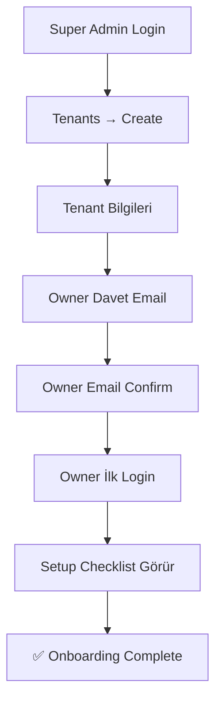

# Workflows

> **Version:** 1.0.0 | **Son Güncelleme:** 2026-02-23

Kritik kullanıcı akışları ve entry/exit noktaları.

---

## 1. Tenant Onboarding (Admin tarafından)

**Hedef:** Yeni müşteri 5 dakikada aktif site
**Rol:** super_admin



| Step | Entry | Exit |
|------|-------|------|
| Create Tenant | /tenants/create | Tenant oluşturuldu |
| Send Invite | Tenant saved | Email gönderildi |
| Owner Login | Email link | Dashboard görüntülendi |

---

## 2. Site Build & Publish

**Hedef:** İlk sayfa 2 dakikada publish
**Rol:** owner, admin

```mermaid
flowchart TD
    A[/site/pages] --> B[+ Yeni Sayfa]
    B --> C[Sayfa Adı/Slug]
    C --> D[/site/builder]
    D --> E[Block Ekle]
    E --> F[İçerik Düzenle]
    F --> G[Kaydet Draft]
    G --> H[/site/publish]
    H --> I{Staging?}
    I -->|Evet| J[Preview]
    J --> K{Onay?}
    K -->|Evet| L[Production Publish]
    L --> M[✅ Live]
```

| Step | Entry | Exit |
|------|-------|------|
| Create Page | Pages list | Builder açıldı |
| Edit Blocks | Builder | Draft kaydedildi |
| Publish | /site/publish | Üretim yayınlandı |

**Hız Hedefi:** < 2 dakika (ilk sayfa)

---

## 3. Offer Submit → Inbox

**Hedef:** Ziyaretçiden 1 saniye, inbox'ta görme
**Rol:** Ziyaretçi (public) → editor+

```mermaid
flowchart TD
    A[Ziyaretçi Site] --> B[Teklif Formu]
    B --> C[Form Doldur]
    C --> D[KVKK Onay]
    D --> E[Submit]
    E --> F{Honeypot OK?}
    F -->|Evet| G[DB Kayıt]
    F -->|Hayır| H[Silent Reject]
    G --> I[Email Bildirim]
    G --> J[Inbox Badge +1]
    J --> K[/inbox/offers]
    K --> L[Row Click]
    L --> M[Drawer Detay]
    M --> N[✅ İşlendi]
```

| Step | Entry | Exit |
|------|-------|------|
| Form Submit | Public site | Success toast |
| Inbox View | /inbox/offers | Drawer açıldı |
| Mark Read | Drawer | Badge güncellendi |

---

## 4. Contact Submit → Inbox

**Hedef:** Müşteri mesajı anında görülür
**Rol:** Ziyaretçi → editor+

```mermaid
flowchart TD
    A[Ziyaretçi] --> B[İletişim Formu]
    B --> C[Doldur + KVKK]
    C --> D[Submit]
    D --> E[DB + Email]
    E --> F[/inbox/contact]
    F --> G[Drawer]
    G --> H[✅ Cevaplandı]
```

| Step | Entry | Exit |
|------|-------|------|
| Submit | Public form | Success message |
| View | /inbox/contact | İşaretlendi |

---

## 5. HR: Job Post → Apply → Inbox

**Hedef:** İlan 2 dakikada yayında, başvuru anında inbox'ta
**Rol:** admin → public → editor+

```mermaid
flowchart TD
    A[/modules/hr/job-posts] --> B[+ Yeni İlan]
    B --> C[Form Doldur]
    C --> D[Kaydet Active]
    D --> E[Site'de Görünür]
    E --> F[Aday Görür]
    F --> G[Başvuru Formu]
    G --> H[CV Upload]
    H --> I[Submit]
    I --> J[DB + Email]
    J --> K[/inbox/applications]
    K --> L[Drawer + CV Link]
    L --> M[✅ İncelendi]
```

| Step | Entry | Exit |
|------|-------|------|
| Create Job | Dialog | İlan active |
| Apply | Public form | CV uploaded |
| Review | /inbox/applications | Drawer viewed |

**Hız Hedefi:** İlan oluşturma < 2 dakika

---

## Workflow Özet

| Workflow | Süre Hedefi | Kritik Adım |
|----------|-------------|-------------|
| Onboarding | < 5 dk | Email confirm |
| Site Publish | < 2 dk | Block editing |
| Offer Inbox | < 1 sn | Form submit |
| Contact Inbox | < 1 sn | Form submit |
| HR Flow | < 2 dk | CV upload |
