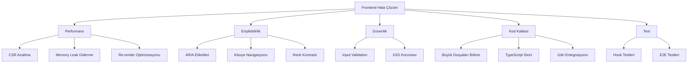

# 🚨 ProsektorWeb Frontend Hata Çözüm Planı

**Tarih:** 23 Şubat 2026  
**Mod:** Architect  
**Proje:** ProsektorWeb Dashboard  

---

## 📊 Özet

Bu plan, frontend durum raporunda tespit edilen kritik sorunları çözmek için oluşturulmuştur. Analiz sonucunda bazı sorunların (örn. data-table useMemo) zaten düzeltilmiş olduğu görülmüştür.

### Analiz Sonuçları

| Kategori | Öncelik | Durum |
|----------|----------|-------|
| Performans | P0 | Düzeltilmeli |
| Erişilebilirlik | P0 | Düzeltilmeli |
| Güvenlik | P1 | Kısmen düzeltilmiş |
| Kod Kalitesi | P1 | Düzeltilmeli |
| Test | P2 | Düzeltilmeli |

---

## 🎯 Ana Hedefler



---

## 📋 Detaylı Görev Listesi

### 1. PERFORMANS İYİLEŞTİRMELERİ (P0)

#### 1.1 sidebar.tsx Optimizasyonu
- [ ] `NavItemComponent` bileşenini `React.memo` ile sarmalama
- [ ] Server Component'lere uygun parçalara bölme (navigation data, icons ayrı dosyalara)
- [ ] Statik navigation verilerini server-side'da tutma

#### 1.2 use-builder.ts Memory Leak
- [ ] History limitini 30'dan 15'e düşürme
- [ ] Delta storage implementasyonu (tam clone yerine değişen alanları saklama)
- [ ] Derin kopyalama yerine shallow copy kullanma

#### 1.3 data-table.tsx
- [ ] Mevcut useMemo optimizasyonlarını doğrulama ✅ (zaten uygulanmış)

---

### 2. ERİŞİLEBİLİRLİK İYİLEŞTİRMELERİ (P0)

#### 2.1 ARIA Etiketleri
- [ ] sidebar.tsx (satır ~573): Toggle butonuna `aria-label="Menüyü aç/kapat"`
- [ ] sidebar.tsx (satır ~172): Dropdown butonuna `aria-expanded` ekleme
- [ ] topbar.tsx (satır ~131): Mobil menü butonuna yeterli `aria-label`
- [ ] Icon-only butonlara `aria-label` ekleme (tüm bileşenler)

#### 2.2 Klavye Navigasyonu
- [ ] `tabIndex` yönetimini Radix UI ile değiştirme
- [ ] Dropdown menülerde klavye navigasyonu

#### 2.3 inbox-table.tsx
- [ ] `aria-selected` ekleme (satır seçimi için)

---

### 3. GÜVENLİK İYİLEŞTİRMELERİ (P1)

#### 3.1 Input Validation
- [ ] input.tsx: `maxLength`, `pattern` validasyonları ekleme
- [ ] Form bileşenlerinde client-side validation

#### 3.2 XSS Koruması
- [ ] Mevcut kodda `dangerouslySetInnerHTML` taraması yapma ✅ (yok, güvenli)
- [ ] İleride DOMPurify entegrasyonu için altyapı hazırlama

---

### 4. KOD KALİTESİ İYİLEŞTİRMELERİ (P1)

#### 4.1 Büyük Dosyaları Bölme
| Dosya | Mevcut Satır | Hedef | Önerilen Parçalama |
|-------|--------------|-------|---------------------|
| sidebar.tsx | 590 | <200 | nav-data.ts, nav-icons.ts, SidebarMain.tsx |
| use-builder.ts | 707 | <300 | use-builder-store.ts, use-builder-actions.ts |
| topbar.tsx | 410 | <250 | topbar-user.tsx, topbar-search.tsx |

#### 4.2 TypeScript İyileştirmeleri
- [ ] `any` tiplerini `unknown` veya spesifik tiplerle değiştirme
- [ ] `NavItem` interface'ındaki `children?: NavItem[]` kontrolü

#### 4.3 i18n Entegrasyonu
- [ ] Magic string'leri `next-intl` sistemine taşıma
- [ ] `topbar.tsx` ROUTE_LABELS'i i18n dosyalarına ekleme

#### 4.4 Prop Drilling
- [ ] Context API kullanımı için refactoring
- [ ] Compound component pattern uygulama

---

### 5. TEST İYİLEŞTİRMELERİ (P2)

#### 5.1 Hook Testleri
- [ ] use-builder.ts testleri
- [ ] use-unread-count.ts testleri

#### 5.2 Entegrasyon Testleri
- [ ] API entegrasyon testleri
- [ ] Auth flow testleri
- [ ] Route testleri

#### 5.3 E2E Testleri
- [ ] Playwright konfigürasyonu tamamlama
- [ ] Kritik user flow'ları test etme

---

### 6. STİL VE DOKÜMASYON (P2)

#### 6.1 CSS İyileştirmeleri
- [ ] Design tokens kullanımını doğrulama
- [ ] Mobile-first yaklaşıma geçiş
- [ ] Hardcoded değerleri CSS variable'lara dönüştürme

#### 6.2 Component Composition
- [ ] Compound component pattern uygulama
- [ ] Render props pattern kullanımı

---

## 🚀 Önerilen Uygulama Sırası

```
Sprint 1 (Hafta 1-2):
├── Performans: CSR azaltma
│   ├── sidebar.tsx React.memo
│   └── use-builder.ts memory leak
├── Erişilebilirlik: ARIA etiketleri
│   ├── sidebar.tsx
│   └── topbar.tsx
└── Güvenlik: Input validation

Sprint 2 (Hafta 3-4):
├── Kod Kalitesi: Büyük dosyaları bölme
│   ├── sidebar.tsx refactor
│   └── use-builder.ts refactor
├── TypeScript strict mode
└── i18n magic strings

Sprint 3 (Hafta 5-6):
├── Test: Hook testleri
├── Test: Entegrasyon testleri
└── E2E testleri
```

---

## ✅ Doğrulama Kontrol Listesi

Her düzeltme sonrası:

- [ ] TypeScript hatası yok
- [ ] ESLint hatası yok
- [ ] Build başarılı
- [ ] Testler geçiyor
- [ ] Lighthouse performans > 90
- [ ] Lighthouse erişilebilirlik > 90
- [ ] WCAG 2.1 AA uyumlu

---

## 📝 Notlar

1. **Mevcut Durum**: data-table.tsx'teki useMemo zaten uygulanmış, XSS riski bulunmuyor
2. **Öncelik**: Performans ve erişilebilirlik P0 olarak ele alınmalı
3. **Bağımlılıklar**: Refactoring önce testler yazılmalı (regression koruması için)
