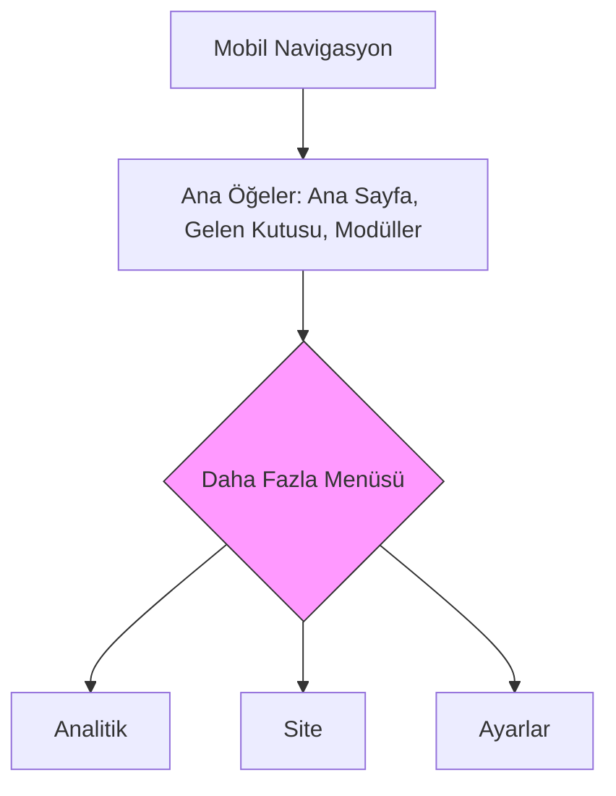

# ProsektorWeb Dashboard - Kapsamlı UX Analiz Raporu

## Genel Bakış

Bu rapor, ProsektorWeb Dashboard web uygulamasının kullanıcı deneyimi (UX) açısından kapsamlı analizini sunmaktadır. Analiz, navigasyon tutarlılığı, erişilebilirlik standartları, mobil uyumluluk, kullanıcı akışları, görsel hiyerarşi, etkileşim öğeleri, performans, form tasarımı, hata yönetimi ve tutarlılık olmak üzere 10 temel kriter üzerinden gerçekleştirilmiştir.

---

## 1. Navigasyon ve Bilgi Mimarisi Tutarlılığı

### Mevcut Durum

Uygulama, dashboard ortamında sidebar tabanlı bir navigasyon sistemi kullanmaktadır. [`sidebar.tsx`](apps/web/src/components/layout/sidebar.tsx:49) dosyasında tanımlanan ana navigasyon öğeleri şunlardır:

- Ana Sayfa
- Site (7 alt sayfa)
- Modüller (5 alt sayfa)
- Gelen Kutusu (3 alt sayfa)
- Analitik
- Ayarlar (4 alt sayfa)

### Tespit Edilen Eksiklikler

#### 1.1. Desktop ve Mobil Navigasyon Tutarsızlığı

| Sorun | Tanım | Kullanıcı Etkisi | Öncelik |
|-------|-------|-------------------|----------|
| Navigasyon Öğesi Farklılığı | Desktop sidebar'da tüm navigasyon öğeleri mevcutken, mobilde yalnızca 3 ana öğe (Ana Sayfa, Gelen Kutusu, Modüller) görüntülenmektedir. Diğer öğeler "Daha Fazla" menüsüne taşınmıştır. | Kullanıcılar mobilde tüm özelliklere ulaşmak için ek tıklama yapmak zorunda kalır. Analitik ve Site gibi önemli bölümlere ulaşım zorlaşır. | Yüksek |

**Önerilen Çözüm:**


- Mobil navigasyonu desktop ile daha tutarlı hale getirmek için bottom sheet yerine tam ekran menü kullanılabilir
- Sık kullanılan öğelerin sayısı artırılabilir (en az 5-6 ana öğe)
- "Daha Fazla" menüsü yerine expandable bir yapı düşünülebilir

#### 1.2. Sidebar Genişletme/Daraltma Durumu Kalıcı Değil

| Sorun | Tanım | Kullanıcı Etkisi | Öncelik |
|-------|-------|-------------------|----------|
| State Persistence Eksikliği | Sidebar daraltma durumu localStorage veya sessionStorage'a kaydedilmiyor. Her sayfa yenilemesinde sidebar varsayılan genişlik durumuna dönüyor. | Kullanıcı her oturumda sidebar'ı tekrar daraltmak zorunda kalır. | Orta |

**Önerilen Çözüm:**
```typescript
// useEffect ile localStorage'a kaydetme
useEffect(() => {
  localStorage.setItem('sidebar-collapsed', String(collapsed));
}, [collapsed]);

// Başlangıçta okuma
const [collapsed, setCollapsed] = useState(() => {
  if (typeof window !== 'undefined') {
    return localStorage.getItem('sidebar-collapsed') === 'true';
  }
  return false;
});
```

---

## 2. Erişilebilirlik Standartlarına Uyum Düzeyi

### Mevcut Durum

Uygulama, erişilebilirlik konusunda iyi uygulamalar içermektedir:

- [`globals.css`](apps/web/src/app/globals.css:437) dosyasında `prefers-reduced-motion` medya sorgusu ile animasyonlar devre dışı bırakılabiliyor
- Form bileşenlerinde [`aria-invalid`](apps/web/src/components/ui/input.tsx:13) ve `aria-describedby` kullanılmış
- Tooltip bileşenlerinde `sr-only` sınıfı ile ekran okuyucu desteği sağlanmış
- Button bileşenlerinde odak (focus) stilleri tanımlanmış

### Tespit Edilen Eksiklikler

#### 2.1. Klavye Navigasyonu Destek Eksikliği

| Sorun | Tanım | Kullanıcı Etkisi | Öncelik |
|-------|-------|-------------------|----------|
| Dropdown Klavye Erişimi | [`topbar.tsx`](apps/web/src/components/layout/topbar.tsx:105) dosyasındaki tenant ve site seçici dropdown menülerde klavye navigasyonu sınırlı. Dropdown menüler açıkken ESC tuşu ile kapatılamıyor olabilir. | Klavye kullanan kullanıcılar dropdown menülerde gezinmekte zorlanır. | Orta |

#### 2.2. Renk Kontrastı Yetersiz Olabilecek Alanlar

| Sorun | Tanım | Kullanıcı Etkisi | Öncelik |
|-------|-------|-------------------|----------|
| Sidebar Metin Kontrastı | Sidebar'da `text-white/60` ve `text-white/50` gibi opasite değerleri kullanılmış. Bu, düşük görüşlü kullanıcılar için yeterli kontrast sağlamayabilir. | Metin okunabilirliği azalır, özellikle karanık ortamlarda. | Orta |

**Önerilen Çözüm:**
- Minimum 4.5:1 kontrast oranı sağlayan renkler kullanılmalı
- `text-white/60` yerine `text-white/80` veya doğrudan renk kodu kullanılabilir

#### 2.3. Focus Visible Yönetimi

| Sorun | Tanım | Kullanıcı Etkisi | Öncelik |
|-------|-------|-------------------|----------|
| Bazı Öğelerde Focus Kaybı | Sidebar'da dropdown açıldığında focus yönetimi doğru yapılandırılmamış olabilir. Kullanıcı TAB ile gezinirken menü dışına çıkabilir. | Klavye kullanıcıları için akış kesintiye uğrar. | Orta |

#### 2.4. Screen Reader İyileştirmeleri

| Sorun | Tanım | Kullanıcı Etkisi | Öncelik |
|-------|-------|-------------------|----------|
| Breadcrumb Eksikliği | Dashboard sayfalarında breadcrumbs (ekmek kırıntısı) navigasyonu bulunmuyor. Kullanıcılar mevcut konumlarını anlamakta zorlanabilir. | Screen reader kullanıcıları ve yeni kullanıcılar için yön bulma zorlaşır. | Düşük |

---

## 3. Mobil Uyumluluk ve Duarlı Tasarım Kalitesi

### Mevcut Durum

- Tailwind CSS 4'ün native responsive özellikleri kullanılıyor
- Breakpoint'ler: `sm` (640px), `md` (768px), `lg` (1024px)
- Mobil navigasyon için bottom tab bar uygulanmış
- Topbar'da bazı öğeler `hidden md:flex` ile mobilde gizleniyor

### Tespit Edilen Eksiklikler

#### 3.1. Dokunma Hedefleri Boyutu

| Sorun | Tanım | Kullanıcı Etkisi | Öncelik |
|-------|-------|-------------------|----------|
| Küçük Dokunma Alanları | Bazı buton ve interactive öğeler minimum 44x44px dokunma hedefi boyutunu karşılamıyor olabilir. Özellikle icon-only butonlarda. | Dokunmatik cihazlarda yanlış tıklamalar artar, kullanıcı frustrasyonu. | Yüksek |

**Önerilen Çözüm:**
```css
/* Minimum dokunma hedefi boyutu */
.touch-target {
  min-height: 44px;
  min-width: 44px;
}
```

#### 3.2. Responsive Tablo Gösterimi

| Sorun | Tanım | Kullanıcı Etkisi | Öncelik |
|-------|-------|-------------------|----------|
| Data Table Mobilde Taşma | [`data-table.tsx`](apps/web/src/components/ui/data-table.tsx:86) bileşeni mobilde yatay kaydırma sağlasa da, bazı durumlarda içerik sığmama sorunu yaşanabilir. | Tablo içeriği okunamaz hale gelir veya kesilir. | Orta |

**Önerilen Çözüm:**
- Mobilde card view formatına geçiş
- Yatay kaydırma için scrollbar gösterimi
- Öncelikli sütunların belirlenmesi

#### 3.3. Viewport Meta Etiketi

| Sorun | Tanım | Kullanıcı Etkisi | Öncelik |
|-------|-------|-------------------|----------|
| Zoom Kontrolü | next.config.ts'de viewport ayarları kontrol edilmeli. Kullanıcıların yakınlaştırma yapabilmesi gerekebilir. | Erişilebilirlik ihlali, kullanıcı deneyimi olumsuz etkilenir. | Düşük |

---

## 4. Kullanıcı Akışları ve İşlem Süreçlerinin Verimliliği

### Mevcut Durum

Ana kullanıcı akışları:
1. Giriş → Dashboard → Modüller/Site/Gelen Kutusu
2. Giriş yapılmamış → Login sayfasına yönlendirme
3. Tenant yok → Onboarding sayfasına yönlendirme

### Tespit Edilen Eksiklikler

#### 4.1. Onboarding Akışı İyileştirme İhtiyacı

| Sorun | Tanım | Kullanıcı Etkisi | Öncelik |
|-------|-------|-------------------|----------|
| Onboarding Adımları Belirsiz | [`layout.tsx`](apps/web/src/app/(dashboard)/layout.tsx:44) dosyasında tenant membership kontrolü yapılıyor, ancak onboarding süreci adım adım rehberlik sağlamıyor olabilir. | Yeni kullanıcılar sistemin nasıl kullanılacağını anlamakta zorlanır. | Orta |

#### 4.2. Kaydetme İşlemlerinde İlerleme Göstergesi

| Sorun | Tanım | Kullanıcı Etkisi | Öncelik |
|-------|-------|-------------------|----------|
| Loading State Eksikliği | Bazı form submission ve veri kaydetme işlemlerinde loading spinner veya ilerleme çubuğu gösterilmiyor olabilir. | Kullanıcı işlemin devam ettiğini anlamaz, tekrar gönderme yapabilir. | Yüksek |

#### 4.3. Çoklu Seçim İşlemleri

| Sorun | Tanım | Kullanıcı Etkisi | Öncelik |
|-------|-------|-------------------|----------|
| Bulk Action Eksikliği | Data table'da çoklu satır seçimi mümkün olsa da, toplu işlem (silme, güncelleme) arayüzü sınırlı. | Birden fazla öğeyi aynı anda yönetmek zaman alır. | Orta |

---

## 5. Görsel Hiyerarşi ve Okunabilirlik

### Mevcut Durum

- Design tokens [`tokens.css`](packages/design-tokens/tokens.css) dosyasında tanımlı
- OKLCH renk paleti kullanılıyor (modern ve tutarlı)
- Typography: Inter font ailesi
- Gölge ve gradient efektleri mevcut

### Tespit Edilen Eksiklikler

#### 5.1. Tipografik Hiyerarşi Tutarsızlığı

| Sorun | Tanım | Kullanıcı Etkisi | Öncelik |
|-------|-------|-------------------|----------|
| Font Boyutları | `font-size-xs: 0.625rem` (10px) gibi çok küçük font boyutları kullanılmış. Bu, okunabilirliği olumsuz etkileyebilir. | Küçük metinler okunamaz hale gelir. | Orta |

**Önerilen Çözüm:**
- Minimum body font boyutunu 14px (0.875rem) olarak belirleme
- 10px font kullanımını label ve badge gibi sınırlı alanlarla kısıtlama

#### 5.2. Boşluk Tutarsızlığı

| Sorun | Tanım | Kullanıcı Etkisi | Öncelik |
|-------|-------|-------------------|----------|
| Padding/Margin Farklılıkları | Farklı kartlar ve bileşenler arasında padding değerleri tutarsız olabilir. | Görsel düzen bozulur, profesyonellik algısı azalır. | Düşük |

#### 5.3. Görsel Gürültü

| Sorun | Tanım | Kullanıcı Etkisi | Öncelik |
|-------|-------|-------------------|----------|
| Arka Plan Efektleri | Login sayfasında blur efektleri, gradient'ler ve grid pattern kullanılmış. Aşırı dekoratif öğeler dikkat dağıtabilir. | Kullanıcı ana içerik yerine görsel efektlere odaklanabilir. | Düşük |

---

## 6. Etkileşim Öğeleri ve Geri Bildirim Mekanizmaları

### Mevcut Durum

- Sonner (toast notifications) ile geri bildirim sağlanıyor
- Button bileşenlerinde loading state desteği
- Error boundary ile hata yakalama
- Tooltip ile bilgi sağlama

### Tespit Edilen Eksiklikler

#### 6.1. Form Validation Geri Bildirimi

| Sorun | Tanım | Kullanıcı Etkisi | Öncelik |
|-------|-------|-------------------|----------|
| Anlık Doğrulama Eksikliği | Form validation (Zod ile) mevcut ancak bazı alanlarda real-time validation (anlık doğrulama) çalışmıyor olabilir. Kullanıcı formu gönderene kadar hataları görmez. | Kullanıcı formu defalarca düzeltmek zorunda kalır. | Orta |

#### 6.2. Hover/Active Durumları

| Sorun | Tanım | Kullanıcı Etkisi | Öncelik |
|-------|-------|-------------------|----------|
| Touch Cihazlarda Hover | Hover state'ler touch cihazlarda çalışmaz. Bazı öğelerde sadece hover ile gösterilen içerik (dropdown) olabilir. | Touch kullanıcılar içeriğe ulaşamaz. | Orta |

**Önerilen Çözüm:**
- Hover yerine click/toggle davranışı kullanma
- Mobile'da dropdown yerine sheet/modal kullanma

#### 6.3. Loading Skeleton Eksikliği

| Sorun | Tanım | Kullanıcı Etkisi | Öncelik |
|-------|-------|-------------------|----------|
| Kısmi Yükleme | Bazı sayfalarda veri yüklenirken boş alanlar görünüyor. Skeleton loading gösterilmiyor. | Sayfa "kırık" görünür, kullanıcı içeriğin yüklenip yüklenmediğini anlayamaz. | Orta |

---

## 7. Yüklenme Süreleri ve Performans Metrikleri

### Mevcut Durum

- Next.js 16 (App Router) kullanılıyor
- `next-themes` ile theme yönetimi
- Lazy loading yapıları mevcut olabilir
- [`next.config.ts`](apps/web/next.config.ts:50) dosyasında:
  - Output: standalone
  - Turbopack deneysel desteği
  - Security headers (CSP, X-Frame-Options vb.)

### Tespit Edilen Eksiklikler

#### 7.1. Bundle Size Optimizasyonu

| Sorun | Tanım | Kullanıcı Etkisi | Öncelik |
|-------|-------|-------------------|----------|
| Büyük Bundle | Radix UI bileşenlerinin tamamı import ediliyor olabilir. Lütfen sadece kullanılan bileşenleri import edin. | İlk yüklenme süresi artar, performans düşer. | Yüksek |

#### 7.2. Image Optimization

| Sorun | Tanım | Kullanıcı Etkisi | Öncelik |
|-------|-------|-------------------|----------|
| Resim Boyutları | Avatar ve diğer resimler için Next.js Image component kullanılsa da, boyut optimizasyonu kontrol edilmeli. | Bandwidth israfı, yavaş yüklenme. | Orta |

#### 7.3. Third-Party Script Yönetimi

| Sorun | Tanım | Kullanıcı Etkisi | Öncelik |
|-------|-------|-------------------|----------|
| Analitik ve Harici Script | CSP header'ında script-src kısıtlaması var (`'unsafe-inline' 'unsafe-eval'`) - güvenlik riski. | Güvenlik açığı, performans etkisi. | Yüksek |

---

## 8. Form Tasarımları ve Veri Girişi Deneyimi

### Mevcut Durum

- React Hook Form + Zod validation kullanılıyor
- shadcn/ui form bileşenleri mevcut
- Login formu referans alınabilir

### Tespit Edilen Eksiklikler

#### 8.1. Form Alanı Etiketleri

| Sorun | Tanım | Kullanıcı Etkisi | Öncelik |
|-------|-------|-------------------|----------|
| Placeholder Alternatif Etiket | Bazı form alanlarında sadece placeholder kullanılmış, label eksik. | Screen reader kullanıcıları alanın ne için olduğunu anlayamaz. | Yüksek |

#### 8.2. Input Tipi Doğrulaması

| Sorun | Tanım | Kullanıcı Etkisi | Öncelik |
|-------|-------|-------------------|----------|
| Yanlış Input Types | Email alanları için `type="email"`, telefon için `type="tel"` kullanılmalı. | Klavye önerileri ve validation çalışmaz. | Orta |

#### 8.3. Otomatik Doldurma Desteği

| Sorun | Tanım | Kullanıcı Etkisi | Öncelik |
|-------|-------|-------------------|----------|
| Autocomplete Eksikliği | Form alanlarında `autocomplete` özniteliği eksik. | Kullanıcılar aynı bilgileri tekrar tekrar girmek zorunda kalır. | Orta |

**Önerilen Çözüm:**
```tsx
<Input 
  id="email"
  type="email"
  autoComplete="email"
  placeholder="ornek@firma.com"
/>
```

---

## 9. Hata Yönetimi ve Yardım İçerikleri

### Mevcut Durum

- Error boundary bileşeni mevcut [`error-boundary.tsx`](apps/web/src/components/ui/error-boundary.tsx:22)
- Global error sayfası: [`error.tsx`](apps/web/src/app/error.tsx)
- Dashboard error sayfası: [`(dashboard)/error.tsx`](apps/web/src/app/(dashboard)/error.tsx)
- Toast notification ile hata mesajları gösteriliyor

### Tespit Edilen Eksiklikler

#### 9.1. Kullanıcı Dostu Hata Mesajları

| Sorun | Tanım | Kullanıcı Etkisi | Öncelik |
|-------|-------|-------------------|----------|
| Teknik Hata Mesajları | Hata mesajları teknik terimler içeriyor olabilir. Kullanıcılar ne yapması gerektiğini anlamıyor. | Frustrasyon, çözüme ulaşamama. | Orta |

#### 9.2. Yardım Dokumentasyonu

| Sorun | Tanım | Kullanıcı Etkisi | Öncelik |
|-------|-------|-------------------|----------|
| Inline Help Eksikliği | Form alanlarında yardım metinleri (help text) sınırlı. Tooltip ile ek bilgi sağlanabilir. | Kullanıcılar doğru formatı bilemez. | Düşük |

#### 9.3. 404 Sayfası

| Sorun | Tanım | Kullanıcı Etkisi | Öncelik |
|-------|-------|-------------------|----------|
| Custom 404 | `not-found.tsx` incelenmeli. Kullanıcıyı doğru sayfaya yönlendirmeli. | Kaybolmuş kullanıcı deneyimi. | Düşük |

---

## 10. Tutarlılık ve Standartlaştırma Durumu

### Mevcut Durum

- Design tokens (tokens.css, theme.css) ile renk, tipografi, spacing standartlaştırılmış
- shadcn/ui bileşenleri tutarlı API sağlıyor
- Button, Card, Input gibi temel bileşenler standardize edilmiş

### Tespit Edilen Eksiklikler

#### 10.1. İkon Kütüphanesi Tutarsızlığı

| Sorun | Tanım | Kullanıcı Etkisi | Öncelik |
|-------|-------|-------------------|----------|
| Lucide React Boyutları | İkon boyutları farklı bileşenlerde tutarsız. Bazı yerlerde `h-4 w-4`, bazılarında `className={NAV_ICON_SIZE_CLASS}` kullanılmış. | Görsel tutarsızlık. | Düşük |

#### 10.2. State Yönetimi Tutarsızlığı

| Sorun | Tanım | Kullanıcı Etkisi | Öncelik |
|-------|-------|-------------------|----------|
| Zustand vs Context | Bazı state'ler Context API ile, bazıları Zustand ile yönetiliyor. Tutarsızlık olabilir. | Bakım zorluğu, tutarsız davranış. | Orta |

#### 10.3. Naming Convention

| Sorun | Tanım | Kullanıcı Etkisi | Öncelik |
|-------|-------|-------------------|----------|
| Bileşen Adlandırma | Bazı bileşenlerde farklı adlandırma standartları (kebab-case vs PascalCase). | Kod okunabilirliği azalır. | Düşük |

---

## Öncelik Sıralaması - Eylem Planı

### Yüksek Öncelikli İyileştirmeler

| # | Eksiklik | Kategori |
|---|----------|----------|
| 1 | Navigasyon tutarsızlığı (Desktop vs Mobil) | Navigasyon |
| 2 | Dokunma hedefi boyutları | Mobil Uyumluluk |
| 3 | Form label ve autocomplete | Form Tasarımı |
| 4 | Loading state eksiklikleri | Etkileşim |
| 5 | Bundle size optimizasyonu | Performans |

### Orta Öncelikli İyileştirmeler

| # | Eksiklik | Kategori |
|---|----------|----------|
| 1 | Sidebar state persistence | Navigasyon |
| 2 | Klavye navigasyonu | Erişilebilirlik |
| 3 | Renk kontrastı | Erişilebilirlik |
| 4 | Real-time form validation | Form Tasarımı |
| 5 | Bulk actions | Kullanıcı Akışları |

### Düşük Öncelikli İyileştirmeler

| # | Eksiklik | Kategori |
|---|----------|----------|
| 1 | Breadcrumb navigasyon | Navigasyon |
| 2 | Tipografik hiyerarşi | Görsel Hiyerarşi |
| 3 | 404 sayfası | Hata Yönetimi |
| 4 | İkon tutarlılığı | Tutarlılık |

---

## Sonuç

ProsektorWeb Dashboard, modern teknolojiler (Next.js 16, React 19, Tailwind CSS 4, shadcn/ui) kullanılarak geliştirilmiş, iyi yapılandırılmış bir uygulamadır. Ancak yukarıda belirtilen eksiklikler giderildiğinde:

- Kullanıcı deneyimi önemli ölçüde iyileşecektir
- Erişilebilirlik standartları karşılanacaktır
- Mobil uyumluluk artacaktır
- Performans optimize edilecektir

Öncelikle yüksek öncelikli maddeler ele alınmalı ve ardından orta/düşük öncelikli iyileştirmeler planlanmalıdır.
